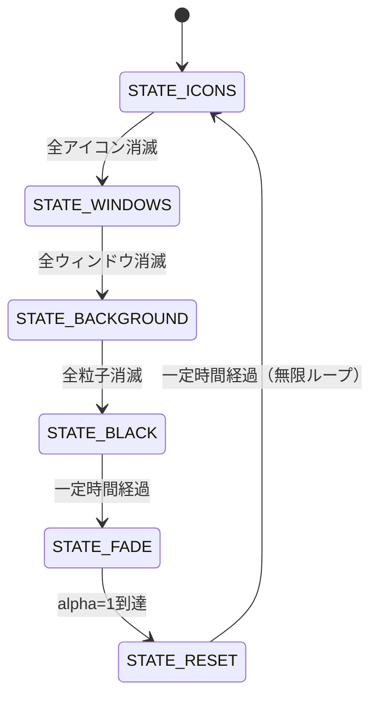

# Spiral Suction Saver

デスクトップのアイコン・開いているウィンドウ・壁紙を、画面上を漂う一点へ**らせん軌道で
吸い込む**アニメーションを描画する Windows スクリーンセーバー (`.scr`) です。
すべて吸い込まれると画面が黒くなり、元の壁紙へフェードインして最初の状態に戻る
（無限ループ）動作をします。

> **注記**: 本ソフトウェアおよび付随するドキュメントは AI (Claude Code) によるコーディングで
> 作成されました。実際の Windows デスクトップのアイコン配置や開いているウィンドウを読み取る
> ことは一切なく、すべて画面内で完結する模擬データ（矩形+ラベル）です。

## ソフト概要

- 吸い込みの中心は画面内をランダムウォークで移動します。
- アイコン (20〜40個) → ウィンドウ (5〜10個) → 背景画像 (NxN 粒子に分割) の順に、
  らせん軌道を描きながら中心へ吸い込まれて消滅します。
- 全て吸い込まれると画面は黒一色になり、その後、元の壁紙へフェードイン (alpha 0→1) し、
  アイコン・ウィンドウを元の位置に再表示してから、また最初のステップへ戻ります。
- 背景画像は既定で Windows の現在の壁紙を自動取得しますが、設定画面から任意の画像
  (BMP/JPEG/PNG/GIF) に差し替えられます。
- 粒子数は設定画面から Low(1,000) / Mid(3,000) / High(6,000) / Max(12,000) / Auto(GPU自動判定)
  / Custom(任意の値) から選択できます。

## 技術的特徴

- **言語/API**: C++17、Win32 API、OpenGL 1.1 固定機能パイプライン (`glBegin`/`glEnd`)。
- **描画方式**: ダブルバッファリング (`PFD_DOUBLEBUFFER`)、60fps を目標としたフレーム制御。
  アイコン・ウィンドウ・粒子はそれぞれ種別ごとに **1回の `glBegin`/`glEnd`** でまとめて描画し、
  粒子数が多い設定でも固定機能のまま実用的な速度で動作するよう最適化しています。
- **画像デコード**: Windows Imaging Component (WIC) を利用し、外部の画像ライブラリに依存せず
  BMP/JPEG/PNG/GIF を読み込みます。
- **設定の保存**: レジストリではなく `%APPDATA%\SpiralSuctionSaver\config.ini` に保存します。
- **アーキテクチャ**: 純粋ロジック (`src/core/`) と Win32/OpenGL 実装 (`src/platform/win32/`) を
  分離しており、`src/core/` は Windows 非依存の C++17 のみで書かれているため Linux 上でも
  ビルド・単体テストできます。詳細は [`docs/DESIGN.md`](docs/DESIGN.md) を参照してください。



## 依存ライブラリとインストール手順

追加の外部ライブラリは不要です（Windows SDK / MinGW-w64 に含まれるヘッダとインポート
ライブラリのみを使用: `opengl32`, `gdi32`, `user32`, `shell32`, `comdlg32`, `ole32`,
`windowscodecs`)。

### 必要なもの

- CMake 3.15 以上
- 以下のいずれかのコンパイラ
  - **MSVC** (Visual Studio 2019/2022 の「C++ によるデスクトップ開発」ワークロード、
    または Visual Studio Build Tools)
  - **MinGW-w64** (`g++-mingw-w64-x86-64` など。Linux/WSL2 からのクロスコンパイルにも対応)
  - **Clang** (Windows ターゲット、上級者向け)

### ビルド方法 (Windows / MSVC)

```powershell
cmake -S . -B build
cmake --build build --config Release
# 生成物: build\src\platform\win32\Release\SpiralSuctionSaver.scr
```

### ビルド方法 (Linux/WSL2 から MinGW-w64 でクロスコンパイル)

```bash
sudo apt install g++-mingw-w64-x86-64 mingw-w64-x86-64-dev binutils-mingw-w64-x86-64
cmake -S . -B build-win -DCMAKE_TOOLCHAIN_FILE=cmake/mingw-w64-toolchain.cmake
cmake --build build-win
# 生成物: build-win/src/platform/win32/SpiralSuctionSaver.scr
```

この手順は開発中に実際に検証済みです（ローカルに展開した MinGW-w64 でクロスコンパイルし、
`.scr` が正しい PE32+ GUI 実行ファイルとして生成されることを確認しています）。

### コアロジックの単体テストのみをビルド (Windows 不要、Linux 上で完結)

`src/core/` (らせん軌道計算・状態遷移・設定ファイルの解析など) は Windows に依存しないため、
Linux 上でもビルド・テストできます。

```bash
cmake -S . -B build-tests -DBUILD_CORE_TESTS_ONLY=ON
cmake --build build-tests
ctest --test-dir build-tests --output-on-failure
```

## 起動方法

`SpiralSuctionSaver.scr` は通常の Windows スクリーンセーバーとして動作します。

1. `SpiralSuctionSaver.scr` を `C:\Windows\System32` (または任意の場所) に配置します。
2. エクスプローラーでファイルを右クリックし「インストール」を選ぶか、ダブルクリックすると
   設定画面が開きます。
3. Windows の「設定 → 個人用設定 → ロック画面 → スクリーンセーバー」からも選択できます。

### コマンドライン引数（手動実行時）

| 引数 | 動作 |
|---|---|
| `SpiralSuctionSaver.scr /s` | フルスクリーンでスクリーンセーバーを開始します。 |
| `SpiralSuctionSaver.scr /c` | 設定ダイアログを表示します。 |
| `SpiralSuctionSaver.scr /p <HWND>` | 指定したウィンドウ内にプレビュー描画します
  (Windows の「スクリーンセーバーの設定」画面が内部的に使用します)。 |
| 引数なし | 設定ダイアログを表示します（Windows の慣習に合わせた既定動作）。 |

## 使用方法

- **設定ダイアログ (`/c`)**: 粒子数のプリセット (Low/Mid/High/Max/Auto/Custom) を選択できます。
  Custom を選ぶと任意の粒子数を、Auto を選ぶと現在の GPU から自動判定した推奨粒子数が
  表示されます。背景画像は既定で現在の壁紙が使われますが、「Browse...」から任意の画像に
  変更するか、「Use system wallpaper」で自動取得に戻せます。設定は OK を押すと
  `%APPDATA%\SpiralSuctionSaver\config.ini` に保存されます。

## 終了方法

- **フルスクリーン実行中 (`/s`)**: キーボードの任意のキー、マウスのクリック、または
  一定量のマウス移動で終了します（通常の Windows スクリーンセーバーと同じ操作感です）。
- **設定ダイアログ**: 「OK」または「Cancel」ボタン、あるいはウィンドウを閉じることで終了します。

## 使用上の注意点

- 本ソフトウェアは実際のデスクトップアイコン・開いているウィンドウを一切読み取らず、
  移動・削除もしません。表示されるアイコンやウィンドウはすべて画面内で完結する模擬データです。
- OS の設定（壁紙など）を変更することはありません。壁紙の取得は読み取り専用です。
- 対応解像度はプライマリディスプレイのみです（マルチモニタでの動作範囲外）。
- ログは `%APPDATA%\SpiralSuctionSaver\saver.log` に出力されます（1MB を超えると自動的に
  ローテートされます）。

## テスト

`src/core/` の各モジュールに対する単体テストが `tests/` にあります（外部依存ゼロの自作
テストハーネス使用）。実行方法は [依存ライブラリとインストール手順](#依存ライブラリとインストール手順)
の「コアロジックの単体テストのみをビルド」を参照してください。

Windows 実機での結合テスト用チェックリストは [`docs/DESIGN.md`](docs/DESIGN.md#83-手動確認チェックリスト-windows実機)
にあります。GitHub Actions (`.github/workflows/build.yml`) では、Windows 実機ビルド (MSVC) と
Linux 上でのユニットテストの両方を自動実行します。

## ライセンス

このプロジェクトは [Apache License 2.0](LICENSE) の下で公開されています。

## 開発について

本ソフトウェアの設計・実装・テストコード・ドキュメントは、要件定義書 (`要件.txt`) に基づき
Claude Code (AI コーディングエージェント) によって生成されました。
