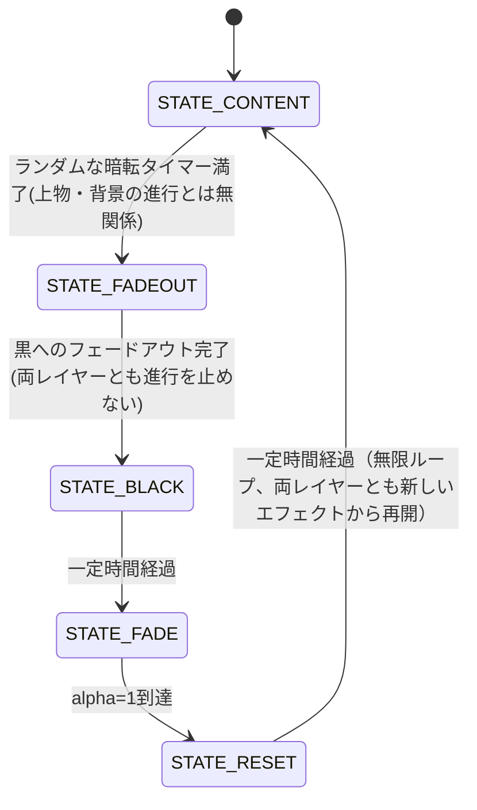

# Spiral Suction Saver

デスクトップのアイコン・開いているウィンドウ(以下「上物」)と壁紙(以下「背景」)を、それぞれ
独立したレイヤーとして扱い、専用の多彩な演出エフェクト(上物14種・背景11種)を**互いに無関係な
タイミングで**それぞれ独立にランダムな順序で切り替えながら描き続ける Windows スクリーンセーバー
(`.scr`) です。上物と背景は、どちらかのエフェクトが終わっても他方に一切同期せず、常に別々の
ペースでエフェクトを回し続けます。そのうえで、単発のエフェクトの目安10倍程度の**ランダムな
間隔**(固定値ではなく毎回揺らぎます)で、両レイヤーとも進行中のエフェクトを止めないまま画面
全体を黒へフェードアウトし、フェードインで起動時の見た目(元の壁紙+検出した上物)へ一度戻って
から、また両レイヤーが独立にランダムなエフェクトをかけ始める――という周期を無限に繰り返します。
上物のエフェクトの一つに、渦を巻きながら**らせん軌道で吸い込まれて消える**演出(VortexSuction)
があり、これが完了するとその場で再出現し、すぐ次のエフェクトへ移ります。詳細は
[レイヤー分離エフェクトシステム](#レイヤー分離エフェクトシステム)を参照してください。

> **注記**: 本ソフトウェアおよび付随するドキュメントは AI (Claude Code) によるコーディングで
> 作成されました。フルスクリーン実行時 (`/s`) は、開始直後に画面全体を1回だけ**読み取り専用で**
> キャプチャ (`BitBlt`) し、これと現在の壁紙画像を比較して「実際に何か描かれている箇所
> (アイコン・タスクバー・開いているウィンドウなど)」だけを検出します。検出した箇所だけが
> キャプチャ画像のクリッピングとしてエフェクト演出の対象になります。**実際のアイコン・
> ウィンドウを移動・削除したり、OS の設定を変更したりすることは一切ありません** -- 画面の
> 内容を「読む」だけで、何も動かしません。画面キャプチャに失敗した場合(別シェル利用時、
> セキュリティソフトによるブロックなど)は、上物のエフェクト対象を検出できないだけで、背景の
> エフェクトは通常どおり動作します。

## ソフト概要

- 実際の画面キャプチャと壁紙画像を比較して検出した「差分ブロック」(アイコン・タスクバー・
  開いているウィンドウなど、壁紙の上に何か描かれている箇所)が上物レイヤーの、壁紙全体
  (NxN 粒子に分割)が背景レイヤーの内容になります。差分のない箇所は最初から壁紙がそのまま
  見えているため、結果的に「変化のない部分は透明化される」演出になります。
- 上物と背景は、それぞれ専用のエフェクトを独立したタイミング・順序でランダムに繰り返し
  適用し続けます。上物のエフェクトの一つ VortexSuction(中心に近づくほど角速度が上がり、
  らせん状に歪んでいく吸い込み演出)が完了すると、上物はその場で再出現して次のエフェクトへ
  進みます。背景も同様に、エフェクトが一つ終わるたびに次のエフェクトをランダムに選んで
  切れ目なく回り続けます。
- 単発のエフェクトの目安10倍程度のランダムな間隔(実行のたびに揺らぎます)で、上物・背景
  ともに今のエフェクトの進行を止めないまま画面全体が黒へフェードアウトし、その後、起動時の
  壁紙へフェードイン(alpha 0→1)して差分ブロックを元の位置に再表示してから、また両レイヤー
  が独立にランダムなエフェクトをかけ始めます。
- 背景画像は既定で Windows の現在の壁紙を自動取得しますが、設定画面から任意の画像
  (BMP/JPEG/PNG/GIF) に差し替えられます。壁紙は Windows の実際の表示設定(塗りつぶし/
  フィット/中央/タイル/ストレッチ)に合わせて画面サイズへ合成してから描画・比較に使うため、
  壁紙ファイルと画面のアスペクト比が異なっていても表示がズレません。
- フルスクリーン実行時、差分ブロックは実際に画面キャプチャで検出した位置・見た目
  (クリッピング画像) で描画されます。画面キャプチャに失敗した場合は上物が最初から存在
  しない扱いになり、背景のエフェクトのみが動作します。プレビュー表示時 (`/p`) は画面
  キャプチャを行わない設計のため、常にこの「上物なし」の状態で見えます。
- 粒子数は設定画面から Low(1,000) / Mid(3,000) / High(6,000) / Max(12,000) / Auto(GPU自動判定)
  / Custom(任意の値) から選択できます。

## レイヤー分離エフェクトシステム

差分ブロック(上物)と壁紙(背景)は完全に独立した2つのレイヤーとして扱われ、それぞれ専用の
演出エフェクトを 5〜15 秒程度でランダムに切り替えながら、互いに同期せず独立して表示し
続けます(固定機能 OpenGL 1.1 のみで実装、シェーダ不使用)。

- **上物レイヤー(差分ブロック)**: 継続演出 8 種(FlagWave / NorenSwing / InfiniteScroll /
  InfiniteRotation / ClothBend / LiquidDistort / Kaleidoscope / SegmentWave)と、
  渦吸い込みなどの演出 6 種(VortexSuction / FragmentFlyAway / GlassShatter / ConfettiFall /
  MosaicCollapse / NoiseDissolve)を合わせてランダムに巡回します。渦吸い込み系の演出が
  完了すると、その場で再出現して次の演出へ進みます(消えたままにはなりません)。
- **背景レイヤー(壁紙)**: 環境演出 11 種(Ripple / FadeOutIn / ZoomShake / Tilt /
  LensDistort / BackgroundKaleidoscope / NoiseRipple / HueShift / GlitchShift /
  ParallaxTilt / WaveZoom)を独立した状態機械で巡回します。上物側の状況とは無関係に、
  1つの演出が終わるたびに次をランダムに選んで切れ目なく続けます。
- 上物・背景それぞれの巡回とは別に、単発のエフェクトの目安10倍程度のランダムな間隔
  (実行のたびに揺らぎ、固定値にはなりません)で両レイヤーがまとめて黒へフェードアウトし、
  フェードインで起動時の見た目に戻ってから、また両レイヤーが独立にエフェクトをかけ
  始めます(無限ループ)。
- 設定画面の「Effects...」ボタンから、エフェクト全体の有効/無効・各層のショーケース時間・
  個々のエフェクトの有効/無効と強度を調整できます。エフェクトごとの重み(`Weight`)・
  持続時間の個別上書き(`MinSeconds`/`MaxSeconds`)・再生順序の固定(`Sequence`)は
  `config.ini` の直接編集でのみ設定できます(詳細は
  [`docs/DESIGN_EFFECTS.md` §9](docs/DESIGN_EFFECTS.md)を参照)。
- `Effects.Enabled=0` にすると、上物・背景とも個々のエフェクトが一切選ばれなくなり、
  上物は渦吸い込み(VortexSuction)だけを繰り返す最小構成になります(背景は無地の壁紙の
  まま静止します)。黒フェードアウト→フェードインの周期そのものはこの設定と無関係に
  常時動作します。
- 設計・実装の詳細(数式・状態遷移・テスト方針)は
  [`docs/DESIGN_EFFECTS.md`](docs/DESIGN_EFFECTS.md) を参照してください。

## 技術的特徴

- **言語/API**: C++17、Win32 API、OpenGL 1.1 固定機能パイプライン (`glBegin`/`glEnd`)。
- **描画方式**: ダブルバッファリング (`PFD_DOUBLEBUFFER`)、60fps を目標としたフレーム制御。
  差分ブロック・背景粒子はそれぞれ **1回の `glBegin`/`glEnd`** でまとめて描画し、粒子数が
  多い設定でも固定機能のまま実用的な速度で動作するよう最適化しています。
- **画像デコード**: Windows Imaging Component (WIC) を利用し、外部の画像ライブラリに依存せず
  BMP/JPEG/PNG/GIF を読み込みます。
- **実デスクトップの読み取りと差分検出 (読み取り専用)**: フルスクリーン実行時、自分の
  ウィンドウで画面を覆う直前に `BitBlt` で画面を1回だけキャプチャします。このキャプチャと、
  Windows の実際の壁紙表示設定(`WallpaperStyle`/`TileWallpaper`)に合わせて画面サイズへ
  合成した壁紙画像とを、グリッドセル単位で比較し(`core::ContentMask`)、差分のあるセルだけを
  「実際に何か描かれている箇所」として検出します。比較の前には、HDR/明るさの違いを吸収する
  ロバストな明るさ補正(全ピクセルの輝度比の中央値)と、両画像に同じボックスブラーをかけて
  デコード・縮小方式の違いによる細かいノイズを均す処理を行い、実際のアイコン・タスクバー・
  ウィンドウのようなはっきりした差分だけを検出するようにしています。いずれも標準 API に
  よる読み取りのみで、移動・削除・設定変更は一切行いません。
- **検出の頑健性向上 (実機フィードバックに基づく改善)**: 上記の基本比較だけでは拾えなかった
  実機特有の失敗モードを、ユーザーからの実機レポートを元に6つ切り分けて個別に対応済みです。
  (1) Windows スポットライト/スライドショー利用時に `SPI_GETDESKWALLPAPER` が実際の表示と
  異なる陳腐化したパスを返すことがある問題 → `core::IsContentMaskSuspicious` でマスクの
  異常(検出全体の90%以上がコンテンツ判定)を検知し、システム壁紙追従時のみ一度だけパスを
  再取得してやり直す。(2) 白いダイアログや黒いターミナルなど、実UIの色が壁紙の一部と偶然
  平均色が近く差分なしと誤判定される問題 → 実UIは写真のような自然なばらつきを持たないことを
  利用した質感ベースの追加検出 (`ContentMaskConfig::textureFlatnessMargin`)。
  (3) 上記の誤判定セルが周囲を完全/部分的に囲まれて穴として残る問題 →
  `core::FillEnclosedMaskHoles` / `FillMajorityNeighborCells` / `FillBoundaryStraddlingCells`
  による後処理で、ウィンドウの端やタイトルバーの角など検出が漏れやすい箇所を補完します。
  さらに、境界に接するセルだけを対象に、ピクセル領域を最大1/64まで再帰的に細分化して
  差分判定を取り直す `core::RefineBoundaryMask` を実行し、粗いグリッド1マス単位では
  拾いきれない、実際のウィンドウ端の形に沿った検出漏れを直接のピクセル測定で補います(この
  細分化はセル単位の判定そのものと、上物画像(1枚のクリッピング画像)を作る際のアルファ
  境界の精緻化にのみ使われ、エフェクト側が扱うブロック数自体は変わりません)。起動時に
  1回だけ実行される処理のため、毎フレームの負荷増加はありません。
  調査の詳細な記録は [`docs/DESIGN.md` §9.9](docs/DESIGN.md) を参照してください。
- **らせん軌道の演出**: 背景粒子は中心に近づくほど角速度が上乗せされる
  (`SpiralParams::centerAccelFactor`) ため、吸い込まれる画像がらせん状に歪んで見えます。
- **設定の保存**: レジストリではなく `%APPDATA%\SpiralSuctionSaver\config.ini` に保存します。
- **アーキテクチャ**: 純粋ロジック (`src/core/`、エフェクトシステムは `src/core/effects/`) と
  Win32/OpenGL 実装 (`src/platform/win32/`) を分離しており、`src/core/` は Windows 非依存の
  C++17 のみで書かれているため Linux 上でもビルド・単体テストできます。詳細は
  [`docs/DESIGN.md`](docs/DESIGN.md)(全体設計)・[`docs/DESIGN_EFFECTS.md`](docs/DESIGN_EFFECTS.md)
  (エフェクトシステム拡張)を参照してください。



## 依存ライブラリとインストール手順

追加の外部ライブラリは不要です（Windows SDK / MinGW-w64 に含まれるヘッダとインポート
ライブラリのみを使用: `opengl32`, `gdi32`, `user32`, `shell32`, `comdlg32`, `ole32`,
`windowscodecs`)。

### 必要なもの

- CMake 3.15 以上
- 以下のいずれかのコンパイラ
  - **MSVC** (Visual Studio 2019/2022 の「C++ によるデスクトップ開発」ワークロード、
    または Visual Studio Build Tools)
  - **MinGW-w64** (`g++-mingw-w64-x86-64` など。Linux/WSL2 からのクロスコンパイルにも対応)
  - **Clang** (Windows ターゲット、上級者向け)

### ビルド方法 (Windows / MSVC)

```powershell
cmake -S . -B build
cmake --build build --config Release
# 生成物: build\src\platform\win32\Release\SpiralSuctionSaver.scr
```

### ビルド方法 (Linux/WSL2 から MinGW-w64 でクロスコンパイル)

```bash
sudo apt install g++-mingw-w64-x86-64 mingw-w64-x86-64-dev binutils-mingw-w64-x86-64
cmake -S . -B build-win -DCMAKE_TOOLCHAIN_FILE=cmake/mingw-w64-toolchain.cmake
cmake --build build-win
# 生成物: build-win/src/platform/win32/SpiralSuctionSaver.scr
```

この手順は開発中に実際に検証済みです（ローカルに展開した MinGW-w64 でクロスコンパイルし、
`.scr` が正しい PE32+ GUI 実行ファイルとして生成されることを確認しています）。

> **MinGW-w64 ビルドと DLL 依存について**: MinGW-w64 の g++ は既定では `libstdc++`/`libgcc`/
> `libwinpthread` を動的リンクするため、それらの DLL が無い環境で実行すると
> 「`libstdc++-6.dll が見つからないため、コードの実行を続行できません`」のようなエラーになります。
> 本プロジェクトの `src/platform/win32/CMakeLists.txt` は MinGW でビルドする際に自動的に
> `-static-libgcc -static-libstdc++ -static` を付与し、これらをすべて実行ファイルに
> 静的リンクするため、上記手順どおりにビルドすれば追加の DLL を配布・同梱する必要はありません
> （`.scr` 単体で動作します）。もし独自のビルド設定でこれらのフラグを外した場合、
> `/c`（設定）や `/p`（プレビュー）はエクスプローラー経由の子プロセスとして起動されるため、
> DLL不足で起動に失敗してもエラーダイアログが表示されず「ボタンを押しても何も起きない」ように
> 見えることがあります。

### GitHub Actions でビルドする (Windows 環境が無い場合)

`.github/workflows/build.yml` は push・PR のたびに、`windows-latest` ランナー上で MSVC
を使って実際に `.scr` をビルドします（同時に Linux 上での `src/core/` ユニットテストも
実行します）。Windows 実機や MinGW-w64 クロスコンパイル環境が手元に無くても、これだけで
実際の Windows ビルドを取得できます。ビルド済みバイナリはリポジトリには**コミットしない**
方針としており（差分が読みにくくなる・リポジトリが肥大化するため）、取得方法は用途に応じて
以下の2通りです。

#### 開発中のビルドを試す (Actions Artifacts)

任意のコミット・ブランチ・PR の実行結果からダウンロードできます（保持期間はデフォルトで
90日）。

1. GitHub の対象リポジトリで「Actions」タブを開き、`build` ワークフローの実行から
   対象のコミットを選びます。
2. `gh` CLI がある場合は次のように実行できます。

   ```bash
   gh run list --repo <owner>/<repo> --limit 5           # 実行一覧から run ID を確認
   gh run download <run-id> --repo <owner>/<repo> \
       -n SpiralSuctionSaver-scr -D ./downloaded
   ```

   ブラウザから行う場合は、該当の Actions 実行ページを開き、「Artifacts」欄の
   `SpiralSuctionSaver-scr` をクリックしてダウンロードします（zip 展開後に `.scr` が
   出てきます）。

#### 安定版を試す (GitHub Releases)

`v*` 形式のタグ（例: `v1.0.0`）を push すると、ワークフローの `release` ジョブが自動的に
その時点のビルドを GitHub Releases のアセットとして公開します。

```bash
git tag v1.0.0
git push origin v1.0.0
```

リポジトリの「Releases」ページから該当バージョンの `SpiralSuctionSaver.scr` を直接
ダウンロードできます。ビルド環境を用意せずすぐ試したいだけであれば、こちらが最も簡単です。
ダウンロードしたファイルは、そのまま [起動方法](#起動方法) の手順で使えます。

### コアロジックの単体テストのみをビルド (Windows 不要、Linux 上で完結)

`src/core/` (らせん軌道計算・状態遷移・設定ファイルの解析など) は Windows に依存しないため、
Linux 上でもビルド・テストできます。

```bash
cmake -S . -B build-tests -DBUILD_CORE_TESTS_ONLY=ON
cmake --build build-tests
ctest --test-dir build-tests --output-on-failure
```

## 起動方法

`SpiralSuctionSaver.scr` は通常の Windows スクリーンセーバーとして動作します。

1. `SpiralSuctionSaver.scr` を `C:\Windows\System32` (または任意の場所) に配置します。
2. エクスプローラーでファイルを右クリックし「インストール」を選ぶか、ダブルクリックすると
   設定画面が開きます。
3. Windows の「設定 → 個人用設定 → ロック画面 → スクリーンセーバー」からも選択できます。

### `C:\Windows\System32` に配置できない場合（アクセス許可について）

`C:\Windows\System32` は標準ユーザー権限では書き込みできないよう NTFS のアクセス許可で
保護されています。「スクリーンセーバーの設定」画面のドロップダウンに一覧表示させるには
`.scr` をこのフォルダー (64bit 版アプリからは `C:\Windows\SysWOW64` も対象) に置く必要が
あるため、標準ユーザーのままコピーしようとすると「アクセスが拒否されました」となります。

**推奨: まずは管理者権限でコピーする**

フォルダーの権限自体は変更せず、コピー操作だけを管理者として実行すれば、通常はこれだけで
解決します（最も安全で、システム全体への影響もありません）。以下のいずれかの方法で行います。

#### 方法A: 管理者権限の PowerShell / コマンドプロンプトから `copy` する（最も簡単・確実）

1. スタートボタンを右クリックする（または <kbd>Win</kbd> + <kbd>X</kbd> キーを押す）。
2. メニューから「ターミナル (管理者)」「Windows PowerShell (管理者)」
   「コマンドプロンプト (管理者)」のいずれかを選択する
   （Windows のバージョンによって表示名が異なります）。
3. UAC (ユーザーアカウント制御) の確認画面が出たら「はい」を選ぶ。管理者アカウントで
   サインインしていない場合は、管理者アカウントのユーザー名とパスワードの入力を求められます。
4. ウィンドウのタイトルバーや先頭行に「管理者:」と表示されていれば昇格に成功しています。
5. 次のコマンドでコピーします（パスは実際の配置場所に合わせて書き換えてください）。

   ```cmd
   copy "C:\path\to\SpiralSuctionSaver.scr" "C:\Windows\System32\"
   ```

#### 方法B: エクスプローラーを管理者権限で開いてコピーする

エクスプローラーは常時稼働している共有プロセスのため、既存のウィンドウを右クリックしても
「管理者として実行」は表示されません。次の手順で**別プロセスとして管理者権限のエクスプローラー**
を起動します。

1. <kbd>Ctrl</kbd> + <kbd>Shift</kbd> + <kbd>Esc</kbd> でタスクマネージャーを開く。
2. 上部メニューの「ファイル」→「新しいタスクの実行」を選ぶ
   （メニューが表示されない場合は左下の「詳細」をクリックして展開してください）。
3. 「新しいタスクの作成」ダイアログで `explorer.exe` と入力する。
4. 「管理者特権でこのタスクを作成します。」のチェックボックスを **ON** にしてから
   「OK」をクリックする。
5. UAC の確認画面で「はい」を選ぶ。
6. 新しく開いたエクスプローラーウィンドウ（タスクバーに常駐している通常のエクスプローラーとは
   別プロセスです）で `.scr` ファイルをコピーし、`C:\Windows\System32` に貼り付けます。

#### 方法C: 「インストール」から UAC 昇格する

`.scr` ファイルを右クリックして「インストール」を選ぶと、Windows がスクリーンセーバーの
コピーと登録を自動的に行います。標準ユーザーで実行すると UAC の確認画面が表示されるので、
管理者アカウントの資格情報を入力すれば、そのまま `C:\Windows\System32` へ配置されます。

**管理者権限そのものが使えない環境向け: 一時的に書き込み権限を付与する手順**

上記がどうしても使えない場合に限り、`System32` フォルダー自体の NTFS アクセス許可を一時的に
変更して標準ユーザーでも書き込めるようにし、コピー後は必ず元に戻します。
**この手順の実行そのものには管理者権限が必要です**（それを持つ人が、後で標準ユーザーが
自分で `.scr` をコピーできるようにするための一時的な準備、という位置づけです）。
System32 の権限を緩めている間はセキュリティ上のリスクがあるため、必ず短時間で完結させ、
他のユーザーがログオンしていない状態で行ってください。

1. **管理者権限**のコマンドプロンプトを開きます (スタートメニューを右クリック →
   「ターミナル (管理者)」など)。

2. 現在のアクセス許可を必ずバックアップします（元に戻すために必須）。

   ```cmd
   icacls "C:\Windows\System32" /save "%USERPROFILE%\Desktop\System32_acl_backup.aclbak"
   ```

3. `Users` グループ (組み込みグループの well-known SID `*S-1-5-32-545` を使うと、
   表示言語が日本語版 Windows でも確実に解決できます) に、このフォルダー自体への
   書き込み権限を一時的に付与します（`(OI)(CI)` は「新規に作成されるファイル/サブフォルダーに
   継承させる」という指定で、**既存のファイルの権限には影響しません**）。

   ```cmd
   icacls "C:\Windows\System32" /grant *S-1-5-32-545:(OI)(CI)M
   ```

4. 標準ユーザーのアカウントで `.scr` を `System32` にコピーします。

   ```cmd
   copy "C:\path\to\SpiralSuctionSaver.scr" "C:\Windows\System32\"
   ```

5. **コピーが終わったら、必ず直後に元の状態へ戻します**（再び管理者権限のコマンドプロンプトで
   実行します）。

   ```cmd
   icacls "C:\Windows\System32" /restore "%USERPROFILE%\Desktop\System32_acl_backup.aclbak"
   ```

6. 元に戻ったことを確認します。

   ```cmd
   icacls "C:\Windows\System32"
   ```

   手順3で付与した `BUILTIN\Users:(OI)(CI)(M)` の行が消えていれば復元は成功です。

> **注意**: 上記の手順3〜5の間は `System32` に誰でも書き込める状態になります。作業は
> 必要最小限の時間で終わらせ、手順5を飛ばさないでください。また、Windows Resource
> Protection (WRP) や組織のグループポリシーによってこれとは別に書き込みが制限されている
> 環境では、この手順でも解決しない場合があります。その場合は素直に管理者権限でのコピー
> （上記の推奨手順）を使ってください。

### コマンドライン引数（手動実行時）

| 引数 | 動作 |
|---|---|
| `SpiralSuctionSaver.scr /s` | フルスクリーンでスクリーンセーバーを開始します。 |
| `SpiralSuctionSaver.scr /c` | 設定ダイアログを表示します。 |
| `SpiralSuctionSaver.scr /p <HWND>` | 指定したウィンドウ内にプレビュー描画します
  (Windows の「スクリーンセーバーの設定」画面が内部的に使用します)。 |
| 引数なし | 設定ダイアログを表示します（Windows の慣習に合わせた既定動作）。 |

## 使用方法

- **設定ダイアログ (`/c`)**: 粒子数のプリセット (Low/Mid/High/Max/Auto/Custom) を選択できます。
  Custom を選ぶと任意の粒子数を、Auto を選ぶと現在の GPU から自動判定した推奨粒子数が
  表示されます。背景画像は既定で現在の壁紙が使われますが、「Browse...」から任意の画像に
  変更するか、「Use system wallpaper」で自動取得に戻せます。設定は OK を押すと
  `%APPDATA%\SpiralSuctionSaver\config.ini` に保存されます。
- **「Effects...」ボタン**: レイヤー分離エフェクトシステム専用の設定ダイアログを開きます。
  エフェクト全体の有効/無効、上物・背景それぞれの演出時間(最小/最大秒数)と上物の
  ショーケース時間、上物 14 種・背景 11 種それぞれの一覧(チェックボックスで有効/無効)と
  選択中エフェクトの強度スライダーを設定できます。「Reset to defaults」で既定値に戻せます。
  こちらの OK/Cancel は親ダイアログの OK を押したときにまとめて保存されます。

## 終了方法

- **フルスクリーン実行中 (`/s`)**: キーボードの任意のキー、マウスのクリック、または
  一定量のマウス移動で終了します（通常の Windows スクリーンセーバーと同じ操作感です）。
- **設定ダイアログ**: 「OK」または「Cancel」ボタン、あるいはウィンドウを閉じることで終了します。

## 使用上の注意点

- 本ソフトウェアは実際の画面の内容をフルスクリーン実行時に**読み取り専用**でキャプチャし、
  壁紙画像との差分から「アイコン・タスクバー・開いているウィンドウなど何か描かれている
  箇所」を検出しますが、移動・削除・サイズ変更など実際のデスクトップへの操作は一切行いません。
  画面キャプチャに失敗した場合は差分ブロックが検出されないだけで、背景画像フェーズ以降は
  通常どおり動作します（プレビュー表示時は画面キャプチャを行わない設計のため、常に背景画像
  フェーズから始まります）。
- OS の設定（壁紙など）を変更することはありません。壁紙・画面の取得はいずれも読み取り専用です。
- 対応解像度はプライマリディスプレイのみです（マルチモニタでの動作範囲外）。
- ログは `%APPDATA%\SpiralSuctionSaver\saver.log` に出力されます（1MB を超えると自動的に
  ローテートされます）。

## テスト

`src/core/`(エフェクトシステムの `src/core/effects/` を含む)の各モジュールに対する単体
テストが `tests/` にあります（外部依存ゼロの自作テストハーネス使用、現在 221 ケース）。
実行方法は [依存ライブラリとインストール手順](#依存ライブラリとインストール手順)
の「コアロジックの単体テストのみをビルド」を参照してください。

Windows 実機での結合テスト用チェックリストは [`docs/DESIGN.md`](docs/DESIGN.md#83-手動確認チェックリスト-windows実機)
にあります。GitHub Actions (`.github/workflows/build.yml`) では、Windows 実機ビルド (MSVC) と
Linux 上でのユニットテストの両方を自動実行します。

## ライセンス

このプロジェクトは [Apache License 2.0](LICENSE) の下で公開されています。

## 開発について

本ソフトウェアの設計・実装・テストコード・ドキュメントは、要件定義書 (`要件.txt`) に基づき
Claude Code (AI コーディングエージェント) によって生成されました。
