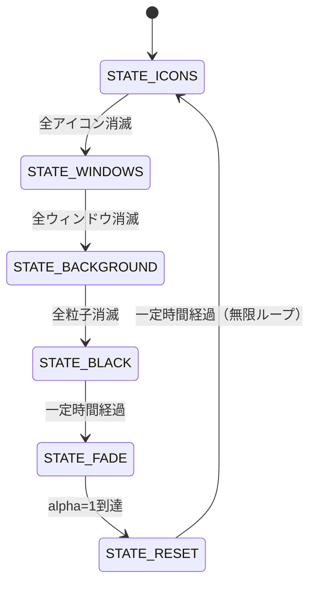

# Spiral Suction Saver

デスクトップのアイコン・開いているウィンドウ・壁紙を、画面上を漂う一点へ**らせん軌道で
吸い込む**アニメーションを描画する Windows スクリーンセーバー (`.scr`) です。
すべて吸い込まれると画面が黒くなり、元の壁紙へフェードインして最初の状態に戻る
（無限ループ）動作をします。

> **注記**: 本ソフトウェアおよび付随するドキュメントは AI (Claude Code) によるコーディングで
> 作成されました。フルスクリーン実行時 (`/s`) は、開始直後に実際のデスクトップアイコンの
> 位置と開いているウィンドウの位置を**読み取り専用で**取得し、その位置を起点に吸い込みアニメーション
> を開始します（`EnumWindows`/`GetWindowRect` 等の標準 API と、デスクトップアイコン一覧
> (`SysListView32`) からの読み取りによるものです）。同時に画面の内容も1回だけキャプチャし、
> 矩形の見た目としてクリッピングして貼り付けます（詳細は後述）。**実際のアイコン・ウィンドウを
> 移動・削除したり、OS の設定を変更したりすることは一切ありません** -- 位置や見た目を「読む」
> だけで、何も動かしません。これらの取得に失敗した場合（別シェル利用時、セキュリティソフトに
> よるブロックなど）は、自動的にランダム生成の模擬レイアウトにフォールバックします。

## ソフト概要

- 吸い込みの中心は画面内をランダムウォークで移動します。
- アイコン → ウィンドウ → 背景画像 (NxN 粒子に分割) の順に、らせん軌道を描きながら
  中心へ吸い込まれて消滅します。背景画像の吸い込みは、中心に近づくほど角速度が上がり、
  らせん状に歪んでいく演出になっています。
- 全て吸い込まれると画面は黒一色になり、その後、元の壁紙へフェードイン (alpha 0→1) し、
  アイコン・ウィンドウを元の位置に再表示してから、また最初のステップへ戻ります。
- 背景画像は既定で Windows の現在の壁紙を自動取得しますが、設定画面から任意の画像
  (BMP/JPEG/PNG/GIF) に差し替えられます。
- フルスクリーン実行時、アイコン・ウィンドウの矩形は実際の位置から開始し、見た目も
  起動直後に1回だけ取得した画面のクリッピング画像で描画されます。実位置の取得に失敗した
  場合は個数20〜40個(アイコン)/5〜10個(ウィンドウ)程度のランダム配置に、画面取得に
  失敗した場合は単色の矩形に、それぞれ独立してフォールバックします。プレビュー表示時
  (`/p`) は縮小シミュレーション用のため、常にランダム配置・単色矩形で表示します。
- 粒子数は設定画面から Low(1,000) / Mid(3,000) / High(6,000) / Max(12,000) / Auto(GPU自動判定)
  / Custom(任意の値) から選択できます。

## 技術的特徴

- **言語/API**: C++17、Win32 API、OpenGL 1.1 固定機能パイプライン (`glBegin`/`glEnd`)。
- **描画方式**: ダブルバッファリング (`PFD_DOUBLEBUFFER`)、60fps を目標としたフレーム制御。
  アイコン・ウィンドウ・粒子はそれぞれ種別ごとに **1回の `glBegin`/`glEnd`** でまとめて描画し、
  粒子数が多い設定でも固定機能のまま実用的な速度で動作するよう最適化しています。
- **画像デコード**: Windows Imaging Component (WIC) を利用し、外部の画像ライブラリに依存せず
  BMP/JPEG/PNG/GIF を読み込みます。
- **実デスクトップの読み取り (読み取り専用)**: フルスクリーン実行時、自分のウィンドウで
  画面を覆う直前に、(1) `BitBlt` で画面を1回だけキャプチャし、(2) `EnumWindows`+
  `GetWindowRect`(可能なら `DwmGetWindowAttribute` で影を除いた実際の可視領域)で開いている
  ウィンドウの位置を、(3) デスクトップのアイコン一覧 (`Progman`/`WorkerW` →
  `SHELLDLL_DefView` → `SysListView32`) から `LVM_GETITEMRECT`/`LVM_GETITEMTEXT` でアイコンの
  位置とラベルを、それぞれ取得します。いずれも標準 API による読み取りのみで、移動・削除・
  設定変更は一切行いません。取得に失敗した項目ごとに独立してランダム配置/単色矩形へ
  フォールバックするため、失敗しても動作は継続します。
- **文字化け対策**: 実ウィンドウ/アイコンのラベルは日本語等の非ASCII文字を含み得ますが、
  固定機能OpenGLのビットマップフォント (`wglUseFontBitmaps`) はASCII専用のため、非ASCII文字を
  含むラベルはテキスト描画をスキップします（矩形自体は表示され、画面キャプチャが有効なら
  実際のラベル文字は画像として正しく見えます）。
- **らせん軌道の演出**: 背景粒子は中心に近づくほど角速度が上乗せされる
  (`SpiralParams::centerAccelFactor`) ため、吸い込まれる画像がらせん状に歪んで見えます。
- **設定の保存**: レジストリではなく `%APPDATA%\SpiralSuctionSaver\config.ini` に保存します。
- **アーキテクチャ**: 純粋ロジック (`src/core/`) と Win32/OpenGL 実装 (`src/platform/win32/`) を
  分離しており、`src/core/` は Windows 非依存の C++17 のみで書かれているため Linux 上でも
  ビルド・単体テストできます。詳細は [`docs/DESIGN.md`](docs/DESIGN.md) を参照してください。



## 依存ライブラリとインストール手順

追加の外部ライブラリは不要です（Windows SDK / MinGW-w64 に含まれるヘッダとインポート
ライブラリのみを使用: `opengl32`, `gdi32`, `user32`, `shell32`, `comdlg32`, `ole32`,
`windowscodecs`)。

### 必要なもの

- CMake 3.15 以上
- 以下のいずれかのコンパイラ
  - **MSVC** (Visual Studio 2019/2022 の「C++ によるデスクトップ開発」ワークロード、
    または Visual Studio Build Tools)
  - **MinGW-w64** (`g++-mingw-w64-x86-64` など。Linux/WSL2 からのクロスコンパイルにも対応)
  - **Clang** (Windows ターゲット、上級者向け)

### ビルド方法 (Windows / MSVC)

```powershell
cmake -S . -B build
cmake --build build --config Release
# 生成物: build\src\platform\win32\Release\SpiralSuctionSaver.scr
```

### ビルド方法 (Linux/WSL2 から MinGW-w64 でクロスコンパイル)

```bash
sudo apt install g++-mingw-w64-x86-64 mingw-w64-x86-64-dev binutils-mingw-w64-x86-64
cmake -S . -B build-win -DCMAKE_TOOLCHAIN_FILE=cmake/mingw-w64-toolchain.cmake
cmake --build build-win
# 生成物: build-win/src/platform/win32/SpiralSuctionSaver.scr
```

この手順は開発中に実際に検証済みです（ローカルに展開した MinGW-w64 でクロスコンパイルし、
`.scr` が正しい PE32+ GUI 実行ファイルとして生成されることを確認しています）。

> **MinGW-w64 ビルドと DLL 依存について**: MinGW-w64 の g++ は既定では `libstdc++`/`libgcc`/
> `libwinpthread` を動的リンクするため、それらの DLL が無い環境で実行すると
> 「`libstdc++-6.dll が見つからないため、コードの実行を続行できません`」のようなエラーになります。
> 本プロジェクトの `src/platform/win32/CMakeLists.txt` は MinGW でビルドする際に自動的に
> `-static-libgcc -static-libstdc++ -static` を付与し、これらをすべて実行ファイルに
> 静的リンクするため、上記手順どおりにビルドすれば追加の DLL を配布・同梱する必要はありません
> （`.scr` 単体で動作します）。もし独自のビルド設定でこれらのフラグを外した場合、
> `/c`（設定）や `/p`（プレビュー）はエクスプローラー経由の子プロセスとして起動されるため、
> DLL不足で起動に失敗してもエラーダイアログが表示されず「ボタンを押しても何も起きない」ように
> 見えることがあります。

### GitHub Actions でビルドする (Windows 環境が無い場合)

`.github/workflows/build.yml` は `main` への push のたびに、`windows-latest` ランナー上で
MSVC を使って実際に `.scr` をビルドし、Actions の実行結果にアーティファクト
(`SpiralSuctionSaver-scr`) としてアップロードします（同時に Linux 上での `src/core/`
ユニットテストも実行します）。Windows 実機や MinGW-w64 クロスコンパイル環境が手元に
無くても、これだけで実際の Windows ビルドを取得できます。

1. GitHub の対象リポジトリで「Actions」タブを開き、`build` ワークフローの実行から
   対象のコミット（通常は最新の成功した push）を選びます。
2. `gh` CLI がある場合は次のように実行できます。

   ```bash
   gh run list --repo <owner>/<repo> --limit 5           # 実行一覧から run ID を確認
   gh run download <run-id> --repo <owner>/<repo> \
       -n SpiralSuctionSaver-scr -D ./downloaded
   ```

   ブラウザから行う場合は、該当の Actions 実行ページを開き、「Artifacts」欄の
   `SpiralSuctionSaver-scr` をクリックしてダウンロードします（zip 展開後に `.scr` が
   出てきます）。
3. リポジトリ直下の `SpiralSuctionSaver.scr` は、この方法で最新の `main` からビルドした
   ものを都度コミットしてあります。ビルド環境を用意せずすぐ試したいだけであれば、これを
   直接 [起動方法](#起動方法) の手順でそのまま使えます。

### コアロジックの単体テストのみをビルド (Windows 不要、Linux 上で完結)

`src/core/` (らせん軌道計算・状態遷移・設定ファイルの解析など) は Windows に依存しないため、
Linux 上でもビルド・テストできます。

```bash
cmake -S . -B build-tests -DBUILD_CORE_TESTS_ONLY=ON
cmake --build build-tests
ctest --test-dir build-tests --output-on-failure
```

## 起動方法

`SpiralSuctionSaver.scr` は通常の Windows スクリーンセーバーとして動作します。

1. `SpiralSuctionSaver.scr` を `C:\Windows\System32` (または任意の場所) に配置します。
2. エクスプローラーでファイルを右クリックし「インストール」を選ぶか、ダブルクリックすると
   設定画面が開きます。
3. Windows の「設定 → 個人用設定 → ロック画面 → スクリーンセーバー」からも選択できます。

### `C:\Windows\System32` に配置できない場合（アクセス許可について）

`C:\Windows\System32` は標準ユーザー権限では書き込みできないよう NTFS のアクセス許可で
保護されています。「スクリーンセーバーの設定」画面のドロップダウンに一覧表示させるには
`.scr` をこのフォルダー (64bit 版アプリからは `C:\Windows\SysWOW64` も対象) に置く必要が
あるため、標準ユーザーのままコピーしようとすると「アクセスが拒否されました」となります。

**推奨: まずは管理者権限でコピーする**

フォルダーの権限自体は変更せず、コピー操作だけを管理者として実行すれば、通常はこれだけで
解決します（最も安全で、システム全体への影響もありません）。以下のいずれかの方法で行います。

#### 方法A: 管理者権限の PowerShell / コマンドプロンプトから `copy` する（最も簡単・確実）

1. スタートボタンを右クリックする（または <kbd>Win</kbd> + <kbd>X</kbd> キーを押す）。
2. メニューから「ターミナル (管理者)」「Windows PowerShell (管理者)」
   「コマンドプロンプト (管理者)」のいずれかを選択する
   （Windows のバージョンによって表示名が異なります）。
3. UAC (ユーザーアカウント制御) の確認画面が出たら「はい」を選ぶ。管理者アカウントで
   サインインしていない場合は、管理者アカウントのユーザー名とパスワードの入力を求められます。
4. ウィンドウのタイトルバーや先頭行に「管理者:」と表示されていれば昇格に成功しています。
5. 次のコマンドでコピーします（パスは実際の配置場所に合わせて書き換えてください）。

   ```cmd
   copy "C:\path\to\SpiralSuctionSaver.scr" "C:\Windows\System32\"
   ```

#### 方法B: エクスプローラーを管理者権限で開いてコピーする

エクスプローラーは常時稼働している共有プロセスのため、既存のウィンドウを右クリックしても
「管理者として実行」は表示されません。次の手順で**別プロセスとして管理者権限のエクスプローラー**
を起動します。

1. <kbd>Ctrl</kbd> + <kbd>Shift</kbd> + <kbd>Esc</kbd> でタスクマネージャーを開く。
2. 上部メニューの「ファイル」→「新しいタスクの実行」を選ぶ
   （メニューが表示されない場合は左下の「詳細」をクリックして展開してください）。
3. 「新しいタスクの作成」ダイアログで `explorer.exe` と入力する。
4. 「管理者特権でこのタスクを作成します。」のチェックボックスを **ON** にしてから
   「OK」をクリックする。
5. UAC の確認画面で「はい」を選ぶ。
6. 新しく開いたエクスプローラーウィンドウ（タスクバーに常駐している通常のエクスプローラーとは
   別プロセスです）で `.scr` ファイルをコピーし、`C:\Windows\System32` に貼り付けます。

#### 方法C: 「インストール」から UAC 昇格する

`.scr` ファイルを右クリックして「インストール」を選ぶと、Windows がスクリーンセーバーの
コピーと登録を自動的に行います。標準ユーザーで実行すると UAC の確認画面が表示されるので、
管理者アカウントの資格情報を入力すれば、そのまま `C:\Windows\System32` へ配置されます。

**管理者権限そのものが使えない環境向け: 一時的に書き込み権限を付与する手順**

上記がどうしても使えない場合に限り、`System32` フォルダー自体の NTFS アクセス許可を一時的に
変更して標準ユーザーでも書き込めるようにし、コピー後は必ず元に戻します。
**この手順の実行そのものには管理者権限が必要です**（それを持つ人が、後で標準ユーザーが
自分で `.scr` をコピーできるようにするための一時的な準備、という位置づけです）。
System32 の権限を緩めている間はセキュリティ上のリスクがあるため、必ず短時間で完結させ、
他のユーザーがログオンしていない状態で行ってください。

1. **管理者権限**のコマンドプロンプトを開きます (スタートメニューを右クリック →
   「ターミナル (管理者)」など)。

2. 現在のアクセス許可を必ずバックアップします（元に戻すために必須）。

   ```cmd
   icacls "C:\Windows\System32" /save "%USERPROFILE%\Desktop\System32_acl_backup.aclbak"
   ```

3. `Users` グループ (組み込みグループの well-known SID `*S-1-5-32-545` を使うと、
   表示言語が日本語版 Windows でも確実に解決できます) に、このフォルダー自体への
   書き込み権限を一時的に付与します（`(OI)(CI)` は「新規に作成されるファイル/サブフォルダーに
   継承させる」という指定で、**既存のファイルの権限には影響しません**）。

   ```cmd
   icacls "C:\Windows\System32" /grant *S-1-5-32-545:(OI)(CI)M
   ```

4. 標準ユーザーのアカウントで `.scr` を `System32` にコピーします。

   ```cmd
   copy "C:\path\to\SpiralSuctionSaver.scr" "C:\Windows\System32\"
   ```

5. **コピーが終わったら、必ず直後に元の状態へ戻します**（再び管理者権限のコマンドプロンプトで
   実行します）。

   ```cmd
   icacls "C:\Windows\System32" /restore "%USERPROFILE%\Desktop\System32_acl_backup.aclbak"
   ```

6. 元に戻ったことを確認します。

   ```cmd
   icacls "C:\Windows\System32"
   ```

   手順3で付与した `BUILTIN\Users:(OI)(CI)(M)` の行が消えていれば復元は成功です。

> **注意**: 上記の手順3〜5の間は `System32` に誰でも書き込める状態になります。作業は
> 必要最小限の時間で終わらせ、手順5を飛ばさないでください。また、Windows Resource
> Protection (WRP) や組織のグループポリシーによってこれとは別に書き込みが制限されている
> 環境では、この手順でも解決しない場合があります。その場合は素直に管理者権限でのコピー
> （上記の推奨手順）を使ってください。

### コマンドライン引数（手動実行時）

| 引数 | 動作 |
|---|---|
| `SpiralSuctionSaver.scr /s` | フルスクリーンでスクリーンセーバーを開始します。 |
| `SpiralSuctionSaver.scr /c` | 設定ダイアログを表示します。 |
| `SpiralSuctionSaver.scr /p <HWND>` | 指定したウィンドウ内にプレビュー描画します
  (Windows の「スクリーンセーバーの設定」画面が内部的に使用します)。 |
| 引数なし | 設定ダイアログを表示します（Windows の慣習に合わせた既定動作）。 |

## 使用方法

- **設定ダイアログ (`/c`)**: 粒子数のプリセット (Low/Mid/High/Max/Auto/Custom) を選択できます。
  Custom を選ぶと任意の粒子数を、Auto を選ぶと現在の GPU から自動判定した推奨粒子数が
  表示されます。背景画像は既定で現在の壁紙が使われますが、「Browse...」から任意の画像に
  変更するか、「Use system wallpaper」で自動取得に戻せます。設定は OK を押すと
  `%APPDATA%\SpiralSuctionSaver\config.ini` に保存されます。

## 終了方法

- **フルスクリーン実行中 (`/s`)**: キーボードの任意のキー、マウスのクリック、または
  一定量のマウス移動で終了します（通常の Windows スクリーンセーバーと同じ操作感です）。
- **設定ダイアログ**: 「OK」または「Cancel」ボタン、あるいはウィンドウを閉じることで終了します。

## 使用上の注意点

- 本ソフトウェアは実際のデスクトップアイコン・開いているウィンドウの位置や見た目を
  フルスクリーン実行時に**読み取り専用**で取得しますが、移動・削除・サイズ変更など
  実際のデスクトップへの操作は一切行いません。読み取りに失敗した場合はランダム配置の
  模擬データにフォールバックします（プレビュー表示時は常に模擬データです）。
- OS の設定（壁紙など）を変更することはありません。壁紙・画面・ウィンドウ位置・アイコン
  位置の取得はいずれも読み取り専用です。
- 対応解像度はプライマリディスプレイのみです（マルチモニタでの動作範囲外）。
- ログは `%APPDATA%\SpiralSuctionSaver\saver.log` に出力されます（1MB を超えると自動的に
  ローテートされます）。

## テスト

`src/core/` の各モジュールに対する単体テストが `tests/` にあります（外部依存ゼロの自作
テストハーネス使用）。実行方法は [依存ライブラリとインストール手順](#依存ライブラリとインストール手順)
の「コアロジックの単体テストのみをビルド」を参照してください。

Windows 実機での結合テスト用チェックリストは [`docs/DESIGN.md`](docs/DESIGN.md#83-手動確認チェックリスト-windows実機)
にあります。GitHub Actions (`.github/workflows/build.yml`) では、Windows 実機ビルド (MSVC) と
Linux 上でのユニットテストの両方を自動実行します。

## ライセンス

このプロジェクトは [Apache License 2.0](LICENSE) の下で公開されています。

## 開発について

本ソフトウェアの設計・実装・テストコード・ドキュメントは、要件定義書 (`要件.txt`) に基づき
Claude Code (AI コーディングエージェント) によって生成されました。
