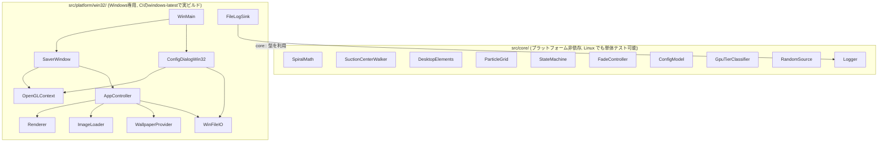
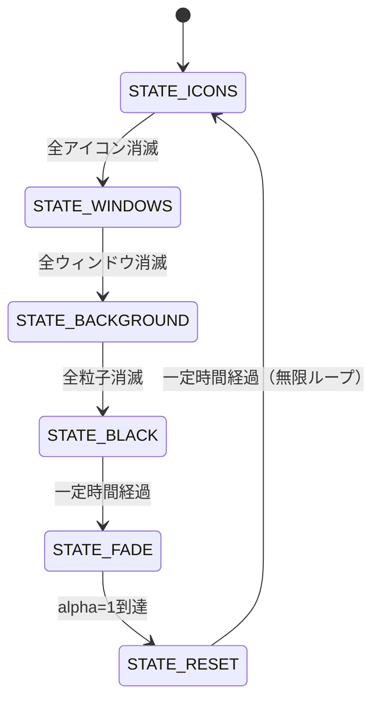

# Spiral Suction Saver 設計書

対象: `要件.txt` に基づく Windows スクリーンセーバー (.scr)。
本書は `skil.md` の定める「設計書は第三者が読んでも実装可能なレベルまで詳細化する」を満たすことを目的とする。

## 1. 全体アーキテクチャ

コアロジック (`src/core/`) を Win32/OpenGL 実装 (`src/platform/win32/`) から完全に分離した。
`src/core/` は Windows ヘッダに一切依存しない C++17 のみで書かれており、Linux 上でも
ビルド・単体テストできる。これは開発機が Linux (WSL2) で Windows/MSVC/MinGW-w64 が
未導入という制約への対応であり、かつ「小さな関数・小さなモジュール」への分割にも資する。



## 2. モジュール構成

### 2.1 src/core/

| モジュール | 責務 |
|---|---|
| `SpiralMath` | θ+=dTheta, r-=speed のらせん軌道計算 (要件§4, §7)。`SpiralState`/`SpiralParams`/`StepSpiral`。 |
| `SuctionCenterWalker` | 吸い込み中心のランダムウォーク (1〜3px/frame 相当、画面端で反射)。`IRandomSource` を注入して決定的にテスト可能。 |
| `DesktopElements` | アイコン(20-40)・ウィンドウ(5-10)を矩形+ラベルとして模擬生成。**シード付きで決定的**であり、起動時に一度だけ生成して毎ループ再利用する (要件§4 step6)。実デスクトップは一切読み書きしない。 |
| `ParticleGrid` | 背景画像を NxN 粒子に分割 (要件§5)。`ComputeGridDimensionForParticleCount` が希望粒子数から N を逆算。 |
| `StateMachine` | `STATE_ICONS→WINDOWS→BACKGROUND→BLACK→FADE→RESET→ICONS` の純粋な遷移関数 (要件§8)。 |
| `FadeController` | 黒→背景画像のフェード (alpha 0→1、時間ベース)。 |
| `ConfigModel` | 粒子数プリセット(Low/Mid/High/Max/Auto/Custom)+背景画像上書きパスと、iniテキストとの相互変換。不正な値は既定値にフォールバックする。 |
| `GpuTierClassifier` | GL_VENDOR/RENDERER/VERSION 文字列→粒子数の純関数 (要件§6 自動判定)。実GLコンテキスト不要でテスト可能。 |
| `RandomSource` | `IRandomSource` の std::mt19937 実装 (本番用)。テストは別途フェイク実装を使う。 |
| `Logger` | sink注入型の最小ロガー。本番はファイル出力、テストはメモリキャプチャに差し替え可能。 |

### 2.2 src/platform/win32/

| モジュール | 責務 |
|---|---|
| `WinMain.cpp` | エントリポイント。`/s /c /p` 引数を解析しディスパッチする。 |
| `SaverWindow` | フルスクリーン(/s)またはプレビュー子ウィンドウ(/p)の作成とメインループ (60fps目標、Update/Draw/SwapBuffers)。 |
| `OpenGLContext` | PIXELFORMATDESCRIPTOR設定 + `wglCreateContext` + ダブルバッファ。GPU自動判定のための一時コンテキスト作成にも使う。 |
| `AppController` | 状態機械・らせん状態・粒子・タイマーを保持し、`Update(dt)`/`Draw()` で要件§4の吸い込み順序を実行するオーケストレータ。 |
| `Renderer` | 固定機能OpenGLの描画バッチ関数群 (アイコン・ウィンドウ・粒子をそれぞれ `glBegin`/`glEnd` 1回で描画、要件§7)。 |
| `TextRenderer` | `wglUseFontBitmaps` によるビットマップフォント表示リストで、アイコン/ウィンドウのラベルを固定機能のまま描画。 |
| `ImageLoader` | Windows Imaging Component (WIC) でBMP/JPEG/PNG/GIFをデコードしGLテクスチャ化。外部画像ライブラリ不要。 |
| `WallpaperProvider` | `SystemParametersInfoW(SPI_GETDESKWALLPAPER)` で現在の壁紙パスを取得 (読み取り専用)。 |
| `ConfigDialogWin32` | `/c` 設定ダイアログ (プリセットコンボ、カスタム数値、Auto検出結果表示、壁紙上書き選択)。 |
| `AppPaths` / `WinFileIO` | `%APPDATA%/SpiralSuctionSaver/{config.ini,saver.log}` の解決とワイド文字パスでのファイルI/O (非ASCIIユーザー名対策)。 |
| `FileLogSink` | `core::Logger` にファイル出力シンクを登録 (1MB超でローテート)。 |
| `StringConvert` | UTF-8 (core側の文字列表現) ⇄ UTF-16 (Win32 API) 変換。 |

## 3. 状態遷移



各フェーズの詳細:

- **STATE_ICONS**: 背景画像を全画面に描画。ウィンドウは元の位置のまま静止表示。アイコンは
  `SpiralMath` で中心へ吸い込まれ、r<=0で消滅する。
- **STATE_WINDOWS**: アイコンは全消滅済みのため非表示。ウィンドウが吸い込まれる。
- **STATE_BACKGROUND**: 画面を黒でクリアしてから粒子をバッチ描画するため、吸い込まれた
  箇所から自然に黒が露出する。
- **STATE_BLACK**: 黒一色を一定時間 (1秒) 保持。
- **STATE_FADE**: 黒背景の上に背景画像を alpha=0→1 でブレンド。
- **STATE_RESET**: 背景・ウィンドウ・アイコンを全て元の位置で静止表示し、一定時間 (1.5秒)
  保持してから `STATE_ICONS` に戻る。アイコン/ウィンドウは起動時に生成した同じレイアウトを
  再利用するため、要件§4 step6 の「元の位置に再描画」を満たす。

## 4. データフロー (1フレーム)

```mermaid
sequenceDiagram
    participant Loop as SaverWindow メインループ
    participant App as AppController
    participant Center as SuctionCenterWalker
    participant Spiral as SpiralMath (対象ごと)
    participant SM as SaverStateMachine
    participant Draw as Renderer

    Loop->>App: Update(dt)
    App->>Center: Step(rng)
    Center-->>App: 現在の中心座標
    App->>Spiral: StepSpiral(state, params, center)
    Spiral-->>App: 新しい位置 / alive
    App->>SM: Advance(inputs)
    SM-->>App: 状態遷移の有無
    Loop->>App: Draw()
    App->>Draw: DrawXxxBatched(...)
    Loop->>Loop: SwapBuffers()
```

## 5. エラーハンドリング方針

| 状況 | 対応 |
|---|---|
| 背景画像の読み込み失敗 (壁紙/上書き画像とも) | 単色プレースホルダー画像で継続する。クラッシュさせない。 |
| `config.ini` の内容が不正 | 該当フィールドのみ既定値にフォールバック (Mid/3000粒子/上書きなし)。ファイル全体を無視することはしない。 |
| OpenGL コンテキスト生成失敗 | 致命的とみなし、`MessageBox` 表示後にそのモードを終了する (処理を継続できないため)。 |
| `%APPDATA%` が解決できない | ログ出力・設定保存を諦めて既定値で動作を継続する。 |

全 Win32 ハンドル (HWND/HDC/HGLRC/テクスチャ/表示リスト) は RAII (デストラクタでの解放) または
明示的な `Shutdown()` で確実に解放する。スクリーンセーバーは無期限に稼働し得るため、
フレームごとに確保・解放を行わない設計 (バッチ描画・使い回しバッファ) にしている。

## 6. ロギング方針

`core::Logger` はシンク注入型。本番は `platform::InstallFileLogSink()` が
`%APPDATA%/SpiralSuctionSaver/saver.log` への追記シンクを登録し、1MBを超えたら
ローテート（切り詰めて再作成）する。ユニットテストではシンクを設定しない
(またはメモリキャプチャに差し替える) ため、ファイルI/Oなしでロジックを検証できる。

## 7. 設定ファイル仕様

`%APPDATA%/SpiralSuctionSaver/config.ini`:

```ini
[SpiralSuctionSaver]
Preset=Mid
CustomParticleCount=3000
BackgroundImageOverride=
```

- `Preset`: `Low|Mid|High|Max|Auto|Custom` (大文字小文字を区別しない)。
- `CustomParticleCount`: `Preset=Custom` のときのみ使用。正の整数以外は既定値(3000)。
- `BackgroundImageOverride`: 空なら現在の壁紙を自動使用。

## 8. テスト方針

### 8.1 単体テスト (このリポジトリで実行・全緑を完成条件とする)

`tests/` に `src/core/` の各モジュールに対する自作最小テストハーネス
(`tests/test_framework.h`、外部依存ゼロ) ベースのテストを配置。

```bash
cmake -S . -B build-tests -DBUILD_CORE_TESTS_ONLY=ON
cmake --build build-tests
ctest --test-dir build-tests --output-on-failure
```

対象: `SpiralMath` の収束性、`SuctionCenterWalker` の境界反射、`StateMachine` の全遷移経路、
`ParticleGrid` の件数・範囲、`ConfigModel` のini往復変換と不正値フォールバック、
`GpuTierClassifier` の既知ベンダ文字列分類、`DesktopElements` の個数・範囲・再現性、
`RandomSource` の値域。

### 8.2 結合テスト

Win32/OpenGL実装はLinux開発機でコンパイルできないため、GitHub Actions
`windows-latest` (MSVC) での実ビルド成功を結合スモークテストとする
(`.github/workflows/build.yml`)。加えて、開発中に **MinGW-w64 をローカルに展開して
クロスコンパイルし、実際に `.scr` (PE32+ GUI 実行ファイル) が生成されることを確認済み**
であり、その過程で以下の問題を発見・修正した:

- `windres` は既定でターゲット依存マクロ (`_WIN32`/`_WIN64`) を定義しないため
  `<windows.h>` のプリプロセスに失敗する → `--preprocessor` に g++ 自身を指定して回避。
- `UNICODE`/`_UNICODE` を定義しないと `LoadCursor` 等の汎用マクロが ANSI 版に展開され、
  `LPCWSTR` を要求する呼び出しと型不一致になる → ターゲットに明示的に定義。
- エントリポイントを `wWinMain` にすると MSVC/MinGW いずれも既定のリンカ設定では
  `WinMainCRTStartup` が `WinMain` を要求し未解決シンボルになる → コマンドラインは
  `GetCommandLineW`/`CommandLineToArgvW` で自前解析しているため、`lpCmdLine` を
  使わない `WinMain` (ANSI シグネチャ) をエントリポイントに採用し、
  追加のリンカフラグなしで両ツールチェーンに対応した。

### 8.3 手動確認チェックリスト (Windows実機)

- [ ] `SpiralSuctionSaver.scr /s` でフルスクリーン起動し、アイコン→ウィンドウ→背景粒子→
      黒→フェードイン→リセットの順にループすることを目視確認する。
- [ ] キー入力・クリック・一定量のマウス移動で `/s` が終了することを確認する。
- [ ] `SpiralSuctionSaver.scr /c` で設定ダイアログが開き、プリセット変更・カスタム値・
      Auto判定結果表示・背景画像の変更ができ、`config.ini` に保存されることを確認する。
- [ ] Windowsの「スクリーンセーバーの設定」プレビュー枠で `/p` によるプレビューが表示され、
      設定ダイアログを閉じるとプレビューも終了することを確認する。
- [ ] 壁紙を変更した状態で上書き未設定のときに新しい壁紙が反映されることを確認する。

## 9. 既知の制約・スコープ外事項

- マルチモニタは対象外とし、プライマリディスプレイの解像度のみを使用する
  (要件.txt に明記がないため、設計レビューでスコープを明示的に限定)。
- 実デスクトップのアイコン配置・実際に開いているウィンドウは一切読み取らず、
  すべて模擬データ (`DesktopElements`) を用いる (要件§10 禁止事項準拠)。
