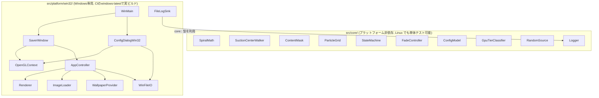
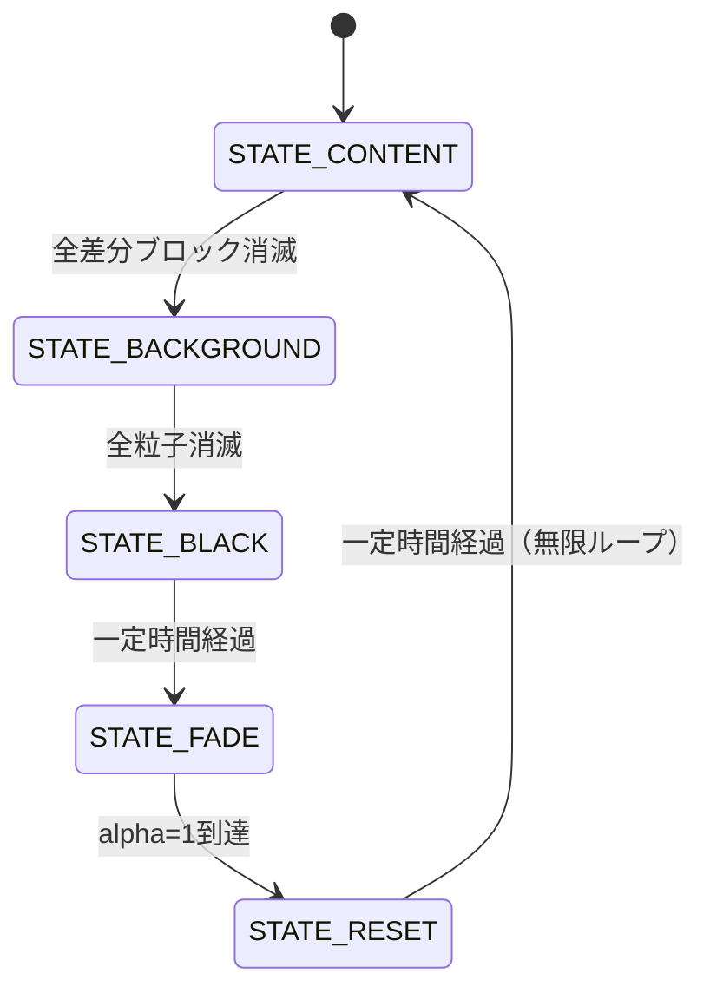

# Spiral Suction Saver 設計書

対象: `要件.txt` に基づく Windows スクリーンセーバー (.scr)。
本書は `skil.md` の定める「設計書は第三者が読んでも実装可能なレベルまで詳細化する」を満たすことを目的とする。

## 1. 全体アーキテクチャ

コアロジック (`src/core/`) を Win32/OpenGL 実装 (`src/platform/win32/`) から完全に分離した。
`src/core/` は Windows ヘッダに一切依存しない C++17 のみで書かれており、Linux 上でも
ビルド・単体テストできる。これは開発機が Linux (WSL2) で Windows/MSVC/MinGW-w64 が
未導入という制約への対応であり、かつ「小さな関数・小さなモジュール」への分割にも資する。



## 2. モジュール構成

### 2.1 src/core/

| モジュール | 責務 |
|---|---|
| `SpiralMath` | θ+=dTheta, r-=speed のらせん軌道計算 (要件§4, §7)。`SpiralState`/`SpiralParams`/`StepSpiral`。`SpiralParams::centerAccelFactor`(>0)で中心に近づくほど角速度が増し、らせん状に歪む(追加要望対応、既定0で従来どおり)。`MakeParamsForRevolutions(r0, suctionSpeed, targetRevolutions)`は、開始半径`r0`から逆算したdThetaを返し、r0の大小にかかわらずほぼ指定回転数で中心に消えるようにする(追加要望: らせん回転をもっと緩やかにし3〜5周回するくらいにする)。 |
| `SuctionCenterWalker` | 吸い込み中心のランダムウォーク (1〜3px/frame 相当、画面端で反射)。`IRandomSource` を注入して決定的にテスト可能。 |
| `ContentMask` | 実画面キャプチャと壁紙画像をグリッドセル単位で差分判定し、「差分ブロック(=実際のアイコン/タスクバー/開いているウィンドウなど)」のセルだけを`true`にした`bool`配列を返す。`ResampleRgba`で壁紙画像を画面サイズへニアレストネイバー変換してから比較する。Windows非依存の純粋関数群。 |
| `ParticleGrid` | 背景画像を NxN 粒子に分割 (要件§5)。`ComputeGridDimensionForParticleCount` が希望粒子数から N を逆算。差分ブロックフェーズもこの同じグリッドを`ContentMask`で絞り込んだ部分集合を使う。 |
| `StateMachine` | `STATE_CONTENT→BACKGROUND→BLACK→FADE→RESET→CONTENT` の純粋な遷移関数 (要件§8)。`STATE_CONTENT`は旧`STATE_ICONS`/`STATE_WINDOWS`を統合したもの(§9参照)。 |
| `FadeController` | 黒→背景画像のフェード (alpha 0→1、時間ベース)。 |
| `ConfigModel` | 粒子数プリセット(Low/Mid/High/Max/Auto/Custom)+背景画像上書きパスと、iniテキストとの相互変換。不正な値は既定値にフォールバックする。 |
| `GpuTierClassifier` | GL_VENDOR/RENDERER/VERSION 文字列→粒子数の純関数 (要件§6 自動判定)。実GLコンテキスト不要でテスト可能。 |
| `RandomSource` | `IRandomSource` の std::mt19937 実装 (本番用)。テストは別途フェイク実装を使う。 |
| `Logger` | sink注入型の最小ロガー。本番はファイル出力、テストはメモリキャプチャに差し替え可能。 |

### 2.2 src/platform/win32/

| モジュール | 責務 |
|---|---|
| `WinMain.cpp` | エントリポイント。`/s /c /p` 引数を解析しディスパッチする。 |
| `SaverWindow` | フルスクリーン(/s)またはプレビュー子ウィンドウ(/p)の作成とメインループ (60fps目標、Update/Draw/SwapBuffers)。 |
| `OpenGLContext` | PIXELFORMATDESCRIPTOR設定 + `wglCreateContext` + ダブルバッファ。GPU自動判定のための一時コンテキスト作成にも使う。 |
| `AppController` | 状態機械・らせん状態・粒子・タイマーを保持し、`Update(dt)`/`Draw()` で要件§4の吸い込み順序を実行するオーケストレータ。起動時に`core::ContentMask`で差分ブロックを決め、`core::ParticleGrid`の部分集合として吸い込み対象を持つ。 |
| `Renderer` | 固定機能OpenGLの描画バッチ関数群 (全画面クアッド・粒子をそれぞれ `glBegin`/`glEnd` 1回で描画、要件§7)。差分ブロック・背景粒子はいずれも同じ`DrawParticlesBatched`を使う。 |
| `ImageLoader` | Windows Imaging Component (WIC) でBMP/JPEG/PNG/GIFをデコードしGLテクスチャ化。外部画像ライブラリ不要。 |
| `ScreenCapture` | `BitBlt`で画面を1回読み取り`DecodedImage`化。`AppController`がこれを壁紙画像と差分判定し、差分ブロックのテクスチャとしても使う。読み取り専用。 |
| `WallpaperProvider` | `SystemParametersInfoW(SPI_GETDESKWALLPAPER)` で現在の壁紙パスを取得 (読み取り専用)。 |
| `ConfigDialogWin32` | `/c` 設定ダイアログ (プリセットコンボ、カスタム数値、Auto検出結果表示、壁紙上書き選択)。 |
| `AppPaths` / `WinFileIO` | `%APPDATA%/SpiralSuctionSaver/{config.ini,saver.log}` の解決とワイド文字パスでのファイルI/O (非ASCIIユーザー名対策)。 |
| `FileLogSink` | `core::Logger` にファイル出力シンクを登録 (1MB超でローテート)。 |
| `StringConvert` | UTF-8 (core側の文字列表現) ⇄ UTF-16 (Win32 API) 変換。 |

## 3. 状態遷移



各フェーズの詳細:

- **STATE_CONTENT**: 背景画像(壁紙)を全画面に描画したうえで、`core::ContentMask`が実画面
  キャプチャと壁紙の差分から検出した「差分ブロック」(実際のアイコン・タスクバー・開いている
  ウィンドウなど、壁紙の上に何か描かれている箇所)だけを、`ScreenCapture`のキャプチャ画像を
  テクスチャにして`SpiralMath`で中心へ吸い込む。差分のなかったセルは最初から描画対象に
  含まれないため、背景の壁紙がそのまま見え続ける(=「透明化」)。各ブロックは
  `MakeParamsForRevolutions`で個別に算出したdThetaにより、開始距離に関わらずほぼ3〜5周回
  してから中心に消える(追加要望対応)。実画面キャプチャが無い場合(プレビュー時・取得失敗時)は
  差分ブロックが0件になり、このフェーズは実質的に即座にスキップされて`STATE_BACKGROUND`に進む。
- **STATE_BACKGROUND**: 画面を黒でクリアしてから粒子をバッチ描画するため、吸い込まれた
  箇所から自然に黒が露出する。粒子の`SpiralParams`には`centerAccelFactor`(既定40)が設定され、
  中心に近づくほど角速度が増してらせん状に歪む演出になる(STATE_CONTENTとは異なるパラメータ
  セットであり、今回の「回転を緩やかに」対応の対象外)。
- **STATE_BLACK**: 黒一色を一定時間 (1秒) 保持。
- **STATE_FADE**: 黒背景の上に背景画像を alpha=0→1 でブレンド。
- **STATE_RESET**: 背景(壁紙)と差分ブロックを全て元の位置で静止表示し、一定時間 (1.5秒)
  保持してから `STATE_CONTENT` に戻る。差分ブロックは起動時に検出した同じ位置・同じ内容を
  再利用するため、要件§4 step6 の「元の位置に再描画」を満たす。

## 4. データフロー (1フレーム)

```mermaid
sequenceDiagram
    participant Loop as SaverWindow メインループ
    participant App as AppController
    participant Center as SuctionCenterWalker
    participant Spiral as SpiralMath (対象ごと)
    participant SM as SaverStateMachine
    participant Draw as Renderer

    Loop->>App: Update(dt)
    App->>Center: Step(rng)
    Center-->>App: 現在の中心座標
    App->>Spiral: StepSpiral(state, params, center)
    Spiral-->>App: 新しい位置 / alive
    App->>SM: Advance(inputs)
    SM-->>App: 状態遷移の有無
    Loop->>App: Draw()
    App->>Draw: DrawXxxBatched(...)
    Loop->>Loop: SwapBuffers()
```

## 5. エラーハンドリング方針

| 状況 | 対応 |
|---|---|
| 背景画像の読み込み失敗 (壁紙/上書き画像とも) | 単色プレースホルダー画像で継続する。クラッシュさせない。 |
| `config.ini` の内容が不正 | 該当フィールドのみ既定値にフォールバック (Mid/3000粒子/上書きなし)。ファイル全体を無視することはしない。 |
| OpenGL コンテキスト生成失敗 | 致命的とみなし、`MessageBox` 表示後にそのモードを終了する (処理を継続できないため)。 |
| `%APPDATA%` が解決できない | ログ出力・設定保存を諦めて既定値で動作を継続する。 |

全 Win32 ハンドル (HWND/HDC/HGLRC/テクスチャ/表示リスト) は RAII (デストラクタでの解放) または
明示的な `Shutdown()` で確実に解放する。スクリーンセーバーは無期限に稼働し得るため、
フレームごとに確保・解放を行わない設計 (バッチ描画・使い回しバッファ) にしている。

## 6. ロギング方針

`core::Logger` はシンク注入型。本番は `platform::InstallFileLogSink()` が
`%APPDATA%/SpiralSuctionSaver/saver.log` への追記シンクを登録し、1MBを超えたら
ローテート（切り詰めて再作成）する。ユニットテストではシンクを設定しない
(またはメモリキャプチャに差し替える) ため、ファイルI/Oなしでロジックを検証できる。

## 7. 設定ファイル仕様

`%APPDATA%/SpiralSuctionSaver/config.ini`:

```ini
[SpiralSuctionSaver]
Preset=Mid
CustomParticleCount=3000
BackgroundImageOverride=
```

- `Preset`: `Low|Mid|High|Max|Auto|Custom` (大文字小文字を区別しない)。
- `CustomParticleCount`: `Preset=Custom` のときのみ使用。正の整数以外は既定値(3000)。
- `BackgroundImageOverride`: 空なら現在の壁紙を自動使用。

## 8. テスト方針

### 8.1 単体テスト (このリポジトリで実行・全緑を完成条件とする)

`tests/` に `src/core/` の各モジュールに対する自作最小テストハーネス
(`tests/test_framework.h`、外部依存ゼロ) ベースのテストを配置。

```bash
cmake -S . -B build-tests -DBUILD_CORE_TESTS_ONLY=ON
cmake --build build-tests
ctest --test-dir build-tests --output-on-failure
```

対象: `SpiralMath` の収束性・`centerAccelFactor`による角速度増加とクランプ挙動・
`MakeParamsForRevolutions`の目標回転数への収束と極小半径時のフォールバック、
`SuctionCenterWalker` の境界反射、`StateMachine` の全遷移経路、
`ParticleGrid` の件数・範囲、`ContentMask` の差分判定(同一/差分セルのみ検出/閾値未満は
無視)とリサンプルの正しさ、`ConfigModel` のini往復変換と不正値フォールバック、
`GpuTierClassifier` の既知ベンダ文字列分類、`RandomSource` の値域。

### 8.2 結合テスト

Win32/OpenGL実装はLinux開発機でコンパイルできないため、GitHub Actions
`windows-latest` (MSVC) での実ビルド成功を結合スモークテストとする
(`.github/workflows/build.yml`)。加えて、開発中に **MinGW-w64 をローカルに展開して
クロスコンパイルし、実際に `.scr` (PE32+ GUI 実行ファイル) が生成されることを確認済み**
であり、その過程で以下の問題を発見・修正した:

- `windres` は既定でターゲット依存マクロ (`_WIN32`/`_WIN64`) を定義しないため
  `<windows.h>` のプリプロセスに失敗する → `--preprocessor` に g++ 自身を指定して回避。
- `UNICODE`/`_UNICODE` を定義しないと `LoadCursor` 等の汎用マクロが ANSI 版に展開され、
  `LPCWSTR` を要求する呼び出しと型不一致になる → ターゲットに明示的に定義。
- エントリポイントを `wWinMain` にすると MSVC/MinGW いずれも既定のリンカ設定では
  `WinMainCRTStartup` が `WinMain` を要求し未解決シンボルになる → コマンドラインは
  `GetCommandLineW`/`CommandLineToArgvW` で自前解析しているため、`lpCmdLine` を
  使わない `WinMain` (ANSI シグネチャ) をエントリポイントに採用し、
  追加のリンカフラグなしで両ツールチェーンに対応した。

### 8.3 手動確認チェックリスト (Windows実機)

- [ ] `SpiralSuctionSaver.scr /s` でフルスクリーン起動し、差分ブロック→背景粒子→
      黒→フェードイン→リセットの順にループすることを目視確認する。
- [ ] キー入力・クリック・一定量のマウス移動で `/s` が終了することを確認する。
- [ ] `SpiralSuctionSaver.scr /c` で設定ダイアログが開き、プリセット変更・カスタム値・
      Auto判定結果表示・背景画像の変更ができ、`config.ini` に保存されることを確認する。
- [ ] Windowsの「スクリーンセーバーの設定」プレビュー枠で `/p` によるプレビューが表示され、
      設定ダイアログを閉じるとプレビューも終了することを確認する(プレビューは実画面キャプチャ
      を行わないため差分ブロックフェーズはなく、背景粒子フェーズから始まって見える -- §9参照)。
- [ ] 壁紙を変更した状態で上書き未設定のときに新しい壁紙が反映されることを確認する。
- [ ] `/s` 実行時、実際のアイコン・タスクバー・開いているウィンドウなど壁紙の上に何か
      表示されている箇所だけがブロックとして吸い込まれ、何もない箇所は最初から壁紙が
      見えていることを確認する。
- [ ] 差分ブロックが中心に吸い込まれるまでに、目視でおおよそ3〜5回転していることを確認する
      (ブロックごとに開始位置からの回転数は個体差があってよい)。
- [ ] 背景粒子が吸い込まれる際は、差分ブロックのフェーズとは別の回転演出(中心に近づくほど
      回転が速くなりらせん状に歪む)になっていることを確認する。
- [ ] Windowsの壁紙表示設定(塗りつぶし/フィット/中央/タイル等)によって、差分ブロックの
      検出精度が変わらないか確認する(ズレが大きい場合は`core::ContentMaskConfig`の
      `pixelDiffThreshold`/`cellDifferingFraction`を調整する)。

## 9. 既知の制約・スコープ外事項

- マルチモニタは対象外とし、プライマリディスプレイの解像度のみを使用する
  (要件.txt に明記がないため、設計レビューでスコープを明示的に限定)。
- 実デスクトップのアイコン・ウィンドウを移動・削除・設定変更する操作は一切行わない
  (要件§10 禁止事項準拠)。以下で述べる画面キャプチャ・差分判定はいずれも
  **読み取り専用**であり、「操作」ではない。

### 9.1 「実際にあった内容から吸い込んでほしい」への対応の変遷

当初の要件§3は「矩形+ラベルのみの抽象表現、位置はランダム生成」だったが、実運用
フィードバックを受けて複数段階で変更した。

1. 「ただの箱に見える」→ 起動直後の画面を1回`BitBlt`で読み取り(`ScreenCapture`)、矩形の
   見た目をそのクリッピングでテクスチャリングするよう変更(位置は依然ランダム)。
2. 「ランダムな位置ではなく実際にあった位置から吸い込んでほしい」→ `EnumWindows`でウィンドウ
   矩形を、アイコン用`ListView`のクロスプロセス読み取りでアイコン矩形を取得し、`DesktopElements`
   の乱数レイアウトの代わりに使うよう変更。重なったウィンドウ/アイコンの見た目のずれ対策として、
   さらに`PrintWindow`で個別ウィンドウ・アイコン層ごとにキャプチャする仕組みも追加した。
3. **(今回)実機で試したところ2の個別クエリ方式は期待した見た目にならなかった**ため、
   個別のアイコン/ウィンドウ矩形という抽象化そのものをやめ、**画面全体のキャプチャと
   壁紙画像の差分だけで「差分ブロック」を決める**方式に置き換えた
   (`EnumWindows`/アイコン`ListView`読み取り/`PrintWindow`個別キャプチャ、および
   `DesktopElements`/`TextRenderer`は削除)。`core::ContentMask`が実画面キャプチャと
   壁紙をグリッドセル単位で比較し、差分のあるセルだけを`AppController`が
   `core::ParticleGrid`の部分集合として吸い込む。差分のないセルは最初から壁紙が
   表示されているため、「差分がない部分は透明化して背景が見えるようにする」という
   要望を自動的に満たす。個々のブロックがどのウィンドウ/アイコンに対応するかという
   意味的な情報は失われるため、**文字ラベルの表示は廃止**した(差分方式では対応関係が
   ないため付けられない)。

  実画面キャプチャ・差分判定のいずれも**位置や見た目を読み取るだけ**で、移動・削除・
  設定変更を行う操作ではないため、要件§10「実際のデスクトップを操作してはならない」には
  抵触しない（操作＝変更を指し、読み取り専用の取得は含まないと解釈）。取得に失敗した場合
  (画面キャプチャ失敗、壁紙デコード失敗等)は、差分ブロックが0件になり`STATE_CONTENT`
  フェーズが実質スキップされるだけで、クラッシュや異常動作にはならない。
  プレビュー表示 (`/p`) は意図的に画面キャプチャを行わない設計を維持しているため、
  差分ブロックのフェーズは表示されず背景粒子フェーズから始まって見える。

### 9.2 壁紙合成方式とのズレ

`core::ContentMask`は壁紙画像を`core::ResampleRgba`でニアレストネイバーにより画面サイズへ
引き伸ばして実画面キャプチャと比較する。これはWindowsの実際の壁紙表示設定(塗りつぶし/
フィット/中央/タイル等)と完全には一致しない場合があり、ズレが大きいと差分が画面全体に
出やすくなる(「差分ブロックだらけ」に近い見た目になる)。この場合も機能停止はせず、
効果が薄まるだけである。`core::ContentMaskConfig`の`pixelDiffThreshold`/
`cellDifferingFraction`は実機確認後に調整することを前提としたチューニング用の値である。
