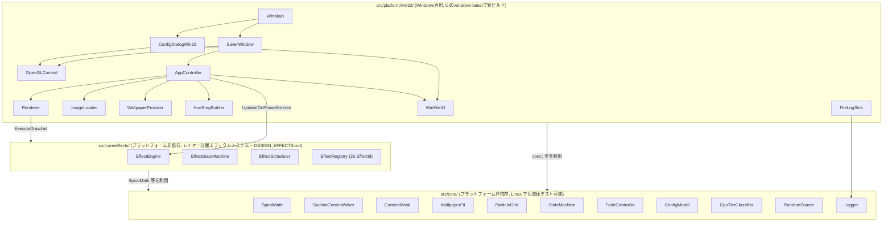
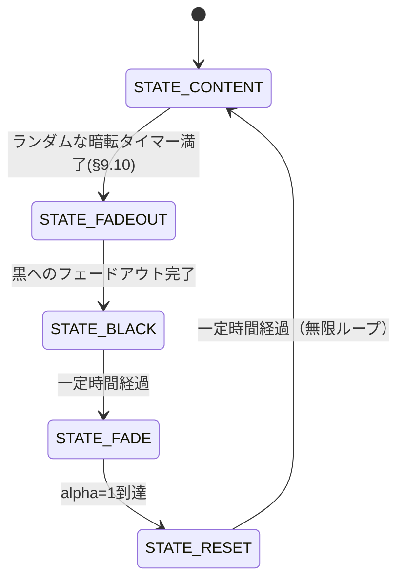

# Spiral Suction Saver 設計書

対象: `要件.txt` に基づく Windows スクリーンセーバー (.scr)。
本書は `skil.md` の定める「設計書は第三者が読んでも実装可能なレベルまで詳細化する」を満たすことを目的とする。

> **拡張について**: `追加要件.txt` に基づくレイヤー分離エフェクトシステム(上物14種・
> 背景11種のエフェクトが差分ブロック/壁紙それぞれをらせん吸い込みの前に演出する拡張)は
> 実装済みで、本書が記述する `AppController`/`Renderer`/`ImageLoader`/`ConfigDialogWin32` は
> いずれもこの拡張を含む現状のコードを反映している。ただし本書は概要レベルに留め、
> エフェクトシステム自体の詳細設計(数式・状態遷移・データモデル・テスト方針・設計判断の
> 経緯)は [`docs/DESIGN_EFFECTS.md`](DESIGN_EFFECTS.md) に譲る(本書には統合しない --
> 同ファイルの分量が本書の5倍以上あり、全文統合すると本書の可読性を損なうため)。
> 本節以降で「(→ DESIGN_EFFECTS.md §n)」とある箇所は、そちらを参照のこと。

## 1. 全体アーキテクチャ

コアロジック (`src/core/`) を Win32/OpenGL 実装 (`src/platform/win32/`) から完全に分離した。
`src/core/` は Windows ヘッダに一切依存しない C++17 のみで書かれており、Linux 上でも
ビルド・単体テストできる。これは開発機が Linux (WSL2) で Windows/MSVC/MinGW-w64 が
未導入という制約への対応であり、かつ「小さな関数・小さなモジュール」への分割にも資する。



## 2. モジュール構成

### 2.1 src/core/

| モジュール | 責務 |
|---|---|
| `SpiralMath` | θ+=dTheta, r-=speed のらせん軌道計算 (要件§4, §7)。`SpiralState`/`SpiralParams`/`StepSpiral`。`SpiralParams::centerAccelFactor`(>0)で中心に近づくほど角速度が増し、らせん状に歪む(追加要望対応、既定0で従来どおり)。`MakeParamsForRevolutions(r0, suctionSpeed, targetRevolutions)`は、開始半径`r0`から逆算したdThetaを返し、r0の大小にかかわらずほぼ指定回転数で中心に消えるようにする(追加要望: らせん回転をもっと緩やかにし3〜5周回するくらいにする)。 |
| `SuctionCenterWalker` | 吸い込み中心のランダムウォーク (1〜3px/frame 相当、画面端で反射)。`IRandomSource` を注入して決定的にテスト可能。 |
| `ContentMask` | 実画面キャプチャと壁紙画像をグリッドセル単位で差分判定し、「差分ブロック(=実際のアイコン/タスクバー/開いているウィンドウなど)」のセルだけを`true`にした`bool`配列を返す。比較対象の壁紙画像は`WallpaperFit`で画面サイズへ合成済みのものを渡す。比較前に(1)各ピクセルの輝度比の中央値による明るさ補正(`ComputeRobustBrightnessGain`、HDR等による明るさのズレを吸収しつつ実コンテンツの混在に頑健)、(2)両画像への同じボックスブラー(`BoxBlurRgb`、独立デコード・縮小パイプラインによる質感ノイズを両側で均等に打ち消す)を適用する (§9.8)。Windows非依存の純粋関数群。 |
| `WallpaperFit` | Windowsの壁紙表示設定(中央/タイル/ストレッチ/フィット/塗りつぶし/スパン)をそれぞれ再現して壁紙画像を画面サイズへ合成する`CompositeWallpaper`。単純な引き伸ばしは「ストレッチ」にしか一致しないため、`ContentMask`の比較基準を実際の表示と正しく合わせるために必要 (§9.2)。`CompositeWallpaperAligned`は`Fill`/`Span`について、cover-scale後に生じるクロップの位置を中央と決め打ちせず、実キャプチャと最も一致する位置を探索して採用する(Windows Spotlight等のオフセンターな「スマートクロップ」に対応、§9.8)。`AppController`はこの合成結果を`ContentMask`の比較用と実際の背景描画テクスチャの両方に使う。Windows非依存の純粋関数群。 |
| `ParticleGrid` | 背景画像を NxN 粒子に分割 (要件§5)。`ComputeGridDimensionForParticleCount` が希望粒子数から N を逆算。差分ブロックフェーズもこの同じグリッドを`ContentMask`で絞り込んだ部分集合を使う。 |
| `StateMachine` | `STATE_CONTENT→BACKGROUND→BLACK→FADE→RESET→CONTENT` の純粋な遷移関数 (要件§8)。`STATE_CONTENT`は旧`STATE_ICONS`/`STATE_WINDOWS`を統合したもの(§9参照)。 |
| `FadeController` | 黒→背景画像のフェード (alpha 0→1、時間ベース)。 |
| `ConfigModel` | 粒子数プリセット(Low/Mid/High/Max/Auto/Custom)+背景画像上書きパスと、iniテキストとの相互変換。不正な値は既定値にフォールバックする。 |
| `GpuTierClassifier` | GL_VENDOR/RENDERER/VERSION 文字列→粒子数の純関数 (要件§6 自動判定)。実GLコンテキスト不要でテスト可能。 |
| `RandomSource` | `IRandomSource` の std::mt19937 実装 (本番用)。テストは別途フェイク実装を使う。 |
| `Logger` | sink注入型の最小ロガー。本番はファイル出力、テストはメモリキャプチャに差し替え可能。 |

### 2.1.1 src/core/effects/ (拡張、→ DESIGN_EFFECTS.md)

上物レイヤー(差分ブロック)14種・背景レイヤー(壁紙)11種+終端1種、計26の`EffectId`を
`EffectRegistry`が管理する。`EffectEngine`が両レイヤーの`EffectStateMachine`(継続エフェクトの
巡回と終端への移行)・`EffectScheduler`(重み付き/台本抽選)を駆動し、`FrameDrawList`という
純粋データを出力する。`platform::Renderer::ExecuteDrawList`がこれを固定機能GL呼び出しに
翻訳するだけなので、エフェクトの出力(頂点・変換・アルファ)はGLなしで単体テストできる。
モジュール一覧・データモデル・状態遷移・全エフェクトの数式は
[`DESIGN_EFFECTS.md` §2〜§7](DESIGN_EFFECTS.md)を参照。`Effects.Enabled=0`で本拡張前の
挙動を完全に再現する(§9.4)。

### 2.2 src/platform/win32/

| モジュール | 責務 |
|---|---|
| `WinMain.cpp` | エントリポイント。`/s /c /p` 引数を解析しディスパッチする。 |
| `SaverWindow` | フルスクリーン(/s)またはプレビュー子ウィンドウ(/p)の作成とメインループ (60fps目標、Update/Draw/SwapBuffers)。 |
| `OpenGLContext` | PIXELFORMATDESCRIPTOR設定 + `wglCreateContext` + ダブルバッファ。GPU自動判定のための一時コンテキスト作成にも使う。 |
| `AppController` | 状態機械・タイマー・`core::fx::EffectEngine`を保持し、`Update(dt)`/`Draw()`でエンジンを駆動するオーケストレータ(拡張前はらせん状態・粒子配列を自前で保持していたが、これらは`EffectEngine`(→ DESIGN_EFFECTS.md §2)に置き換わった)。起動時に`core::ContentMask`で差分ブロックを決め、上物/背景それぞれの`core::fx::LayerSource`を組み立てて`EffectEngine::SetLayers`に渡す。`HueRingBuilder`(色相回転テクスチャの生成ワーカースレッド、→ DESIGN_EFFECTS.md §6.2.8.1)も所有する。 |
| `Renderer` | 固定機能OpenGLの描画バッチ関数群。既存の`DrawFullscreenTexturedQuad`/`DrawParticlesBatched`(`STATE_FADE`/`STATE_RESET`用に残存)に加え、`core::fx::FrameDrawList`を解釈する`ExecuteDrawList`(→ DESIGN_EFFECTS.md §7.2)を持つ。 |
| `ImageLoader` | Windows Imaging Component (WIC) でBMP/JPEG/PNG/GIFをデコードしGLテクスチャ化。外部画像ライブラリ不要。`CreateMaskedTextureFromImage`(差分なしセルのアルファを0にした上物テクスチャ)・`CreateTextureFromRgba`(色相リング用)も提供する。 |
| `ScreenCapture` | `BitBlt`で画面を1回読み取り`DecodedImage`化。`AppController`がこれを壁紙画像と差分判定し、差分ブロックのテクスチャとしても使う。読み取り専用。 |
| `WallpaperProvider` | `SystemParametersInfoW(SPI_GETDESKWALLPAPER)` で現在の壁紙パスを取得(読み取り専用)。パスが空(壁紙が画像ではなく単色背景に設定されている場合、Windowsはエラーではなく空文字列を返す)の場合に備え、`GetSysColor(COLOR_DESKTOP)`で実際の単色背景色を取得する`GetSystemDesktopColor`も提供する。また`HKCU\Control Panel\Desktop`の`WallpaperStyle`/`TileWallpaper`(読み取り専用)から実際の壁紙表示設定を判定する`GetSystemWallpaperFitMode`も提供し、`core::WallpaperFit`に渡す。 |
| `ConfigDialogWin32` | `/c` 設定ダイアログ (プリセットコンボ、カスタム数値、Auto検出結果表示、壁紙上書き選択)。「Effects...」ボタンからエフェクトシステム専用のダイアログ(→ DESIGN_EFFECTS.md §9.5)を開ける。 |
| `HueRingBuilder` | HueShiftエフェクト用の色相回転テクスチャをワーカースレッドで事前生成する(→ DESIGN_EFFECTS.md §6.2.8.1)。GL呼び出しは主スレッドのみ。 |
| `AppPaths` / `WinFileIO` | `%APPDATA%/SpiralSuctionSaver/{config.ini,saver.log}` の解決とワイド文字パスでのファイルI/O (非ASCIIユーザー名対策)。 |
| `FileLogSink` | `core::Logger` にファイル出力シンクを登録 (1MB超でローテート)。 |
| `StringConvert` | UTF-8 (core側の文字列表現) ⇄ UTF-16 (Win32 API) 変換。 |

## 3. 状態遷移



**§9.10 で背景の強制らせん吸い込みを廃止して以降(この節が現行の実装)**、`STATE_CONTENT`と
`STATE_BACKGROUND`はそれぞれ`STATE_CONTENT`/`STATE_FADEOUT`に置き換わり、意味も変わった。
上物・背景はそれぞれ独立したエフェクト状態機械(`core::fx::EffectEngine`)を持ち、
`STATE_CONTENT`の間はどちらも相手の状態と無関係に、自分のエフェクト(継続演出、上物は
時々終端演出も)を選んでは切り替え続ける「無限巡回」状態になる。`STATE_CONTENT`から
先へ進む条件は、もう「上物/背景が消え終わったか」ではなく、`AppController`が
`STATE_CONTENT`に入るたびに引き直すランダムなタイマー(単発エフェクトの目安10倍の間隔、
毎回揺らぐ)が満了したかどうかだけである。`STATE_FADEOUT`(旧`STATE_BACKGROUND`)は
両レイヤーのエフェクト進行を止めずに画面全体を黒へフェードアウトさせるだけの固定長の
区間で、この間も上物・背景は普段どおりエフェクトを回し続ける。詳細は §9.10 を参照。

各フェーズの詳細:

- **STATE_CONTENT**: 背景レイヤー(壁紙全体)と上物レイヤー(`core::ContentMask`が実画面
  キャプチャと壁紙の差分から検出した「差分ブロック」)を、`core::fx::EffectEngine`がそれぞれ
  独立にエフェクトを回しながら描画する。上物のエフェクトの一つ(VortexSuction)は中心へ
  らせん吸い込みされて消えるが、完了すると即座に元の位置へ再出現し次のエフェクトへ進む
  (§9.10) ため、上物が画面から完全にいなくなることはない。実画面キャプチャが無い場合
  (プレビュー時・取得失敗時)は上物が最初から存在しない扱いになり、背景のエフェクトのみが
  動作する。
- **STATE_FADEOUT**: 両レイヤーともエフェクトの進行を止めないまま、画面全体に黒の
  半透明オーバーレイを2秒かけて重ねてアルファ1まで持っていく(`DrawFullscreenBlackOverlay`)。
  完全に不透明になったら`STATE_BLACK`へ進む。
- **STATE_BLACK**: 黒一色を一定時間 (1秒) 保持。
- **STATE_FADE**: 黒背景の上に背景画像を alpha=0→1 でブレンド。
- **STATE_RESET**: 背景(壁紙)と差分ブロックを全て元の位置で静止表示し、一定時間 (1.5秒)
  保持してから `STATE_CONTENT` に戻る(両レイヤーとも新しいエフェクトから再開)。差分
  ブロックは起動時に検出した同じ位置・同じ内容を再利用するため、要件§4 step6 の
  「元の位置に再描画」を満たす。

## 4. データフロー (1フレーム)

```mermaid
sequenceDiagram
    participant Loop as SaverWindow メインループ
    participant App as AppController
    participant Center as SuctionCenterWalker
    participant Spiral as SpiralMath (対象ごと)
    participant SM as SaverStateMachine
    participant Draw as Renderer

    Loop->>App: Update(dt)
    App->>Center: Step(rng)
    Center-->>App: 現在の中心座標
    App->>Spiral: StepSpiral(state, params, center)
    Spiral-->>App: 新しい位置 / alive
    App->>SM: Advance(inputs)
    SM-->>App: 状態遷移の有無
    Loop->>App: Draw()
    App->>Draw: DrawXxxBatched(...)
    Loop->>Loop: SwapBuffers()
```

## 5. エラーハンドリング方針

| 状況 | 対応 |
|---|---|
| 背景画像の読み込み失敗 (壁紙/上書き画像とも)、または壁紙が単色背景設定でパスが空 | `GetSystemDesktopColor`で実際のデスクトップ単色背景色を取得し、それを単色画像として継続する(取得自体に失敗した場合のみ固定色 (30,40,60) にフォールバック)。クラッシュさせない。 |
| `config.ini` の内容が不正 | 該当フィールドのみ既定値にフォールバック (Mid/3000粒子/上書きなし)。ファイル全体を無視することはしない。 |
| OpenGL コンテキスト生成失敗 | 致命的とみなし、`MessageBox` 表示後にそのモードを終了する (処理を継続できないため)。 |
| `%APPDATA%` が解決できない | ログ出力・設定保存を諦めて既定値で動作を継続する。 |

全 Win32 ハンドル (HWND/HDC/HGLRC/テクスチャ/表示リスト) は RAII (デストラクタでの解放) または
明示的な `Shutdown()` で確実に解放する。スクリーンセーバーは無期限に稼働し得るため、
フレームごとに確保・解放を行わない設計 (バッチ描画・使い回しバッファ) にしている。

## 6. ロギング方針

`core::Logger` はシンク注入型。本番は `platform::InstallFileLogSink()` が
`%APPDATA%/SpiralSuctionSaver/saver.log` への追記シンクを登録し、1MBを超えたら
ローテート（切り詰めて再作成）する。ユニットテストではシンクを設定しない
(またはメモリキャプチャに差し替える) ため、ファイルI/Oなしでロジックを検証できる。

## 7. 設定ファイル仕様

`%APPDATA%/SpiralSuctionSaver/config.ini`:

```ini
[SpiralSuctionSaver]
Preset=Mid
CustomParticleCount=3000
BackgroundImageOverride=
```

- `Preset`: `Low|Mid|High|Max|Auto|Custom` (大文字小文字を区別しない)。
- `CustomParticleCount`: `Preset=Custom` のときのみ使用。正の整数以外は既定値(3000)。
- `BackgroundImageOverride`: 空なら現在の壁紙を自動使用。

拡張後は `[Effects]`/`[ForegroundEffects]`/`[BackgroundEffects]` の3セクションが追加される
(パーサはセクションを追跡するようになったが、上記3キーは既存ファイルとの後方互換のため
セクション外でも受理する)。キー仕様・既定値・不正値時のフォールバック規則の全詳細は
[`DESIGN_EFFECTS.md` §9](DESIGN_EFFECTS.md#9-設定ファイル拡張)を参照。

## 8. テスト方針

### 8.1 単体テスト (このリポジトリで実行・全緑を完成条件とする)

`tests/` に `src/core/` の各モジュールに対する自作最小テストハーネス
(`tests/test_framework.h`、外部依存ゼロ) ベースのテストを配置。

```bash
cmake -S . -B build-tests -DBUILD_CORE_TESTS_ONLY=ON
cmake --build build-tests
ctest --test-dir build-tests --output-on-failure
```

対象: `SpiralMath` の収束性・`centerAccelFactor`による角速度増加とクランプ挙動・
`MakeParamsForRevolutions`の目標回転数への収束と極小半径時のフォールバック、
`SuctionCenterWalker` の境界反射、`StateMachine` の全遷移経路、
`ParticleGrid` の件数・範囲、`ContentMask` の差分判定(同一/差分セルのみ検出/閾値未満は
無視)とリサンプルの正しさ、`WallpaperFit` の各表示スタイル(中央/タイル/ストレッチ/
フィット/塗りつぶし)の合成結果とレターボックス色、`ConfigModel` のini往復変換と不正値
フォールバック、
`GpuTierClassifier` の既知ベンダ文字列分類、`RandomSource` の値域。

`src/core/effects/` (拡張、`tests/test_fx_*.cpp`) も同じハーネスでテストされ、`ctest`実行に
含まれる。対象: 全26エフェクトの純粋関数(数式の数値検証・静止一致等の不変条件)、
`EffectScheduler`の抽選規則、`EffectStateMachine`の全遷移経路、`EffectEngine`の
`Enabled=0`再現、`Mesh`/`FragmentSystem`等の幾何ヘルパ。詳細は
[`DESIGN_EFFECTS.md` §12](DESIGN_EFFECTS.md#12-テスト方針)を参照。

### 8.2 結合テスト

Win32/OpenGL実装はLinux開発機でコンパイルできないため、GitHub Actions
`windows-latest` (MSVC) での実ビルド成功を結合スモークテストとする
(`.github/workflows/build.yml`)。加えて、開発中に **MinGW-w64 をローカルに展開して
クロスコンパイルし、実際に `.scr` (PE32+ GUI 実行ファイル) が生成されることを確認済み**
であり、その過程で以下の問題を発見・修正した:

- `windres` は既定でターゲット依存マクロ (`_WIN32`/`_WIN64`) を定義しないため
  `<windows.h>` のプリプロセスに失敗する → `--preprocessor` に g++ 自身を指定して回避。
- `UNICODE`/`_UNICODE` を定義しないと `LoadCursor` 等の汎用マクロが ANSI 版に展開され、
  `LPCWSTR` を要求する呼び出しと型不一致になる → ターゲットに明示的に定義。
- エントリポイントを `wWinMain` にすると MSVC/MinGW いずれも既定のリンカ設定では
  `WinMainCRTStartup` が `WinMain` を要求し未解決シンボルになる → コマンドラインは
  `GetCommandLineW`/`CommandLineToArgvW` で自前解析しているため、`lpCmdLine` を
  使わない `WinMain` (ANSI シグネチャ) をエントリポイントに採用し、
  追加のリンカフラグなしで両ツールチェーンに対応した。

### 8.3 手動確認チェックリスト (Windows実機)

- [ ] `SpiralSuctionSaver.scr /s` でフルスクリーン起動し、差分ブロック→背景粒子→
      黒→フェードイン→リセットの順にループすることを目視確認する。
- [ ] キー入力・クリック・一定量のマウス移動で `/s` が終了することを確認する。
- [ ] `SpiralSuctionSaver.scr /c` で設定ダイアログが開き、プリセット変更・カスタム値・
      Auto判定結果表示・背景画像の変更ができ、`config.ini` に保存されることを確認する。
- [ ] Windowsの「スクリーンセーバーの設定」プレビュー枠で `/p` によるプレビューが表示され、
      設定ダイアログを閉じるとプレビューも終了することを確認する(プレビューは実画面キャプチャ
      を行わないため差分ブロックフェーズはなく、背景粒子フェーズから始まって見える -- §9参照)。
- [ ] 壁紙を変更した状態で上書き未設定のときに新しい壁紙が反映されることを確認する。
- [ ] `/s` 実行時、実際のアイコン・タスクバー・開いているウィンドウなど壁紙の上に何か
      表示されている箇所だけがブロックとして吸い込まれ、何もない箇所は最初から壁紙が
      見えていることを確認する。デスクトップ背景が単色設定のときも、ブロックが消えた
      箇所にプレースホルダー色ではなく実際の背景色が見えることを確認する(§9.3)。
- [ ] 差分ブロック・背景粒子とも、中心に吸い込まれるまでに目視でおおよそ1.5〜2.5回転して
      いることを確認する(粒子ごとに開始位置からの回転数は個体差があってよい)。
      背景粒子側は中心に近づくにつれ、それに加えてさらに回転が速くなりらせん状に
      歪む演出になっていることを確認する(§9.6)。
- [ ] Windowsの壁紙表示設定(塗りつぶし/フィット/中央/タイル等)によって、差分ブロックの
      検出精度が変わらないか確認する(ズレが大きい場合は`core::ContentMaskConfig`の
      `pixelDiffThreshold`/`cellDifferingFraction`を調整する)。
- [ ] 差分ブロック内のアイコンやタスクバーの文字が、縦横比を保ったまま(不自然に
      縦や横へ引き伸ばされることなく)表示されていることを確認する(§9.5)。
- [ ] `/s` 起動直後、実際のデスクトップから最初のフレーム(差分ブロックが浮かんだ状態)へ
      黒画面を挟まずに切り替わることを確認する(§9.7)。

エフェクトシステム(拡張)専用のチェックリストは
[`DESIGN_EFFECTS.md` §12.5](DESIGN_EFFECTS.md#125-結合テスト手動確認)にある
(エフェクトの巡回・切替、`Effects.Enabled=0`での再現、設定ダイアログの「Effects...」
ボタン、HueShiftの起動ヒッチ確認等)。

## 9. 既知の制約・スコープ外事項

- マルチモニタは対象外とし、プライマリディスプレイの解像度のみを使用する
  (要件.txt に明記がないため、設計レビューでスコープを明示的に限定)。エフェクトシステム
  拡張もこの制約を引き継ぐ。
- エフェクトシステムは差分方式(セル単位の変化検出)を前提とするため、個々のウィンドウ/
  アイコンを識別した独立アニメーションはできない(将来拡張として
  → DESIGN_EFFECTS.md §15 に連結成分ラベリング案を記載)。また固定機能OpenGL 1.1のみを
  使うため、ピクセル単位の色変換(ブラー等)は行わず、頂点単位の幾何変形・頂点色・
  チャネルマスク・複数パス合成までに限られる(→ DESIGN_EFFECTS.md §1.4, §7.1)。
- 実デスクトップのアイコン・ウィンドウを移動・削除・設定変更する操作は一切行わない
  (要件§10 禁止事項準拠)。以下で述べる画面キャプチャ・差分判定はいずれも
  **読み取り専用**であり、「操作」ではない。

### 9.1 「実際にあった内容から吸い込んでほしい」への対応の変遷

当初の要件§3は「矩形+ラベルのみの抽象表現、位置はランダム生成」だったが、実運用
フィードバックを受けて複数段階で変更した。

1. 「ただの箱に見える」→ 起動直後の画面を1回`BitBlt`で読み取り(`ScreenCapture`)、矩形の
   見た目をそのクリッピングでテクスチャリングするよう変更(位置は依然ランダム)。
2. 「ランダムな位置ではなく実際にあった位置から吸い込んでほしい」→ `EnumWindows`でウィンドウ
   矩形を、アイコン用`ListView`のクロスプロセス読み取りでアイコン矩形を取得し、`DesktopElements`
   の乱数レイアウトの代わりに使うよう変更。重なったウィンドウ/アイコンの見た目のずれ対策として、
   さらに`PrintWindow`で個別ウィンドウ・アイコン層ごとにキャプチャする仕組みも追加した。
3. **(今回)実機で試したところ2の個別クエリ方式は期待した見た目にならなかった**ため、
   個別のアイコン/ウィンドウ矩形という抽象化そのものをやめ、**画面全体のキャプチャと
   壁紙画像の差分だけで「差分ブロック」を決める**方式に置き換えた
   (`EnumWindows`/アイコン`ListView`読み取り/`PrintWindow`個別キャプチャ、および
   `DesktopElements`/`TextRenderer`は削除)。`core::ContentMask`が実画面キャプチャと
   壁紙をグリッドセル単位で比較し、差分のあるセルだけを`AppController`が
   `core::ParticleGrid`の部分集合として吸い込む。差分のないセルは最初から壁紙が
   表示されているため、「差分がない部分は透明化して背景が見えるようにする」という
   要望を自動的に満たす。個々のブロックがどのウィンドウ/アイコンに対応するかという
   意味的な情報は失われるため、**文字ラベルの表示は廃止**した(差分方式では対応関係が
   ないため付けられない)。

  実画面キャプチャ・差分判定のいずれも**位置や見た目を読み取るだけ**で、移動・削除・
  設定変更を行う操作ではないため、要件§10「実際のデスクトップを操作してはならない」には
  抵触しない（操作＝変更を指し、読み取り専用の取得は含まないと解釈）。取得に失敗した場合
  (画面キャプチャ失敗、壁紙デコード失敗等)は、差分ブロックが0件になり`STATE_CONTENT`
  フェーズが実質スキップされるだけで、クラッシュや異常動作にはならない。
  プレビュー表示 (`/p`) は意図的に画面キャプチャを行わない設計を維持しているため、
  差分ブロックのフェーズは表示されず背景粒子フェーズから始まって見える。

### 9.2 壁紙合成方式とのズレの修正 (実機フィードバック)

当初`core::ContentMask`は壁紙画像を`core::ResampleRgba`でニアレストネイバーにより単純に
画面サイズへ引き伸ばして(アスペクト比無視)実画面キャプチャと比較していたが、これは
Windowsの実際の壁紙表示設定のうち「ストレッチ」にしか一致しない。Windows 10/11の既定は
「塗りつぶし」(アスペクト比を保って画面いっぱいになるよう拡大しクロップ)であり、この
方式の違いにより広い範囲で誤って差分ありと判定され、「本来透明なはずの箇所に実キャプチャ
のブロック(≒背景に近い色)が見え隠れする」という実機フィードバックにつながった。

`core::WallpaperFit`(新設)に、Windowsの壁紙表示設定(中央/タイル/ストレッチ/フィット/
塗りつぶし/スパン)をそれぞれ再現する`CompositeWallpaper`を実装し、
`platform::GetSystemWallpaperFitMode`(`HKCU\Control Panel\Desktop`の`WallpaperStyle`/
`TileWallpaper`を読み取り専用で取得)で実際の設定を判定してから比較用の基準画像を
合成するよう修正した。中央/フィットで生じる余白(レターボックス)は
`platform::GetSystemDesktopColor`で取得した実際の単色背景色で塗る(Windowsの挙動と一致)。
スパン(マルチモニタ用)はこのプロジェクトの対象外であるプライマリ画面のみのスコープ
(§9冒頭)に合わせ、塗りつぶしと同じ扱いにしている。

### 9.3 単色背景時の「透明化」不具合の修正 (実機フィードバック)

実機確認で、「差分がない箇所が透明化されているはずが、背景画像未指定時のプレースホルダー
のような無地の領域が見える」という報告があった。原因は、デスクトップの背景が(画像ではなく)
単色に設定されている場合、`GetSystemWallpaperPath`は失敗ではなく**空文字列**を返す
Windowsの仕様で、この場合`AppController`は固定の適当な色 (30,40,60) をプレースホルダーとして
使っていたため、実際の単色背景色と一致していなかった点にある。差分ブロックが消えて
「背景」が露出したときに、この不一致な色が見えてしまっていた。
`platform::GetSystemDesktopColor` (`GetSysColor(COLOR_DESKTOP)`) で実際の単色背景色を
取得してプレースホルダーとして使うよう修正し、壁紙画像デコード失敗時とパス空時の両方の
フォールバックをこの実際の色に統一した。

### 9.4 らせん回転を緩やかにする対応の適用範囲 (実機フィードバック)

当初は差分ブロック(STATE_CONTENT)のみ`MakeParamsForRevolutions`による緩やかな回転
(3〜5周)に変更し、背景粒子(STATE_BACKGROUND)は既存の`centerAccelFactor`(既定40)による
Vortex演出のまま据え置いていたが、「デスクトップ画像が吸い込まれた後の背景画像側も回転が
速すぎる」との実機フィードバックを受け、背景粒子にも同じ`MakeParamsForRevolutions`に
よる緩やかな基準回転を適用するよう変更した。

その後さらに、「まだ速く感じる」との追加フィードバックを受けて調査したところ、基準の
dThetaを緩めても、中心付近で`centerAccelFactor`が上乗せする角速度(`kMaxDTheta`=1.2まで
到達しうる)が非常に大きく、この"仕上げ"部分が全体の速度印象を支配していたことが分かった。
`kParticleCenterAccelFactor`を40から8まで下げ、この加速が効き始める半径を大幅に縮小した
(中心付近のごく短い区間だけの演出になるよう調整)。中心に近づくほど角速度が増す効果自体は
(別の追加要望に基づくものなので)完全には無くさず、弱めて残している。

### 9.5 粒子クアッドが正方形に固定されていたことによる縦伸び (実機フィードバック)

実機確認で、「吸い込まれるブロック内のアイコン画像が縦に伸びている、タスクバーの時刻
文字が不自然に拡大されて見える」との報告があった。原因は`AppController`の
`particleHalfSizePx_`(単一のスカラー値)にあった:
`std::max(cellWidth, cellHeight) * 0.55` としてグリッドセルの**大きい方の辺**を採用し、
それを幅・高さ両方に使う**正方形**のクアッドとして粒子を描画していた。しかし1920x1080の
ような非正方形の画面をN×Nの正方グリッドで分割すると、セル自体は横長(アスペクト比は
画面と同じ)になる。セルの内容(UV座標が示す範囲)は正しく非正方形のままなのに、それを
描画する枠だけ正方形に引き伸ばしていたため、サンプリングされた画像が縦方向に約
(横幅/縦幅)倍(1920x1080・粒子数3000の場合で計算すると約1.8倍)引き伸ばされて見えていた。
背景粒子フェーズ(壁紙のシャッター効果)にも同じ問題が存在していたが、抽象的な画像の
欠片では歪みが目立ちにくく、これまで気づかれていなかった。

`particleHalfSizePx_`を`particleHalfWidthPx_`/`particleHalfHeightPx_`の軸ごとの値に分割し、
`Renderer::DrawParticlesBatched`もこの2値を受け取って矩形(セルと同じアスペクト比)の
クアッドを描画するよう修正した。これによりSTATE_CONTENT・STATE_BACKGROUNDの両フェーズで
歪みが解消される。

### 9.6 回転速度をさらに半分程度に、吸い込まれるまでの時間は維持 (追加要望)

「デスクトップ画像も背景画像も、吸い込まれるまでの時間はそのままに回転速度を半分くらいに
したい」との要望を受けて調整した。`core::MakeParamsForRevolutions`の設計上、dThetaは
`目標回転数 * 2π / (r0 / suctionSpeed)`で決まり、消費までのフレーム数(`r0 / suctionSpeed`)
と回転数は独立している。そのため`suctionSpeed`(=消費時間を決める値)には一切触れず、
目標回転数の範囲`kSpiralMinRevolutions`/`kSpiralMaxRevolutions`を3〜5から1.5〜2.5へ
半減させるだけで、要望どおり「消費時間を変えずに回転速度だけを半分」にできる。
背景粒子フェーズの中心加速`kParticleCenterAccelFactor`も8から4へ同様に半減し、
中心付近の"仕上げ"の速さも他の回転と揃えて緩めた。

### 9.7 起動時のブラックアウト解消 (追加要望、実機フィードバックで原因を特定)

`/s`起動直後、実画面キャプチャ後に生成する全画面ウィンドウ(`WS_POPUP`+`WS_EX_TOPMOST`)が
画面を覆ってから実際にアニメーションが表示されるまでの間、黒い画面が2秒程度見えるという
報告があった。調査の過程で2つの対応を試みた。

1. 「ウィンドウを`WS_VISIBLE`なしで非表示のまま生成し、初期化完了後に`ShowWindow`で
   表示する」方式 → 実機では改善しなかった。
2. 「ウィンドウは`WS_VISIBLE`付きで即座に表示したまま、`AppController::Initialize`
   (壁紙デコード・`ContentMask`の差分計算・テクスチャ生成を含む)より**前**に、実画面
   キャプチャ画像をそのままテクスチャ化して全画面に1枚描画し`SwapBuffers`する」方式
   (`SaverWindow::RunMessageLoop`) → こちらも実機では改善しなかった。

そこで、起動シーケンスの各ステップに`QueryPerformanceCounter`ベースの所要時間ログと、
キャプチャ画像・壁紙合成画像の明るさのサンプリングログを一時的に追加し、実機のログ
(`%APPDATA%/SpiralSuctionSaver/saver.log`)を確認したところ、**キャプチャ・ウィンドウ
生成・OpenGL初期化・`AppController::Initialize`を含む全工程が一貫して200ミリ秒未満で
完了しており**、アプリのコード内には2秒に相当する遅延が存在しないことが判明した。

このことから、黒画面はアプリの処理速度の問題ではなく、**画面全体に寸分違わず一致する
最前面(TOPMOST)のボーダーレスウィンドウを新規表示した際に、Windows/GPUドライバ側で
フルスクリーン判定が働き、表示モード(フリップ方式)の切り替えが発生してその間だけ
物理ディスプレイが黒くなる**、という(多くのフルスクリーンアプリ/ゲームで報告される)
OS/GPUドライバ側の挙動であると推定した。この判定は、ウィンドウの矩形が実際のモニタの
解像度と完全に一致することがトリガーになっていると考えられる。

対策として、`RunFullScreenSaver`でウィンドウを生成する際の高さを実際の画面の高さより
**1ピクセルだけ大きく**した(`height + 1`)。はみ出た1行は画面の下端の外側に位置し
描画もされない(`SetupOrthoProjection2D`に渡すのは実際の`width`/`height`のまま)ため
見た目には影響しないが、ウィンドウの矩形がモニタの解像度と完全一致しなくなることで
上記のOS側フルスクリーン判定を回避できる。実機で検証し、黒画面が解消されることを
確認済み。プレビュー(`/p`)はモニタ全体を覆う子ウィンドウではないため、この現象・対応の
対象外。

診断のために追加したタイミング/明るさのログ(`PerfTimer`等)は原因特定後に削除し、
恒久対応(ウィンドウサイズの調整)のみを残した。

### 9.8 差分判定の精度問題とその解決 (実機フィードバック、複数ラウンド)

9.2で壁紙表示スタイル(`Fill`/`Fit`/等)を再現する`CompositeWallpaper`を導入した後も、
実機で「本来差分なしのはずの背景まで差分ブロックとして吸い込まれる」問題が複数の原因に
分かれて残っていた。実機の`saver.log`と、`AppController`から一時的に出力させた
`debug_capture.bmp`/`debug_wallpaper.bmp`(実際に比較している2枚の画像そのもの)を
ピクセル単位で解析し、原因ごとに切り分けて対応した。

1. **HDR/明るさのズレ**: 実機がHDR("詳細な色")を有効にしたディスプレイだったため、
   Windowsが実際の画面をSDR画像そのものより明るくトーンマッピングしており、壁紙ファイルを
   単純にデコードしただけでは再現できなかった(`platform::LogDisplayColorInfo`という
   一時診断で`advancedColorEnabled=1`を確認)。まず画像全体のピクセル合計値の比を明るさ
   補正として掛ける対応を入れたが、これは次の問題を誘発した。
2. **明るさ補正が実コンテンツに引きずられる**: 上記の「合計値の比」による補正は、画面上に
   大きなウィンドウ等の実コンテンツがあると、その明暗に補正値そのものが引っ張られて
   歪み、本来なら触る必要のない背景ピクセルまで誤って補正して逆に差分を悪化させることが
   判明した(実測: 補正なしで誤検出24.3%のところ、歪んだ補正ありでは49.3%に悪化)。
   `core::ComputeContentMask`の明るさ補正を「画面全体の合計値の比」から「各ピクセルの
   輝度比の**中央値**」(`ComputeRobustBrightnessGain`)に変更し、少数の実コンテンツ
   ピクセルに引きずられないようにした。
3. **壁紙のクロップ位置が中央基準ではない**: 画面のアスペクト比(実機はウルトラワイド
   2560x1080)と壁紙ファイルのアスペクト比(3840x2160)が異なる場合、`CompositeWallpaper`の
   `Fill`合成は画面に収まらない分をクロップするが、常に中央を基準にクロップしていた。
   実際のWindows側のクロップは(Windows Spotlightのような「スマートクロップ」機能により)
   中央とは限らないため、実機では縦方向に大きくズレていた(`debug_capture.bmp`と
   `debug_wallpaper.bmp`を目視比較して確認)。Windows内部の非公開クロップアルゴリズムを
   再現する代わりに、`core::CompositeWallpaperAligned`(新設)で実キャプチャと最も一致する
   クロップ位置を探索して採用するよう変更した。合わせて、この合成結果を`ContentMask`の
   比較用だけでなく`AppController`が実際に描画する背景テクスチャ(`backgroundTexture_`)にも
   使うよう修正した -- それまでは背景テクスチャ自体が壁紙ファイルの生画像を単純に画面へ
   引き伸ばしていたため、起動前後で背景の見た目がズレる別の不具合にもなっていた。
4. **独立デコード・縮小パイプラインによる質感ノイズ**: 上記の対応後も、雪山のような
   細かい質感を持つ壁紙で、山肌の部分だけが誤って差分ブロックと判定される事例が残った。
   ピクセル解析の結果、これは「本コードのWICデコード+縮小」と「Windows自体の画面描画」
   という独立した2つのレンダリング経路が、細部(輪郭のアンチエイリアシング等)まで
   ピクセル完全一致することはない、という原理的な限界によるノイズだと判明した(縮小
   アルゴリズムをニアレストネイバーから適切なバイリニアに変えても改善しなかったため、
   縮小方式自体のバグではないことも確認済み)。ユーザー提案により、比較直前に両画像へ
   同じボックスブラー(5x5)をかける対応(`BoxBlurRgb`)を追加し、方向性のないノイズを
   両側で均等に打ち消しつつ、実際のアイコン・タスクバー・ウィンドウのようなずっと大きく
   はっきりした差分は残るようにした。`core::ContentMaskConfig`の`pixelDiffThreshold`
   (24→90)・`cellDifferingFraction`(0.03→0.30)も、この残存ノイズの水準に合わせて
   最終的に調整済み。

この一連の調査で得られた教訓として、**要約されたログの数値だけで閾値を決めようとすると
外れやすく、実際に比較している2枚の画像(`debug_capture.bmp`/`debug_wallpaper.bmp`)を
ピクセルレベルで直接解析し、その結果を`saver.log`の実際の判定結果と突き合わせて検証して
から対応を決める方が確実だった**(ダウンスケールした画像で解析して閾値を決めたところ、
実際のフル解像度での判定結果と大きく乖離していた、という失敗も一度経験した)。診断のために
追加した明るさ・HDR状態・画像ダンプ等のログはすべて原因特定後に削除し(9.7の`PerfTimer`と
同様)、恒久対応(`ComputeRobustBrightnessGain`/`BoxBlurRgb`/`CompositeWallpaperAligned`/
閾値変更)のみを残した。

### 9.9 前景マスクの「穴」問題: 6つの独立した原因の切り分けと解決 (実機フィードバック、複数ラウンド)

9.8の対応後も、実機から「空の領域が実体として検出される」「ウィンドウ内部の一部が透明に
なる(穴が空く)」という報告が続いた。`saver.log`と実機の`debug_capture.bmp`/
`debug_wallpaper.bmp`/`debug_mask_overlay.bmp`(除外セルを紫に着色したオーバーレイ、
`core::BuildDiffOverlayRgba`で生成)を繰り返しピクセル単位で解析し、6つの独立した原因に
切り分けて対応した。

1. **グリッドセル境界の不一致(実装バグ)**: `CreateMaskedTextureFromImage`
   (`src/platform/win32/ImageLoader.cpp`)が`core::ComputeContentMask`の実際のセル境界式
   `(col*width)/gridN`ではなく、固定幅`image.width/gridN`を使っていた。widthがgridNの
   倍数でない限り(実質すべての解像度で)ズレが蓄積し、最後のセルに端数がすべて集中して
   いた。境界計算式を`core::PixelToGridIndex`として共有関数に切り出し、
   `ComputeContentMask`自身の境界式と網羅的に突き合わせるテストを追加して解消。
2. **マスク済みテクスチャのアルファブレンド(実装バグ)**: マスク済み前景テクスチャが
   `GL_LINEAR`フィルタリングを使っていたため、alpha=0の境界を挟んで実際のコンテンツ色が
   隣接セルへにじみ出ていた(v1はセル単位でクアッドの描画有無を切り替えていたため、この
   失敗モードを持たなかった)。当該テクスチャのみ`GL_NEAREST`に変更。
3. **Windows スポットライト/スライドショーによる壁紙パスの陳腐化**:
   `platform::GetSystemWallpaperPath`(`SPI_GETDESKWALLPAPER`)が、実際に画面に表示されて
   いるものと一致しない古いパスを返すことがあると判明(`debug_capture.bmp`/
   `debug_wallpaper.bmp`が全く別の写真同士だった)。`core::IsContentMaskSuspicious`
   (マスクの90%以上が「コンテンツ」判定なら別画像同士を比較している可能性が高いとみなす)
   を追加し、システム壁紙追従時(設定で固定パスを指定していない場合)に限り、一度だけ
   パスを再取得してやり直す(`AppController::Initialize`)。
4. **実UIと壁紙の偶然の色一致**(`core::ContentMaskConfig::textureFlatnessMargin`):
   3を直しても、白いダイアログや黒いターミナルの背景が、壁紙の似た明るさの部分とたまたま
   平均色が近く、差分なしと誤判定される事例が残った(1回のキャプチャで1000セル以上に
   及ぶことも)。実UIは写真のような質感(自然なばらつき)を持たないことを利用し、壁紙側が
   明らかにざらついているのにキャプチャ側が妙にのっぺりしているセルも「コンテンツ」に
   追加するルールを導入(閾値は実機データのスイープで20→15に調整)。
5. **完全に包囲された穴**(`core::FillEnclosedMaskHoles`): 4の誤判定は、周囲を完全に
   コンテンツ判定セルで囲まれる場合が大半だった。グリッド端からの4方向フラッドフィルで
   「コンテンツに完全に囲まれて外に出られない」セルを検出し、コンテンツに昇格。
6. **部分的にしか囲まれない・境界をまたぐセル**(`core::FillMajorityNeighborCells` /
   `core::FillBoundaryStraddlingCells`): 5だけでは、ウィンドウの端やタイトルバーの角など
   「背景の大きな連結領域に1セルだけ繋がっている」ケースを拾えなかった。上下左右4方向の
   うち3方向以上がコンテンツならそのセルも昇格させるルールと、実際のウィンドウの直線的な
   端がグリッド境界と一致しないために生じる「本当に半々」の境界セルを、隣接2方向以上の
   コンテンツ+自身のわずかでもゼロでない生の差分という弱いエビデンスの組み合わせで昇格
   させるルールを追加。

診断のために追加した画像ダンプ(`platform::WriteDebugBmp`/`DebugDump.h`/`.cpp`、
`core::BuildDiffOverlayRgba`)は、6つの原因すべての特定・解決後にすべて削除し(9.7/9.8と
同様)、恒久対応のみを残した。得られた教訓は9.8と同じ: **要約された数値だけでなく実際の
2枚の画像をピクセル単位で比較する**手法が、複数の独立した原因を確実に切り分ける鍵になった。

### 9.10 背景の強制らせん吸い込みを廃止し、両レイヤーを独立した無限巡回に (ユーザー要望)

v2.0.0までは、上物が消え終わると`STATE_BACKGROUND`に入り、背景レイヤーが強制的に
`RequestTerminal()`されて`BackgroundSuction`(既存のv1らせん吸い込みをそのまま再利用した
唯一の背景終端エフェクト)で終わるまで、上物なしで背景だけが表示される区間があった
(DESIGN_EFFECTS.md §5.1)。ユーザーから、(1)背景が必ずこの決まったらせん吸い込みで終わる
仕様は不要、(2)背景も上物も、それぞれ用意したエフェクトを独立にランダムな順序で回し続け、
互いの進行に同期せず常に両方が同時に見えるようにしたい、という要望があり、設計を見直した
うえで以下のとおり実装した:

- **背景レイヤー**: `core::fx::EffectEngine::OnPhaseEntered`から背景への`RequestTerminal()`
  呼び出しを削除。背景の状態機械はTerminal(終端)へ一切遷移しなくなり、継続エフェクト11種を
  常に順送りし続ける(`EffectId::BackgroundSuction`/`SuctionEffect`/
  `EffectCatalog::BackgroundTerminalCatalog`自体は削除せず、単純に呼ばれなくなっただけ--
  共有クラス`EffectStateMachine`のTerminal機構自体は上物側(VortexSuction)がまだ使うため)。
- **上物レイヤー**: 継続演出→終端演出という既存の流れ(§5.3)は維持しつつ、`Consumed`に
  達した瞬間、上位のフェーズ機械を待たずその場で`Reset()`して次の継続エフェクトから即座に
  再開するようにした(`EffectEngine::UpdateLayer`)。これにより上物も背景と同様、消えた
  ままにはならず常に画面上に存在し続ける。
- **フェーズ機械**: `STATE_CONTENT`→`STATE_BACKGROUND`の遷移条件だった
  `allContentConsumed`(上物消滅)/`allParticlesConsumed`(背景消滅)を廃止し、
  `AppController`が`STATE_CONTENT`突入のたびに引き直すランダムなタイマー
  (`blackoutTimer_`/`blackoutTargetSeconds_`)に置き換えた。基準値は上物・背景それぞれの
  `defaultMinSeconds`/`defaultMaxSeconds`の中間値を平均し10倍したもので、実行のたびに
  [0.7, 1.3]倍のランダムな揺らぎを加える(固定間隔にしないための要望)。`STATE_BACKGROUND`は
  `STATE_FADEOUT`に改名し、両レイヤーのエフェクト進行を止めないまま画面全体を黒い
  半透明オーバーレイ(`DrawFullscreenBlackOverlay`)でフェードアウトさせるだけの固定長
  (2秒)の区間になった。`STATE_BLACK`/`STATE_FADE`/`STATE_RESET`の3フェーズは変更していない。
- **`Effects.Enabled=0`**: 背景がTerminalへ遷移しなくなったため、この設定では背景の継続
  エフェクトも全て無効化される結果、背景は無地の壁紙のまま静止する(以前のような
  `BackgroundSuction`へのフォールバックは発生しない)。上物側は従来どおり`VortexSuction`
  固定にフォールバックし、上記の自己Resetにより繰り返す。ユーザーからv1完全互換に拘る
  必要はないと明示されたため、この設定はもはや「拡張前とまったく同じ見た目」を再現する
  ものではない。

コア(`src/core/`)側の変更は`src/core/StateMachine.{h,cpp}`・
`src/core/effects/EffectEngine.{h,cpp}`のみで、Linux上のユニットテスト
(`tests/test_StateMachine.cpp`・`tests/test_fx_Engine.cpp`)で新しい挙動を確認済み。
`AppController`/`Renderer`側の変更はWindows専用のためこのリポジトリのLinux環境では
ビルド確認できておらず、実機・CI(MSVCビルド)での確認が必要。

### 9.11 境界セルの再帰的サブセル再評価 (ユーザー要望)

9.9で追加した`FillBoundaryStraddlingCells`は、実際のウィンドウ端がグリッドセル境界と
一致しないことで生じる「本当に半々」の境界セルを、近傍セルの多数決という間接的な弱い
根拠でしか判定できていなかった。ユーザーから、境界に接するセルは実際にピクセル領域を
再分割して差分を取り直し、より直接的な根拠で判定してほしいという要望があり、
`core::RefineBoundaryMask`(`src/core/ContentMask.{h,cpp}`)を追加した。

- 粗いマスク(`FillEnclosedMaskHoles`/`FillMajorityNeighborCells`まで適用済み)のうち、
  隣接セルと判定が異なる「境界セル」だけを対象に、そのピクセル矩形を2x2ずつ再帰的に
  細分化(1/4→1/16→1/64、既定で最大3段階、`ContentMaskConfig::boundaryRefineMaxDepth`で
  調整可能)し、`ComputeContentMask`と全く同じ判定式(色差分率→テクスチャ平坦度の順)を
  各部分領域に再適用する。
- **意図的に、途中の階層の判定が親と一致しても再帰を打ち切らない**(全深度まで無条件に
  細分化する)。実測で確認済みの通り、ウィンドウの角がセルをわずかにかすめるだけのケースは
  全体はもちろん、どの中間階層で見ても30%の閾値を超えないまま、最深部の1リーフだけが
  100%content、ということが起こりうるため(`RefineBoundaryMask_RecoversContentVisibleOnlyAtTheDeepestLevel`
  テストで再現)。
- 細分化した結果、いずれかのリーフが content と判定されれば元々falseだったセルをtrueへ
  昇格させる(逆にtrueのセルを再判定してfalseへ降格させることは絶対にしない -- 過剰包含は
  背景レイヤーが同じピクセルを描いているため無害だが、過小検出は実際に穴として見えてしまう
  ため、この非対称性は意図的)。
- 昇格判定とは別に、細分化で得たリーフ単位の詳細な形状は`core::BoundaryRefinement`として
  `platform::CreateMaskedTextureFromImage`に渡され、境界セルのアルファ境界をセル単位の
  ブロックではなく実際のピクセル形状に沿わせるのに使われる。**この細分化は上物の
  クリッピング画像(1枚のRGBA画像)を作る起動時の処理でのみ使われ**、エフェクト系が扱う
  グリッド解像度(`gridN`、パーティクル/ブロック数)自体は一切変更しない -- 以降のあらゆる
  エフェクトは、この1枚の画像(透過領域込み)だけを対象に動作する。
- `ComputeContentMask`は起動時に1回しか呼ばれないため、境界セルだけを対象にした追加の
  細分化(全セル数よりずっと少ない境界セル×最大84回の小さな追加計算)は毎フレームの負荷には
  ならない。

`src/core/`側の実装・テスト(`tests/test_ContentMask.cpp`の`RefineBoundaryMask_*`)はLinux上で
確認済み。`platform::CreateMaskedTextureFromImage`/`AppController::Initialize`側の配線は
Windows専用のためこのリポジトリのLinux環境ではビルド確認できておらず、実機・CI(MSVCビルド)
での確認が必要。
