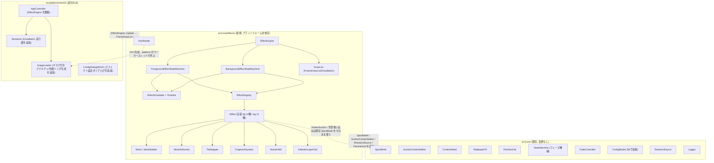
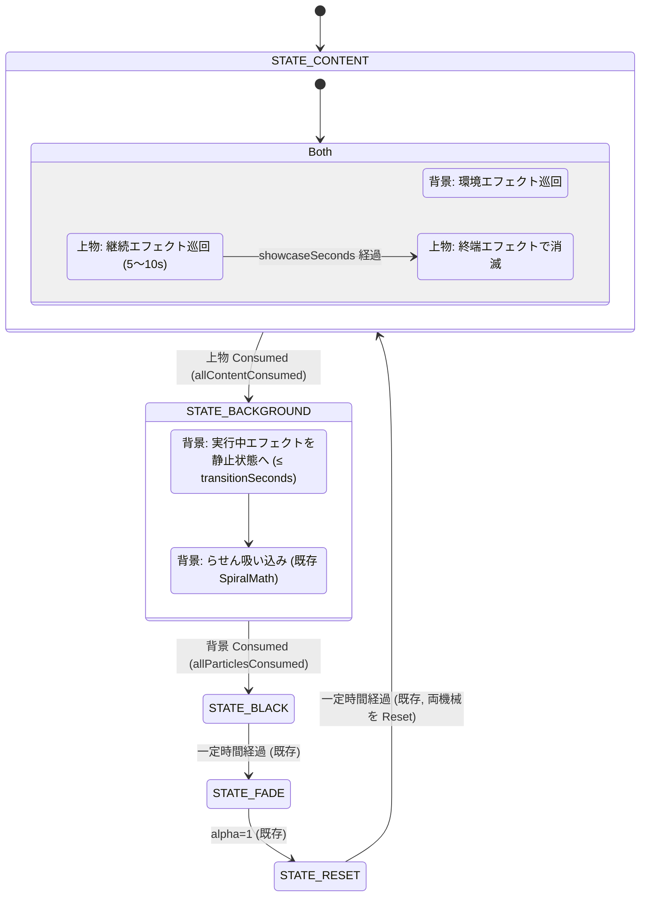
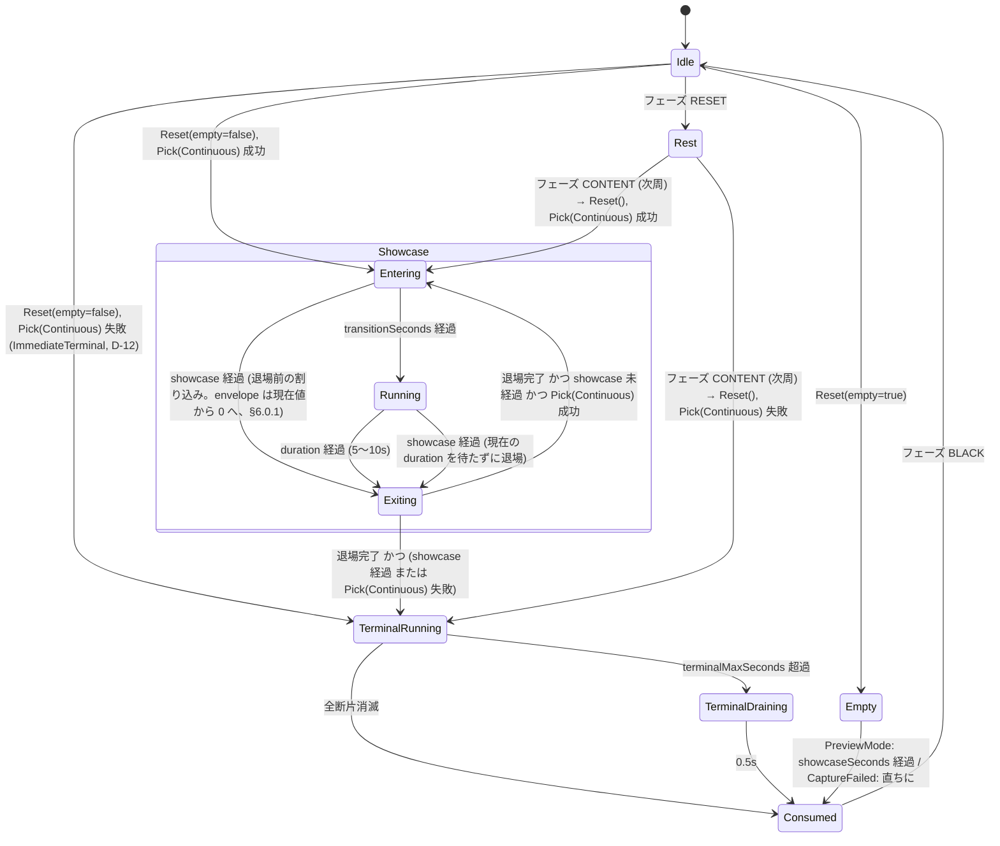
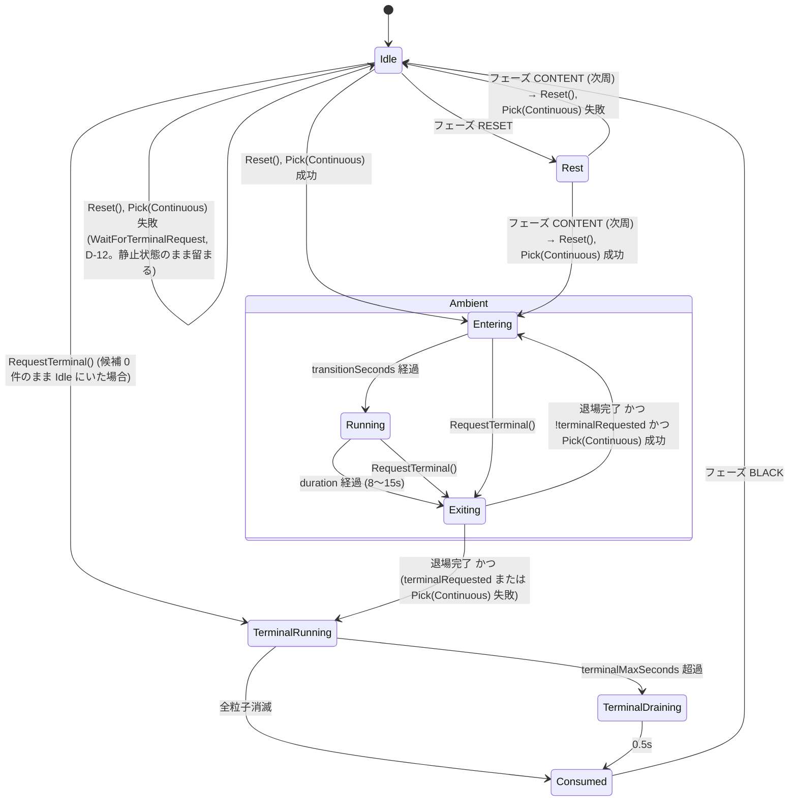
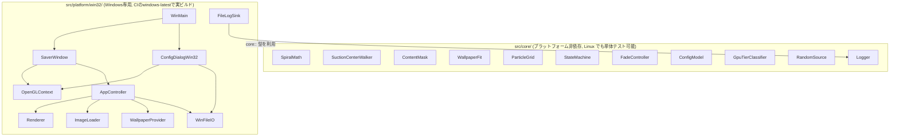

# Spiral Suction Saver 拡張設計書: レイヤー分離エフェクトシステム

対象: `追加要件.txt` に基づく、既存 Spiral Suction Saver (`docs/DESIGN.md`, `README.md`) の拡張。
本書は `skil.md` の定める「設計書は第三者が読んでも実装可能なレベルまで詳細化する」を満たす
ことを目的とし、**実装コードは含まない**(インタフェース定義・擬似コード・数式のみ)。

本書は既存 `docs/DESIGN.md` を置き換えるものではなく、その上に積み重なる拡張版である。
既存設計書の §1〜§9 で確定している事項(core/platform 分離、差分ブロック検出、壁紙合成、
状態機械、設定ファイル、テスト方針)はすべて前提として引き継ぐ。**`docs/DESIGN.md` は
本拡張のために変更しない**。実装完了後に本書の内容を `DESIGN.md` へ統合し、
`DESIGN_EFFECTS.md` は履歴として残す(skil.md 禁止事項: 設計書とコードの差異を放置しない)。

**本書は単独で自己完結する**: `docs/DESIGN.md` および現行ソースコードのうち本拡張の
実装・レビューに必要な事実は、すべて末尾の**付録A**に転記済みである。本書 1 ファイルだけを
渡された第三者(レビュー担当の別 AI を含む)が、他のファイルを一切参照せずに設計内容を
検証・実装できることを意図している。本文中で `core::Xxx`/`platform::Xxx` など既存の型・
関数を名指しする箇所は、対応する付録Aの項番を `(→ A.n)` の形で添えてある。

## 0. 用語

| 用語 | 意味 |
|---|---|
| **背景レイヤー (BackgroundLayer)** | 壁紙合成画像 (`AppController::backgroundTexture_`) を画面全体に描く層。常に画面全域を覆う不透明な画像。 |
| **上物レイヤー (ForegroundLayer)** | 実画面キャプチャのうち `core::ContentMask`(→ A.4.3)が差分ありと判定したセル(アイコン・タスクバー・開いているウィンドウ)だけを描く層。差分なしセルは**アルファ0**。 |
| **エフェクト (Effect)** | ある層の静止状態(rest)を、時刻 `t` と強度 `I` に応じて変形・変色・断片化する処理単位。`IEffect` を実装する。 |
| **継続エフェクト (Continuous)** | 終わりを持たず、任意のタイミングで静止状態へ戻せるエフェクト(FlagWave など)。5〜10秒でランダムに切り替わる。 |
| **終端エフェクト (Terminal)** | 層を消滅させて終わるエフェクト(VortexSuction, GlassShatter など)。終了すると既存の状態機械に「消費完了」を通知する。 |
| **ジオメトリ表現 (GeometryKind)** | エフェクトが層をどう扱うか: 変換のみ / メッシュ / 放射メッシュ / タイル連結 / 帯 / 断片。§4.3 参照。 |
| **静止状態 (rest pose)** | エフェクトが何も適用されていない状態。すべての継続エフェクトは `I = 0` かつ位相 0 で静止状態と一致しなければならない(§6.0 不変条件)。 |
| **フェーズ機械** | 既存の `core::SaverStateMachine` (CONTENT→BACKGROUND→BLACK→FADE→RESET)。本書では変更しない。 |

## 1. 追加要件の構造化

### 1.1 機能要件

| ID | 要件 | 本書での対応箇所 |
|---|---|---|
| F-1 | 背景レイヤーと上物レイヤーを完全に分離する | §2, §4.1 |
| F-2 | 上物レイヤーに 14 種のエフェクトを 5〜10 秒ランダム切替で適用する | §5.3, §6.1 |
| F-3 | 背景レイヤーに 11 種のエフェクトを**独立した状態機械**でランダム切替する | §5.4, §6.2 |
| F-4 | 設定ファイルでエフェクトごとの ON/OFF・強度・持続時間を指定できる | §9 |
| F-5 | 既存の吸い込みループ(差分ブロック→背景粒子→黒→フェード→リセット)は維持する | §5.1, §14 |

### 1.2 非機能要件

| ID | 要件 | 本書での対応箇所 |
|---|---|---|
| N-1 | OpenGL 1.1 固定機能のみで描画する(シェーダ不使用、要件.txt §2/§7 準拠) | §7 |
| N-2 | 各エフェクトの数学モデルは純粋関数として Linux 上で単体テストできる | §6, §12 |
| N-3 | 60fps 目標を維持する(Max プリセット 12,000 粒子でも実用速度) | §13 |
| N-4 | 既存 `src/core/` の Windows 非依存を維持する | §3.1 |
| N-5 | 既存の設定ファイルは新版でもそのまま読める(後方互換) | §9.3 |

### 1.3 制約条件

- 実デスクトップの読み取り以外の操作は行わない(要件.txt §10)。本拡張は描画のみの変更で、
  キャプチャ・差分判定のロジックは一切変更しない。
- `EffectsEnabled=0` で**現行の動作を完全に再現**できること(退行時の逃げ道)。
- 追加の外部ライブラリは使わない(既存方針)。
- HDR/明るさ補正・壁紙合成(既存 §9.2, §9.8)の結果である `backgroundTexture_` /
  差分マスクをそのまま入力とし、再計算しない。

### 1.4 スコープ外

- マルチモニタ(既存 §9 と同じ)。
- ピクセル単位の色変換(ブラー、ピクセルシェーダ的処理)。固定機能で実現できるのは
  頂点単位の幾何変形・頂点色・アルファ・チャネルマスク・複数パス合成まで(§7.1)。
- 上物レイヤーの個々のウィンドウ/アイコン単位の独立アニメーション(差分方式では対応関係が
  ないため不可、既存 §9.1)。§15 に「連結成分単位」の将来拡張として記載する。

## 2. 全体アーキテクチャ

既存の core/platform 分離(→ A.1)をそのまま踏襲する。追加分は `src/core/effects/` (純粋ロジック) と、
`src/platform/win32/` の `Renderer` / `AppController` / `ImageLoader` / `ConfigDialogWin32` への
差分に限定する。**core は「何をどこにどう描くか」を `FrameDrawList` というデータで出力し、
platform はそれを固定機能 GL 呼び出しに翻訳するだけ**にする。これにより、エフェクトの
出力(頂点列・変換・アルファ)を GL なしで検証できる。



### 2.1 レイヤー分離の考え方

現行実装は「差分ブロック粒子」と「背景粒子」を同じ `DrawParticlesBatched` で描き、
フェーズごとにどちらを描くかを `AppController::Draw()` が切り替えている。本拡張では
これを **2 つの独立した `Layer` オブジェクト**に再編する。

| 項目 | BackgroundLayer | ForegroundLayer |
|---|---|---|
| テクスチャ | `backgroundTexture_` (RGB, 不透明) | `foregroundTexture_` (**新規**: キャプチャ画像に差分マスクを焼き込み、差分なしセルをアルファ0にした RGBA) |
| 静止ジオメトリ | 画面全域を覆うメッシュ(§4.4, 解像度は粒子数と独立) | 粒子グリッド(`gridN×gridN`)のうち差分ありセルのみ(既存 `contentParticles_` 相当) |
| 断片単位 | 粒子グリッドの全セル(既存 `particles_`) | 差分ありセル(既存 `contentParticles_`) |
| 状態機械 | `BackgroundEffectStateMachine` | `ForegroundEffectStateMachine` |
| 終端エフェクト | 既存の背景らせん吸い込み(固定) | 上物終端エフェクト 6 種からランダム(§5.3) |
| 描画順 | 先(下) | 後(上) |

**差分なしセルをアルファ0にした上物テクスチャ**が本設計の要である。これにより、
上物レイヤーを「画面全体の1枚の画像」として扱う効果(メッシュ変形・タイル連結・万華鏡)
でも、描かれるのは差分ありの部分だけになり、セル単位で描く効果(断片系)は差分ありセルの
クアッドだけを出力すればよい。両者で同じテクスチャを共有できるため、エフェクト実装は
「層の中身が何か」を意識しなくてよい。

### 2.2 既存フェーズ機械との関係

既存の 5 状態(`STATE_CONTENT`→`STATE_BACKGROUND`→`STATE_BLACK`→`STATE_FADE`→`STATE_RESET`)
と `SaverStateMachine::Advance` の遷移条件は**一切変更しない**。変更するのは、各フェーズの
「中身」を誰が計算するかである。

| フェーズ | 現行 | 拡張後 |
|---|---|---|
| `STATE_CONTENT` | 差分ブロックがらせん吸い込み → 全消滅で完了 | 背景レイヤー: 環境エフェクト巡回。上物レイヤー: 継続エフェクトを 5〜10 秒で巡回(ショーケース)し、所定時間経過後に**終端エフェクト**で消滅 → 完了 |
| `STATE_BACKGROUND` | 背景粒子がらせん吸い込み → 全消滅で完了 | 背景レイヤー: 実行中の環境エフェクトを静止状態へ戻してから、既存のらせん吸い込み(終端) → 全消滅で完了 |
| `STATE_BLACK` / `STATE_FADE` / `STATE_RESET` | 変更なし | 変更なし(エフェクト機械は Idle。RESET は両層を静止状態で描く) |

つまり、「上物が消え、次に背景が消える」という既存の物語構造はそのままに、
消える前に両層が独立に踊る時間を挿入し、消え方(終端エフェクト)を多様化する。
`EffectsEnabled=0` のときはショーケース時間 0・上物終端 = VortexSuction 固定・背景環境
エフェクトなし、となり現行と同じ振る舞いになる(§9.4)。

## 3. モジュール構成

### 3.1 src/core/effects/ (新規)

すべて `namespace core::fx`。Windows/OpenGL ヘッダに依存しない C++17 のみ。
既存 `CMakeLists.txt` の `file(GLOB CORE_SOURCES src/core/*.cpp)` を
`src/core/*.cpp src/core/effects/*.cpp src/core/effects/fg/*.cpp src/core/effects/bg/*.cpp` に
広げるだけで `spiral_core` に含まれ、Linux でも `core_tests` からテストできる。

| モジュール | 責務 |
|---|---|
| `EffectTypes.h` | `EffectId` 列挙(fg 14 + bg 11 + 背景終端 1)、`LayerKind`、`GeometryKind`、`ExitStrategy`、`EffectKind {Continuous, Terminal}`、`Transform2D`、`ColorMask`、`BlendMode`。名前⇄列挙の変換 (`EffectIdToString`/`EffectIdFromString`、設定ファイルとログで使用)。 |
| `EffectParams.h` | 全エフェクト共通の `EffectParams { enabled, intensity, weight, minSeconds, maxSeconds }` と、エフェクト固有パラメータ構造体群(§4.2)。既定値はここに集約する。 |
| `Mesh.h/.cpp` | `Mesh`(頂点配列 + クアッド索引配列)、`MeshBuilder::BuildGrid`(縦横分割・縫い目列指定・部分クアッド有効化)、`MeshBuilder::BuildRadial`(万華鏡用の放射メッシュ)。純粋。 |
| `MeshDeformer.h/.cpp` | 静止メッシュに「変位場」を適用して現在メッシュを得る。`DisplacementField` は `std::function<Vec2(Vec2 rest, float t)>` ではなく**関数ポインタ + パラメータ構造体**で受ける(ホットパスで `std::function` を避ける)。頂点アルファ・頂点シェード(明度)も同じ枠組みで扱う。 |
| `TileMapper.h/.cpp` | 無限スクロール/無限回転のためのタイル連結計算。`WrapPosition`、`EdgeDuplicates`(セルが画面端をまたぐときの複製オフセット)、`VisibleTileOffsets`(3×3 複製のうち変換後に画面と交差するもの)。純粋。 |
| `FragmentSystem.h/.cpp` | `Fragment` 配列の生成(セル→断片、シャード分割)、積分器 `FragmentIntegrator` による毎フレーム更新、全断片消滅判定、上限時間による強制終了。VortexSuction 用積分器は既存 `core::StepSpiral` を呼ぶだけの薄いラッパ。 |
| `NoiseField.h/.cpp` | テーブル不要のハッシュベース値ノイズ `ValueNoise3(x,y,z,seed)`∈[-1,1]、`Fbm3`、1次元用 `Noise1(t,seed)`。決定的・純粋。 |
| `KaleidoscopeFold.h/.cpp` | 画面座標→折り返し後のソース座標(UV)を返す純粋関数 `FoldPoint`。放射メッシュと組み合わせて使う(§6.3.2)。 |
| `HueRotate.h/.cpp` | RGBA8 バッファの色相回転 `HueRotateRgba(src, dst, w, h, degrees)`。HueShift 用の色相リング(§6.2.8)を platform が CPU で生成する際に呼ぶ。純粋。 |
| `Envelope.h` | 状態保持型の包絡線ヘルパー `Envelope::Step(e, dt, target, rateSeconds)` (§6.0.1)。EffectStateMachine が保持するスカラーを目標値へ線形追従させる純粋関数。 |
| `Timeline.h/.cpp` | `TimelineEntry { layer, effectId, startSeconds, durationSeconds, seed }` の列。ログ出力用の文字列化、設定ファイルからの台本(scripted)読込。 |
| `EffectScheduler.h/.cpp` | 有効エフェクト集合・重み・直近履歴から次のエフェクトと持続時間を選ぶ純粋ロジック(`IRandomSource` 注入)。 |
| `EffectStateMachine.h/.cpp` | 継続エフェクトの Entering/Running/Exiting 巡回と終端エフェクトへの移行を扱う**共通**状態機械。`ForegroundEffectStateMachine`/`BackgroundEffectStateMachine` はこれをパラメータ(カタログ・終端の決め方・ショーケース時間)で特殊化した薄いクラス。 |
| `IEffect.h` | エフェクトの抽象インタフェース(§4.5)。 |
| `EffectRegistry.h/.cpp` | `EffectId → std::unique_ptr<IEffect>` のファクトリ表。エフェクトを追加するときの唯一の登録点(§15)。 |
| `DrawList.h` | `FrameDrawList` / `DrawBatch` / `GeometryRef`(§4.6)。platform がこれを読んで描く。 |
| `EffectEngine.h/.cpp` | 2 つの層と 2 つの状態機械を所有し、`Update(dt, inputs)` で両層を進めて `FrameDrawList` を生成する。フェーズ機械への出力(`foregroundConsumed`/`backgroundConsumed`)を返す。 |
| `fg/*.cpp` | 上物エフェクト 14 種(1 ファイル 1 エフェクト)。各ファイルは「純粋な数学関数群」と「それを `IEffect` に接続する薄いクラス」の 2 部構成。 |
| `bg/*.cpp` | 背景エフェクト 11 種 + `BackgroundSuction`(既存吸い込みの `IEffect` 化)。 |

### 3.2 src/platform/win32/ (差分)

| モジュール | 変更内容 |
|---|---|
| `AppController` | らせん状態・粒子位置の配列(`contentSpirals_` 等)と `EnsureXxxSpiralsInit`/`StepXxxSpirals`/`DrawXxxPhase` を**削除**し、代わりに `core::fx::EffectEngine` を所有する。`Update(dt)` はフェーズ機械の現在状態と `EffectEngine::Update` の出力(`foregroundConsumed`/`backgroundConsumed`)を `StateMachineInputs` に写す。`Draw()` は `FrameDrawList` を `Renderer::ExecuteDrawList` に渡す。BLACK/FADE の描画は現行のまま。 |
| `Renderer` | `ExecuteDrawList(const FrameDrawList&, const TextureTable&)` を追加(§7.2)。`DrawBatch` 1 件につき `glPushMatrix`/変換/`glColorMask`/`glBlendFunc`/`glBegin(GL_QUADS)`…`glEnd`/`glPopMatrix`。既存 `DrawParticlesBatched`/`DrawFullscreenTexturedQuad` は `STATE_FADE`/`STATE_RESET`/フォールバック用に残す。 |
| `ImageLoader` | `CreateMaskedTextureFromImage(image, mask, gridN)`(差分なしセルのアルファを 0 にして RGBA テクスチャ化)と `CreateTextureFromRgba(w,h,data)`(色相リング用)を追加。 |
| `HueRingBuilder` (新規) | `std::thread` で `core::fx::HueRotateRgba` を K 回呼び、完成分から順に `AppController` が主スレッドでテクスチャ化する(§6.2.8)。GL 呼び出しは主スレッドのみ。ライフサイクル(`Stop`/`Join`/`IsRunning`)とスレッド間受け渡しの排他制御は §6.2.8 で規定する(外部レビュー ISSUE-1)。 |
| `ConfigDialogWin32` / `resources/*.rc` | 「Effects...」ボタンと `IDD_EFFECTS` ダイアログを追加(§9.5)。 |
| `SaverWindow` | 変更なし。 |

### 3.3 変更しないもの

`ScreenCapture`, `WallpaperProvider`, `ContentMask`, `WallpaperFit`, `SpiralMath`,
`SuctionCenterWalker`, `ParticleGrid`, `StateMachine`, `FadeController`, `GpuTierClassifier`,
`Logger`, `AppPaths`, `WinFileIO`, `FileLogSink`, `StringConvert`, `OpenGLContext`, `WinMain`
(いずれの正確な現状仕様も → A.2〜A.5)。既存テスト(`tests/test_*.cpp`)はそのまま全緑であること。

## 4. データモデル

以下はすべて `namespace core::fx`。座標系は既存と同じ**画面ピクセル座標、左上原点、y 下向き**。
時刻 `t` は「そのエフェクトが開始してからの秒数」、`dt` はフレーム間隔秒。

### 4.1 層 (Layer)

```cpp
enum class LayerKind { Background, Foreground };
enum class TextureRole { Background, Foreground, HueRing /* + index */ };
// レビュー指摘 #6: 「上物が 0 件」の理由を区別する。プレビュー (/p) は元々キャプチャを
// 行わない設計上の仕様である一方、フルスクリーン (/s) でのキャプチャ失敗は既存
// DESIGN.md §9.1 が定める「取得失敗時は CONTENT フェーズを実質スキップして継続する」
// というエラー耐性方針(セキュリティソフトによるブロック等、実運用で起こりうる)に
// 従うべきで、両者を同じに扱うと後者で毎周期 showcaseSeconds 分(既定 40 秒)の
// 待ちが新たに発生してしまう(既存方針からの意図しない退行)。
enum class EmptyReason { NotEmpty, PreviewMode, CaptureFailed };

// 層の静止状態。Initialize 時に一度だけ構築し、以後は変更しない。
struct LayerSource {
    LayerKind kind;
    TextureRole texture;          // Background または Foreground
    float screenW, screenH;
    int gridN;                    // 粒子グリッド分割数 (core::ComputeGridDimensionForParticleCount, → A.4.2)
    std::vector<int> cellIndices; // 断片化するセル (Background: 全セル / Foreground: 差分ありセルのみ)
    std::vector<Particle> cells;  // cellIndices に対応する core::Particle (中心座標 + UV, → A.4.2)
    float cellHalfW, cellHalfH;   // 既存 particleHalfWidthPx_/HeightPx_ と同じ値
    Mesh restMesh;                // メッシュ系エフェクトの静止メッシュ (§4.4)
    Mesh restRadialMesh;          // 万華鏡用放射メッシュ (§4.4.2)。遅延構築可
    bool empty;                   // Foreground でセルが 0 件のとき true (emptyReason != NotEmpty と同値)
    EmptyReason emptyReason = EmptyReason::NotEmpty; // empty のときのみ意味を持つ
};
```

### 4.2 EffectParams

```cpp
// 全エフェクト共通 (設定ファイル §9 に 1:1 対応)
struct EffectParams {
    bool  enabled    = true;
    float intensity  = 0.7f;   // [0,1]。各エフェクトの振幅・速度スケール
    float weight     = 1.0f;   // 抽選重み (>0)
    float minSeconds = 0.0f;   // 0 = 層既定 (Fg 5〜10 / Bg 8〜15) を使う
    float maxSeconds = 0.0f;
};

// エフェクト固有パラメータは EffectParams と別に持ち、既定値のみ持つ (設定ファイル非公開)。
// 例:
struct FlagWaveParams   { float ampRatio = 0.03f; float wavesAcross = 1.5f; float hz = 0.8f; float shear = 0.25f; float shadeDepth = 0.25f; };
struct NorenSwingParams { int strips = 6; float ampRatio = 0.06f; float hz = 0.5f; float phaseStep = 0.9f; float pinPow = 1.5f; };
struct RippleParams     { float ampPx = 12; float wavelengthPx = 120; float hz = 1.2f; float decayPx = 600; float decaySec = 2.5f;
                          float spawnMinSec = 0.8f; float spawnMaxSec = 2.0f; int maxDrops = 6; };
// ... 各エフェクトの §6 に記載のパラメータをそれぞれ 1 構造体にする

struct LayerEffectConfig {
    std::map<EffectId, EffectParams> perEffect;
    float defaultMinSeconds, defaultMaxSeconds; // Fg: 5,10 / Bg: 8,15
};

struct EngineConfig {
    bool  enabled = true;               // false = 現行動作 (§9.4)
    float transitionSeconds = 0.5f;     // Entering / Exiting の長さ
    float foregroundShowcaseSeconds = 40.0f; // 終端エフェクトに入るまでの上物ショーケース総時間
    float terminalMaxSeconds = 20.0f;   // 終端エフェクトの安全上限 (超過で強制消滅)
    LayerEffectConfig foreground, background;
    std::vector<EffectId> scriptedForeground, scriptedBackground; // 空 = ランダム (デバッグ用台本)
};
```

### 4.3 ジオメトリ表現 (GeometryKind)

エフェクトは自分がどの表現で層を扱うかを宣言し、`EffectEngine` は開始時にその表現を
`LayerSource` から用意する。1 つのエフェクトは 1 つの表現だけを使う(組合せは §15)。

| GeometryKind | 内容 | 描画単位 | 使うエフェクト |
|---|---|---|---|
| `Transform` | 層全体を 1 つの `Transform2D` で剛体変換(平行移動/回転/拡縮)+ アルファ | 全画面クアッド 1 枚 (Fg も同じ: アルファ0部分は透明) | ZoomShake, Tilt, ParallaxTilt, FadeOutIn, HueShift |
| `Mesh` | 格子メッシュの頂点を変位場で動かす | メッシュのクアッド群 (Fg は差分ありセルの分だけ有効) | FlagWave, NorenSwing, ClothBend, LiquidDistort, Ripple, LensDistort, NoiseRipple, WaveZoom |
| `RadialMesh` | 放射メッシュの各頂点 UV を折り返し関数で決める | 放射メッシュのクアッド群 | Kaleidoscope, BackgroundKaleidoscope |
| `Tiles` | 層画像の複製(3×3 または端複製)を 1 つの変換の下で並べる | 複製ごとの全画面クアッド (Bg) / セルクアッド (Fg) | InfiniteScroll, InfiniteRotation |
| `Bands` | 水平帯 `{y0, y1, dx}` の列。帯ごとに剛体オフセット | 帯ごとのクアッド 1 枚 | GlitchShift |
| `Fragments` | セル単位の断片(位置・回転・拡縮・アルファ)を積分器で動かす | 断片ごとのクアッド | SegmentWave, VortexSuction, FragmentFlyAway, GlassShatter, ConfettiFall, MosaicCollapse, NoiseDissolve, BackgroundSuction |

### 4.4 Mesh

```cpp
struct MeshVertex {
    Vec2  pos;    // 画面座標
    Vec2  uv;     // テクスチャ座標 [0,1]
    float alpha = 1.0f;  // 頂点アルファ
    float shade = 1.0f;  // 頂点明度 (glColor の RGB に乗算; 布系の疑似陰影用, 既定 1)
};

struct Mesh {
    int cols = 0, rows = 0;                 // 格子メッシュのときのみ有効 (放射メッシュは 0)
    std::vector<MeshVertex> vertices;
    std::vector<std::array<int,4>> quads;   // 反時計回り 4 頂点索引
    std::vector<bool> quadActive;           // false のクアッドは描かない (Fg: 差分なしセル)
};
```

#### 4.4.1 格子メッシュ (`MeshBuilder::BuildGrid`)

**関数シグネチャ(外部レビュー ISSUE-4: 旧版は擬似コードのみで C++ シグネチャが未定義だった)**:

```cpp
// screenW, screenH : 画面サイズ (px)
// cols, rows       : 生成する頂点格子の分割数 (= gridN * cellSubdiv, 下記)
// seamColumns      : 頂点を 2 重化する列インデックスの集合 (空 = 縫い目なし。NorenSwing 専用)
// activeCells       : 親セル (gridN × gridN, row-major, index = parentRow*gridN + parentCol) の
//                     差分有無。空なら「全セル有効」として扱う (背景メッシュはこちらを渡す)
// cellSubdiv        : 1 個の親セルを cellSubdiv × cellSubdiv 個の子クアッドへ分割する係数。
//                     既定 1 (分割なし)。gridN < 48 のとき呼び出し側が ceil(48/gridN) を渡す
Mesh MeshBuilder::BuildGrid(float screenW, float screenH, int cols, int rows,
                            const std::vector<int>& seamColumns,
                            const std::vector<bool>& activeCells,
                            int cellSubdiv = 1);
```

```
頂点 (c, r) for c∈[0..cols], r∈[0..rows]: pos = (c*screenW/cols, r*screenH/rows), uv = (c/cols, r/rows)
seamColumns に含まれる列 c は頂点を 2 重化し、左のクアッドは左側複製、右のクアッドは右側複製を参照する
  (NorenSwing の暖簾の切れ目: 隣接ストリップが独立に動けるようにする。cellSubdiv と併用しない)
quads[r*cols + c] = {(c,r),(c+1,r),(c+1,r+1),(c,r+1)}
quadActive[r*cols + c] = activeCells.empty() ? true
                        : activeCells[ (r / cellSubdiv) * gridN + (c / cellSubdiv) ]
  // 子クアッド (c,r) の親セル添字は整数除算で一意に求まる (cellSubdiv=1 なら恒等)。
  // gridN は cols/cellSubdiv (= rows/cellSubdiv) と一致する (呼び出し側がその関係を保証する)
```

- **背景メッシュ解像度**: 粒子数とは独立に `cols = ceil(screenW / 20px)`、`rows = ceil(screenH / 20px)`
  (1080p で 96×54 = 5,184 クアッド)。Ripple の波長 120px を線形補間で解像するため。
  `activeCells` は空(全セル有効)、`cellSubdiv = 1` で呼ぶ。
- **上物メッシュ解像度**: 差分マスクの粒子グリッド `gridN`(→ A.4.2)に合わせ、
  `cols = rows = gridN * cellSubdiv` として呼ぶ。`cellSubdiv = max(1, ceil(48 / gridN))`
  (`gridN ≥ 48` なら 1 = 分割なし)。UV は子クアッドの `pos`/`uv` 生成式(上記)が
  `screenW`/`screenH` に対する均等分割としてそのまま線形補間するため、`Particle` の
  セル UV 範囲を追加計算なしで過不足なく分割する(`test_fx_Mesh.cpp` §12.3 が検証)。

#### 4.4.2 放射メッシュ (`MeshBuilder::BuildRadial`)

万華鏡用。中心 `c=(W/2,H/2)`、外径 `R = 0.5·sqrt(W²+H²)`、分割数 `N` に対し、
**半楔 (half-wedge) 2N 個 × 半径方向 rings 個 × 角度方向 subdiv 個**のクアッドを生成する。
頂点の `pos` は極座標 `(r_i, α_j)` の画面座標、`uv` は `KaleidoscopeFold::FoldPoint`(§6.3.2)で
決める。半楔の境界に必ず頂点列を置くため、**各クアッド内では折り返し写像がアフィン
(回転または鏡映 1 回)となり、線形補間で正確に再現できる**(縫い目が出ない)。
既定: `rings = 16`, `subdiv = 4` → N=12 で 24×16×4 = 1,536 クアッド。
中心の最内リングは `r_0 = 0` で縮退クアッドになるが固定機能では問題ない。

### 4.5 IEffect と実行コンテキスト

```cpp
struct EffectContext {           // 開始時に固定
    const LayerSource* layer;
    const EffectParams* params;  // enabled/intensity/...
    const EngineConfig* engine;
    float screenW, screenH;
    uint32_t seed;               // TimelineEntry.seed。Begin がこの値で自前の RNG を作る (下記)
};

struct EffectFrame {             // 毎フレーム
    float t;                     // 開始からの秒
    float dt;
    float intensity;             // params.intensity × envelope (§6.0.1, 0..1)
    Vec2  suctionCenter;         // SuctionCenterWalker の現在位置 (吸い込み系のみ使う)
    LayerGeometry* out;          // 書き込み先 (§4.6)
};

class IEffect {
public:
    virtual ~IEffect() = default;
    virtual EffectId     Id() const = 0;
    virtual EffectKind   Kind() const = 0;      // Continuous / Terminal
    virtual GeometryKind Geometry() const = 0;
    virtual ExitStrategy Exit() const = 0;      // Envelope / ReturnToRest / Crossfade (継続のみ)
    virtual void Begin(const EffectContext& ctx) = 0;  // 個体差の乱数を確定
    virtual void Step(EffectFrame& frame) = 0;  // out を書き換える
    virtual bool IsFinished() const = 0;        // Terminal: 全断片消滅 / Continuous: 常に false
    virtual void RequestExit(float exitSeconds) {}   // ReturnToRest 用: 位相を静止値へ滑走開始
    virtual bool IsAtRest() const { return true; }   // ReturnToRest 用: 静止値へ到達したか
};
```

**乱数と決定性の規約(レビュー指摘 #1 反映)**: `IEffect` は `Begin` の冒頭で
`ctx.seed` から**自分専用**の `core::Mt19937RandomSource rng_`(メンバ変数として保持)を
1 度だけ構築し、`Begin` 内・以後すべての `Step` 内で個体差の抽選(Ripple の滴の発生時刻、
Glitch のバースト、GlassShatter のシード点配置など)には**必ずこの `rng_` だけ**を使う。
`EffectEngine` が共有で持つエンジン全体の RNG(中心のランダムウォーク等に使う既存の
`Mt19937RandomSource`)を `IEffect` に渡すことはしない。これにより、
「同じ `ctx.seed` で `Begin` した同じエフェクトは、以後の実行順序や他のエフェクト・
中心ランダムウォークの状態に一切依存せず、同一の出力列を生成する」という決定性
(§12.4 のテスト再現性の前提)が文字どおり成立する。旧設計で `Begin`/`Step` に
`IRandomSource& rng`/`frame.rng` として**共有**ストリームを渡していた案は、
「`ctx.seed` だけで再現できる」という主張と矛盾していたため撤回した。

`EffectScheduler::Pick` が生成する `seed`(§5.5)は、エンジン共有 RNG から 1 回引いた
値であり、**どのエフェクトが・いつ・何秒選ばれるか**(スケジューリング自体)の再現性は
保証しない(保証する必要もない — テストは `EffectScheduler` 単体に決定的な `IRandomSource`
を注入して検証する、§12.3)。`seed` が保証するのはあくまで「選ばれた後、そのエフェクト
**単体**が何をするか」の再現性である。

### 4.6 描画データ (DrawList)

core の出力。platform はこれを解釈するだけで、状態機械やエフェクトを知らない。

```cpp
struct Transform2D { Vec2 translate{0,0}; float rotateRad = 0; float scale = 1; Vec2 pivot{0,0}; };
// 適用順 (頂点 p に対し): p' = pivot + R(rotate)·(scale·(p − pivot)) + translate

struct ColorMask { bool r = true, g = true, b = true; };
enum class BlendMode { Normal /* SRC_ALPHA, ONE_MINUS_SRC_ALPHA */, Additive /* SRC_ALPHA, ONE */ };

struct QuadVertex { Vec2 pos; Vec2 uv; float alpha; float shade; };

struct LayerGeometry {               // エフェクトが Step で書き込むバッファ (層ごとに 1 つ、毎フレーム使い回し)
    Mesh mesh;                       // Mesh / RadialMesh 用 (現在頂点)
    std::vector<QuadVertex> quads;   // Tiles / Bands / Fragments 用 (4 頂点ずつ)
    Transform2D transform;           // 全体変換
    float alpha = 1.0f;              // 全体アルファ
    int   textureIndex = 0;          // HueRing のときのリング番号
};

struct DrawBatch {
    TextureRole texture; int textureIndex;
    Transform2D transform;
    float alpha;
    ColorMask colorMask;
    BlendMode blend;
    // ジオメトリ: どちらか一方 (mesh は quadActive で間引き済みの索引列を平坦化して渡す)
    const Mesh* mesh = nullptr;
    const std::vector<QuadVertex>* quads = nullptr;
};

struct FrameDrawList {
    std::vector<DrawBatch> batches;  // 背景 → 上物 の順。1 エフェクトが複数バッチを出すことがある
                                     // (GlitchShift の RGB 分離 3 パス、HueShift の 2 パス、Crossfade の 2 パス)
};
```

### 4.7 Fragment

```cpp
struct Fragment {
    int   cellIndex;      // LayerSource::cells の添字
    Vec2  restPos;        // 静止中心座標
    Vec2  pos;
    Vec2  vel{0,0};
    float rot = 0, angVel = 0;   // ラジアン / rad/s
    float scaleX = 1, scaleY = 1;
    float alpha = 1;
    float shade = 1;
    int   group = -1;     // シャード/ストリップの所属 (-1 = 独立)
    float delay = 0;      // 活動開始までの秒 (それまでは静止)
    bool  alive = true;
    // VortexSuction / BackgroundSuction 専用 (既存 SpiralMath をそのまま使う)
    SpiralState  spiral;
    SpiralParams spiralParams;
};

struct FragmentGroup { Vec2 centroid; Vec2 vel; float rot, angVel; float delay; };

// 積分器: 断片 1 個を dt 進める純粋関数。副作用は f のみ。
using FragmentIntegrator = void (*)(Fragment& f, const FragmentGroup* g, const EffectFrame& frame, const void* params);
```

`FragmentSystem` は `std::vector<Fragment>` と `std::vector<FragmentGroup>` を持ち、
`StepAll(integrator, frame, params)`、`AllDead()`、`EmitQuads(cellHalfW, cellHalfH, out.quads)`
(生存断片だけをクアッド化。回転・拡縮は中心まわりで 4 隅を計算)を提供する。

**`delay` 経過前 (`τ = t − delay < 0`) の共通契約(外部レビュー ISSUE-6)**: `FragmentIntegrator`
実装は `τ < 0` の間、`pos = restPos`・`rot = 0`・`scaleX = scaleY = 1`・`alpha = 1`(= 静止状態)
を維持し、`τ ≥ 0` になった時点で初めて各エフェクト固有の運動式を適用する(`StepAll` 側では
分岐しない — 各 `FragmentIntegrator` が自分の `τ` を計算し、負なら早期リターンする)。
GlassShatter (§6.1.9) の「ひび割れ閃光」(`g.delay − 0.08 ≤ t < g.delay`)は、この既定の
静止状態に scale の脈動を上乗せする**唯一の例外**であり、他のすべての終端エフェクト
(FragmentFlyAway, ConfettiFall, MosaicCollapse, NoiseDissolve, VortexSuction, BackgroundSuction)
は `τ < 0` の間はこの既定の静止状態のまま(§6.1.6/§6.1.10/§6.1.11/§6.1.12 の擬似コードが
`τ ≥ 0`/`t ≥ delay` の条件のみを書いているのはこの既定契約を前提にしているためで、
個別に早期リターンを書き下していない)。

### 4.8 Timeline

```cpp
struct TimelineEntry {
    LayerKind layer;
    EffectId  effectId;
    float     startSeconds;      // フェーズ開始からの秒 (ログ/デバッグ用)
    float     durationSeconds;   // Running の長さ (Terminal は上限 terminalMaxSeconds)
    uint32_t  seed;              // このエフェクト個体の乱数種
};

class Timeline {
public:
    void Append(TimelineEntry e);
    const TimelineEntry* Current() const;
    const std::deque<TimelineEntry>& History() const; // 直近 8 件 (Scheduler の重複回避に使用)
    std::string ToString() const;                     // "fg: FlagWave@0.0s(7.3s) -> InfiniteScroll@7.8s(5.1s) -> ..."
};
```

## 5. 状態遷移

### 5.1 フェーズ機械との接続



`AppController::Update` の擬似コード(現行の `switch` を置き換える部分のみ。既存の状態機械の
正確な遷移規則は → A.5):

```
center.Step(rng)
engineInputs = { phase: stateMachine.Current(), dt, suctionCenter: center.Position() }
engineOut = engine.Update(engineInputs)        // 両層を進め FrameDrawList を作る
inputs.allContentConsumed   = (phase == CONTENT)    && engineOut.foregroundConsumed
inputs.allParticlesConsumed = (phase == BACKGROUND) && engineOut.backgroundConsumed
BLACK / FADE / RESET のタイマは現行どおり
if stateMachine.Advance(inputs): engine.OnPhaseEntered(stateMachine.Current())
```

`EffectEngine::OnPhaseEntered`:

| 入ったフェーズ | 上物機械 | 背景機械 |
|---|---|---|
| `STATE_CONTENT` | `Reset()` → Showcase 開始 (`empty` なら Empty へ) | `Reset()` → Ambient 開始 |
| `STATE_BACKGROUND` | (Consumed のまま) | `RequestTerminal()` |
| `STATE_BLACK` | `Idle` | `Idle` |
| `STATE_FADE` | `Idle` | `Idle` |
| `STATE_RESET` | `Rest`(静止描画) | `Rest`(静止描画) |

### 5.2 共通エフェクト状態機械 (`EffectStateMachine`)

両層の機械は同じ骨格を持つ。差は「終端へ入る条件」「終端の選び方」「時間既定」だけで、
`EffectStateMachine` の構築パラメータで与える。

```cpp
enum class FxState { Idle, Rest, Entering, Running, Exiting, TerminalRunning, TerminalDraining, Consumed, Empty };
enum class NoCandidatePolicy { ImmediateTerminal, WaitForTerminalRequest }; // Fg / Bg (下記)

struct FxInputs {
    float dt;
    bool  terminalRequested;   // Bg: フェーズ機械が BACKGROUND に入った / Fg: showcase 経過 (機械内部で生成)
    bool  currentFinished;     // Terminal: IsFinished()
    bool  currentAtRest;       // ReturnToRest: IsAtRest()
};

struct FxOutputs {
    bool  switched;            // このフレームで新しい TimelineEntry を開始した
    bool  consumed;            // Consumed に到達した
    float envelope;            // 現在のエフェクトに渡す包絡値 (0..1)。§6.0.1 参照
};

class EffectStateMachine {
public:
    EffectStateMachine(LayerKind kind, NoCandidatePolicy, const LayerEffectConfig&, const EngineConfig&,
                        EffectScheduler&, Timeline&);
    void Reset(bool layerEmpty);
    void RequestTerminal();
    FxOutputs Step(const FxInputs& in);     // 純粋: 時間と入力フラグだけで遷移する
    FxState Current() const;
};
```

**`Idle`/`Rest` が描くもの**: 両状態とも「層を静止状態(rest pose)のまま、変形・分割なしで
描く」— 見た目は同一で、違いは遷移可能な先だけである(`Idle` は `Entering`/`TerminalRunning`
へ進めるが、`Rest` は `OnPhaseEntered(CONTENT)` でしか動かない)。したがって `Idle` は
「何も描かない」状態ではなく、**層は常に見えている**(背景レイヤーの「常に画面全域を覆う」
という §2.1 の性質、および上物レイヤーが差分ブロックとして常時見えているべきという既存
挙動を、有効な継続エフェクトが 1 つもない場合でも壊さない)。

**候補が 0 件のときの扱い(レビュー指摘 #2)**: `Scheduler.Pick(Continuous, ...)` が
`nullopt` を返す状況は 2 通りある — (a) `EngineConfig.enabled == false`(マスタースイッチ
OFF、§9.4 の現行動作再現)、(b) 個々のエフェクトをすべて `Enabled=0` にした場合(マスター
は ON のまま)。**この 2 通りを状態機械は区別しない**(`Scheduler.Pick` の内部でどちらも
一様に `nullopt` を返すよう §5.5 で定義済み)。`Idle`/`Empty` からの遷移は、選んだ
`NoCandidatePolicy` に応じて次のいずれかになる(コンストラクタで固定、§5.3/§5.4):

- `ImmediateTerminal`(上物): `Reset(empty=false)` 時に `Scheduler.Pick(Continuous)` を
  まず試し、`nullopt` なら `Entering` を経由せず**直接** `Scheduler.Pick(Terminal)` を呼んで
  `TerminalRunning` へ入る(結果的に showcase 時間 0)。`Pick(Terminal)` も `nullopt` なら
  層既定の終端 `VortexSuction` を強制する。
- `WaitForTerminalRequest`(背景): `Reset(empty=false)` 時に候補が `nullopt` なら
  `Entering` へ進まず **`Idle` に留まる**(= 静止した層がそのまま見え続ける)。
  `RequestTerminal()` を受け取った時点で初めて `Scheduler.Pick(Terminal)` を呼び
  `TerminalRunning` へ入る(`nullopt` なら `BackgroundSuction` を強制)。

`Effects.Enabled=0`(§9.4)は、この機構だけで現行動作を再現する — 追加のフラグ分岐は
`EffectStateMachine` に持たない。

**遷移規則**(両層共通。`ImmediateTerminal`/`WaitForTerminalRequest` の差は `*` 印の行のみ):

| 現在 | 条件 | 次 | 動作 |
|---|---|---|---|
| `Idle` | `Reset(empty=false)` かつ `Pick(Continuous)` 成功 | `Entering` | 選んだ継続エフェクトを `Begin` |
| `Idle` | `Reset(empty=false)` かつ `Pick(Continuous)` が `nullopt` | `TerminalRunning`(*`ImmediateTerminal`) / `Idle` のまま(*`WaitForTerminalRequest`) | 前者は `Pick(Terminal)` して `Begin`(既定終端へのフォールバック含む) |
| `Idle` | `Reset(empty=true)` | `Empty` | 描画なし(§5.3/§10, 上物が実在しない場合のみ到達) |
| `Idle` | `RequestTerminal()`(`WaitForTerminalRequest` のみ) | `TerminalRunning` | `Pick(Terminal)` して `Begin` |
| `Entering` | `elapsed ≥ transitionSeconds` | `Running` | envelope はそのまま 1 に向けて追従を続ける(§6.0.1) |
| `Entering` | `terminalRequested` | `Exiting` | `RequestExit(transitionSeconds)`(ReturnToRest のみ)。envelope は中断した値から 0 へ向け追従開始 |
| `Running` | `elapsed ≥ durationSeconds` かつ `!terminalRequested` | `Exiting` | `RequestExit(transitionSeconds)`(ReturnToRest のみ) |
| `Running` | `terminalRequested` | `Exiting` | 同上、退場後は終端へ |
| `Exiting` | `Envelope`: envelope が 0 に到達 / `ReturnToRest`: `currentAtRest` / `Crossfade`: `elapsed ≥ transitionSeconds` | `Entering` または `TerminalRunning` | 次のエントリを `Begin`。`Pick` が `nullopt` なら上記「候補が 0 件」の規則に従う |
| `TerminalRunning` | `currentFinished` | `Consumed` | |
| `TerminalRunning` | `elapsed ≥ terminalMaxSeconds` | `TerminalDraining` | 残存断片を 0.5s でフェードアウト(安全網) |
| `TerminalDraining` | `elapsed ≥ 0.5` | `Consumed` | |
| `Empty` | `elapsed ≥ showcaseSeconds`(Fg) / `terminalRequested`(Bg) | `Consumed` | 何も描かないが、**背景の環境エフェクトを見せる時間は確保する**(§5.3 注) |
| 任意 | `OnPhaseEntered(BLACK/FADE)` | `Idle` | |
| 任意 | `OnPhaseEntered(RESET)` | `Rest` | 静止状態で描く(`Idle` と同じ見た目) |

Exiting 中の `Crossfade` は、退場中エフェクトを `alpha = 1 − u`、静止状態を `alpha = u`
(`u = elapsed / transitionSeconds` のスムーズステップ)で**2 バッチ**出力する。
`Envelope` は envelope 値だけを 0 へ落とす(静止状態と一致する設計なので 1 バッチ)。
`ReturnToRest` はエフェクトが自分の位相を静止値へ滑走させ、`IsAtRest()` で完了を告げる
(退場に `transitionSeconds` より時間がかかることがある。上限 `2 × transitionSeconds` で
Crossfade に切り替える)。

### 5.3 ForegroundEffectStateMachine



`Reset()` は呼ばれた時点(`Idle` からでも `Rest` からでも)で同期的に `Pick(Continuous)` を
評価し、成功なら `Entering`、失敗なら直接 `TerminalRunning` へ遷移する(`Step()` を待たない)。
図の `Idle`/`Rest` から出る矢印はすべてこの1回の `Reset()` 呼び出し中に解決される。

- **カタログ**: 継続 8 種 `FlagWave, NorenSwing, InfiniteScroll, InfiniteRotation, ClothBend,
  LiquidDistort, Kaleidoscope, SegmentWave` / 終端 6 種 `VortexSuction, FragmentFlyAway,
  GlassShatter, ConfettiFall, MosaicCollapse, NoiseDissolve`。
- **終端要求**: 機械内部で `showcaseElapsed ≥ foregroundShowcaseSeconds` を `terminalRequested` に
  写す。継続候補が 0 件の場合の扱いは D-12/`NoCandidatePolicy::ImmediateTerminal`(上図)を
  参照。終端候補も 0 件なら `Pick(Terminal)` が `VortexSuction` を強制する(§5.5)。
  **これは意図した仕様である(外部レビュー ISSUE-5)**: 例えばユーザーが継続 8 種すべてを
  `Enabled=0` にし、`GlassShatter` だけを ON にした場合、`Reset()` 直後(0 秒時点)に
  `TerminalRunning` へ入り `showcaseSeconds` を待たずに `GlassShatter` が発動する。
  「継続を全 OFF にする」という設定自体が「巡回演出を見せず終端だけ見たい」という意図を
  表しているとみなし、`ForegroundShowcaseSeconds` の待ち時間を別途課さない(D-12 の
  `ImmediateTerminal` ポリシーの直接の帰結であり、追加のフラグ分岐は設けない)。
  巡回演出を維持したまま終端だけ選びたい場合は、継続候補を 1 つ以上 `Enabled=1` のままにし、
  `Effects.ForegroundSequence` や個々の `Weight` で発動しやすさを調整する。
- **Empty の注(レビュー指摘 #6 反映)**: 上物が 0 件になる 2 通りの理由を `LayerSource::emptyReason`
  で区別する。`PreviewMode`(`/p`。既存 DESIGN.md §9.1 のとおり、プレビューは仕様として
  常にキャプチャを行わない)では、背景の環境エフェクトを実際に見せられるよう
  `showcaseSeconds` の間 `STATE_CONTENT` に留まってから `Consumed` にする。`CaptureFailed`
  (フルスクリーン `/s` で `BitBlt` 失敗・壁紙デコード失敗等、既存 DESIGN.md §9.1 の
  「取得に失敗した場合は差分ブロックが 0 件になり CONTENT フェーズが実質スキップされる
  だけで…」というエラー耐性方針が対象とする経路)では、既存の即時スキップ挙動を保つため
  `showcaseSeconds` を待たず**直ちに** `Consumed` にする。
  `Effects.Enabled=0` では(理由によらず)候補 0 件の扱い(§5.2)によりそもそも `Entering`
  を経由しないため、この Empty の区別とは独立に現行どおり即座に `STATE_BACKGROUND` へ進む。

### 5.4 BackgroundEffectStateMachine



`TerminalRunning` は常に `Pick(Terminal)`(既定 `BackgroundSuction`)を `Begin` する。
`Idle` からの `RequestTerminal()` 到達を含め、`Reset()`/`RequestTerminal()` はいずれも
呼ばれた時点で同期的に評価される(§5.3 と同じ、`Step()` を待たない)。

- **カタログ**: 環境 11 種 `Ripple, FadeOutIn, ZoomShake, Tilt, LensDistort,
  BackgroundKaleidoscope, NoiseRipple, HueShift, GlitchShift, ParallaxTilt, WaveZoom`。
  終端は `BackgroundSuction`(既存の背景らせん吸い込み)固定。
- **上物との独立性**: 背景機械は上物機械の状態を一切参照しない。唯一の同期点は
  フェーズ機械経由の `RequestTerminal()` である。したがって上物が終端に入っている最中も
  背景は環境エフェクトを続け、上物が消えた瞬間に背景が退場を始める(視覚的には
  「上物が消えて 0.5 秒ほどで背景が静止し、吸い込みが始まる」)。
- `Effects.Enabled=0` では `Reset()` が `Pick(Continuous)` 失敗により `Idle` に留まり
  (静止表示のまま)、`RequestTerminal()` で直接 `TerminalRunning` へ入る → 現行と同一
  (D-12、`NoCandidatePolicy::WaitForTerminalRequest`)。

### 5.5 EffectScheduler (抽選規則)

```
Pick(kind ∈ {Continuous, Terminal}, layer, history, rng) → (EffectId, durationSeconds, seed) | nullopt
  候補 = カタログ内で kind が一致し params.enabled かつ (HueShift の場合) リング準備完了 のもの
  engine.enabled == false → 常に nullopt (Continuous も Terminal も。EffectStateMachine 側の
    扱いは §5.2 の Idle/Empty 行を参照。Terminal 側で nullopt を受け取った EffectStateMachine
    は層既定の終端 (Fg: VortexSuction, Bg: BackgroundSuction) を強制する)
  候補が空 (engine.enabled==true だが全個別エフェクトが Enabled=0) → 同上、Continuous/Terminal とも nullopt
  除外 = history の直近 min(3, |候補| − 1) 件に含まれる EffectId   // 連続・近接の同一エフェクトを避ける
  重み付き抽選: P(e) = weight(e) / Σ weight  (除外後)
  minS = perEffect.minSeconds, maxS = perEffect.maxSeconds
  // 評価順序 (外部レビュー ISSUE-8): 1. 0 判定 → 2. Min>Max 判定 → 3. uniform。
  // どちらも「層既定値へのフォールバック」という同じ結果に落ちるが、順序を先に固定することで
  // 「0 かつ Min>Max」のような組み合わせでも一意に決まる (レビュー指摘 #8: 片方だけ 0 の部分上書きは認めない)
  if minS == 0 || maxS == 0:      (minS, maxS) = (defaultMinSeconds, defaultMaxSeconds)   // 1
  else if minS > maxS:            (minS, maxS) = (defaultMinSeconds, defaultMaxSeconds)   // 2 (外部レビュー ISSUE-8)
  duration = uniform(minS, maxS)
  seed = rng.NextUInt32()   // IRandomSource::NextUInt32() (下記) の生の 32bit 値。ログに記録 (台本再現・障害調査用の識別子であり、
                             // エフェクト自身の乱数再現には ctx.seed から作る自前の rng_ (§4.5) が使われる。NextFloat01() の量子化
                             // (23bit 仮数由来で分布が偏る) は使わない
台本 (scriptedXxx) が非空なら、その列を先頭から巡回して返す (重複回避・重みは無視)
```

`core::IRandomSource`(既存 `src/core/SuctionCenterWalker.h`)に、既定実装付きの
`virtual uint32_t NextUInt32() { return static_cast<uint32_t>(NextFloat01() * 4294967295.0); }`
を追加する(唯一の変更、既存呼び出し元・既存テストへの影響なし)。本番実装の
`Mt19937RandomSource`(既存 `src/core/RandomSource.h`)は内部で 32bit ワードを直接
生成しているため、コンストラクタで保持する `std::mt19937` から `operator()` を直接返す
オーバーライドに差し替え、既定実装の量子化ロスを避ける。

`IRandomSource` を注入するため決定的にテストできる(§12.4)。

## 6. エフェクトの数学モデル

### 6.0 共通の記法と不変条件

| 記号 | 意味 |
|---|---|
| `W, H` | 画面幅・高さ (px)。`c = (W/2, H/2)` 画面中心 |
| `p = (x, y)` | 頂点または断片の**静止**座標。`p'` は変位後 |
| `n = ((x − cx)/(H/2), (y − cy)/(H/2))` | アスペクト比を保った正規化座標(縦が ±1) |
| `t` | エフェクト開始からの秒。`dt` フレーム間隔 |
| `I` | 実効強度 = `params.intensity × Envelope(t)` ∈ [0,1] |
| `σ(u)` | スムーズステップ `3u² − 2u³`(u を [0,1] にクランプ) |
| `noise3(x,y,z)` | `NoiseField::ValueNoise3` ∈ [−1,1] |
| `N1(t, k)` | `NoiseField::Noise1(t, seed+k)` ∈ [−1,1] |
| `U(a,b)` | `Begin` 時に `rng` で引く一様乱数 |

**不変条件(全継続エフェクトが満たす。§12 で機械的に検証する)**

1. **静止一致**: `I = 0` かつ位相が静止値のとき、出力は静止状態と一致する
   (メッシュ: 全頂点 `pos == rest.pos`, `uv == rest.uv`, `alpha == 1`, `shade == 1`。
   変換: 恒等。断片: `pos == restPos`, `rot == 0`, `scale == 1`, `alpha == 1`)。
2. **有界**: `I = 1` のとき、変位の大きさは各エフェクトの `ampRatio × 基準長` を超えない。
3. **決定性**: 同じ `(ctx.seed, rng 呼び出し列, t 列)` に対して出力は同一。
4. **時間連続**: `Step` の出力は `t` に関して連続(フレーム落ちで `dt` が大きくなっても跳ばない。
   例外: GlitchShift は設計上不連続で、これは「バースト境界でのみ」許す)。

**終端エフェクトの不変条件**

5. `IsFinished()` は単調(いったん true になったら false に戻らない)。
6. 各断片は `alive=false` になると以後描画されない。全断片 `alive=false` ⇔ `IsFinished()`。
7. `terminalMaxSeconds` 以内に終了しなくても機械側が `TerminalDraining` で強制終了する(§5.2)。

#### 6.0.1 Envelope (状態保持型、レビュー指摘 #5 反映)

「エフェクト開始からの絶対時刻 `t` の純関数」としては定義**しない**。`Entering` が
`RequestTerminal()` で `Running` に到達する前に打ち切られ `Exiting` へ割り込まれる経路
(§5.2 の `Entering | terminalRequested | Exiting` 行)があり、絶対時刻ベースの式では
その時点の envelope 値が不連続に跳ぶ(例: `t=0.2s`、まだ 1 に達していないのに
`Exiting` の式は `1 − σ(...)` を `1` から起動してしまう)。そこで `EffectStateMachine` が
スカラー値 `e ∈ [0,1]` を 1 個保持し、フレームごとに**目標値へ線形に追従**させるだけの
状態を持つ関数にする:

```
Envelope::Step(e, dt, target, rateSeconds) → e':
  step = dt / max(rateSeconds, 1e-3)
  e' = (target > e) ? min(e + step, target) : max(e − step, target)
```

`EffectStateMachine::Step` は現在の `FxState` に応じて `target`/`rateSeconds` を選び、
`e` を必ず**その時点の値から**追従させる(初期値 0 から開始し、状態をまたいでも
リセットしない)。跳躍が起きないため、`Entering` が途中で打ち切られても `e` は
現在値から滑らかに 0 へ向かうだけになる。

| `FxState` | `target` | `rateSeconds` |
|---|---|---|
| `Entering` | 1 | `transitionSeconds` |
| `Running` | 1 | `transitionSeconds`(`Entering` が短い `dt` で打ち切られ `e<1` のまま `Running` に達した場合の保険。通常は既に 1) |
| `Exiting`(`Envelope` 戦略) | 0 | `transitionSeconds` |
| `Exiting`(`ReturnToRest`/`Crossfade` 戦略) | 1 | — (envelope は下げない。エフェクト自身が位相を静止値へ滑走 (`ReturnToRest`) するか、静止状態バッチとの α クロスフェード (`Crossfade`) で見た目の遷移を作るため) |
| `TerminalRunning`/`TerminalDraining` | 1 | — (終端エフェクトは常時フル強度。`TerminalDraining` のフェードは断片の `alpha` で表現し envelope とは独立) |

`EffectFrame.intensity = params.intensity × e`。§6.1/§6.2 の各数式中の `I` はこの値を指す。
`Exiting` の完了条件(§5.2 の `Envelope` 戦略の行)は「`e` が 0 に到達」であり、
`elapsed ≥ transitionSeconds` という固定時間ではない(割り込みで `e` の初期値が
1 未満なら、その分だけ早く 0 に到達する)。

#### 6.0.2 NoiseField

テーブル不要の決定的ハッシュ値ノイズ。外部依存なし、`<cmath>` のみ。

```
hash(ix, iy, iz, seed) → [0,1): 32bit 整数ハッシュ (例: xorshift-multiply 混合) を 2^32 で割る
ValueNoise3(x, y, z, seed):
  i = floor(x, y, z), f = frac(x, y, z), w = σ(f) (成分ごと)
  8 格子点の hash を三線形補間 (重み w) → [0,1) → 2·v − 1 で [−1,1]
Fbm3(x,y,z, seed, octaves=3, lacunarity=2, gain=0.5): Σ gain^k · ValueNoise3(2^k·(x,y,z), seed+k) を Σ gain^k で正規化
Noise1(t, seed) = ValueNoise3(t, 0.37, 0.71, seed)
```

性質(テスト対象): 値域 [−1,1]、格子点で `2·hash−1` に一致、`f` に関して C¹ 連続、seed が違えば異なる系列。

#### 6.0.3 TileMapper

```
WrapPosition(p, period=(W,H)) → p mod period  (各成分を [0, period) に)
EdgeDuplicates(pWrapped, halfW, halfH, W, H) → 追加で描くべきオフセット集合 ⊆ {(−W,0),(0,−H),(−W,−H)} ∪ {(+W,0),(0,+H),(+W,+H)}
  セル矩形 [x−halfW, x+halfW] が x<halfW なら (+W,0) を、x>W−halfW なら (−W,0) を追加。y も同様。両方なら対角も追加
VisibleTileOffsets(T: Transform2D, tileW, tileH, W, H) → {(i,j) ∈ {−1,0,1}²  |  T(タイル(i,j) の 4 隅) の AABB が画面矩形 [0,W]×[0,H] と交差}
```

3×3 複製が回転で画面を覆う条件: 複製ブロックの内接円半径 `min(1.5W, 1.5H)` ≥ 画面の
半対角 `0.5·sqrt(W²+H²)`。16:9 なら `1.5H = 1620 > 1101`(1080p)、21:9(2560×1080)でも
`1620 > 1389` で成立。9:16 縦画面でも対称に成立するため 3×3 で十分(テストで
一般の W,H について `1.5·min(W,H) ≥ 0.5·sqrt(W²+H²)` ⇔ `min ≥ max/√8` を確認する。
これを満たさない極端なアスペクト比(> 2.83:1)では 5×5 に切り替える)。

#### 6.0.4 CoverScale

回転・平行移動で画面端に空白が出ないよう、層全体をわずかに拡大する係数。

```
CoverScaleForRotation(W, H, θ)  = max( (W·|cosθ| + H·|sinθ|) / W,  (W·|sinθ| + H·|cosθ|) / H )
CoverScaleForShift(W, H, dx, dy) = max( 1 + 2|dx|/W,  1 + 2|dy|/H )
CoverScaleForDisplacement(W, H, maxDispPx) = 1 + 2·maxDispPx / min(W, H)
```

変換系・メッシュ系の背景エフェクトは、自分の最大変位から決めた `coverScale` を
`Transform2D::scale`(pivot = c)に入れて出力する。上物レイヤーは透明部分があるため
`coverScale = 1` で構わない。

### 6.1 上物レイヤーのエフェクト (14 種)

各項の構成: **表現 / 種別 / 退場戦略 / パラメータ既定値 / 数式 / 純粋関数の署名**。
純粋関数は `IEffect` 実装とは別の自由関数として置き、テストは純粋関数だけを呼ぶ。

#### 6.1.1 FlagWave (旗のはためき)

- 表現 `Mesh` / 継続 / 退場 `Envelope`
- 既定: `ampRatio=0.03`(振幅 = 0.03·H), `wavesAcross=1.5`, `hz=0.8`, `shear=0.25`, `shadeDepth=0.25`
- 左端(x=0)を旗竿として固定し、右へ行くほど振幅を増す。

```
u = x / W                                    // 0 = 竿, 1 = 自由端
g(u) = 0.15 + 0.85·u²                        // 竿側は小さく、先端で最大
φ = 2π·wavesAcross·u − 2π·hz·t
d(u,t) = sin(φ) + 0.5·sin(2.3·φ + 1.3)       // 主波 + 高調波 (∈ [−1.5, 1.5])
dy = I · ampRatio·H · g(u) · d(u,t) / 1.5
dx = shear · dy · (u − 0.5)
p' = (x + dx, y + dy)
shade = 1 − I · shadeDepth · clamp(cos(φ), 0, 1) · g(u)   // 波の裏側を暗く
```

`Vec2 FlagWaveDisplace(Vec2 rest, float t, float I, const FlagWaveParams&, float W, float H)`
`float FlagWaveShade(...)`

#### 6.1.2 NorenSwing (暖簾の揺らめき)

- 表現 `Mesh`(縫い目列 = ストリップ境界) / 継続 / 退場 `Envelope`
- 既定: `strips=6`, `ampRatio=0.06`(振幅 = 0.06·W), `hz=0.5`, `phaseStep=0.9`, `pinPow=1.5`
- 上端(y=0)で固定され、下へ行くほど大きく横に揺れる。ストリップごとに位相をずらす。

```
s = floor(x / (W / strips))  (縫い目上の頂点は所属ストリップの複製を使う)
v = y / H
dx = I · ampRatio·W · sin(2π·hz·t + phaseStep·s + 0.4·sin(0.7·t)) · v^pinPow
dy = −0.12 · |dx| · v                          // 横に振れた分だけわずかに持ち上がる (布長一定の近似)
```

`Vec2 NorenDisplace(Vec2 rest, int strip, float t, float I, const NorenSwingParams&, float W, float H)`

#### 6.1.3 InfiniteScroll (無限スクロール)

- 表現 `Tiles`(端複製) / 継続 / 退場 `ReturnToRest`
- 既定: `speedRatio=0.15`(速度 = 0.15·max(W,H) px/s), 方向は `Begin` で `{0°, 90°, 180°, 270°, ±45°}` から抽選
- 各差分ありセルを `offset(t)` だけ平行移動し、画面端で周期 `(W,H)` にラップする。

```
v = I · speedRatio · max(W,H) · (cos θd, sin θd)
offset(t + dt) = offset(t) + v·dt                  // 積分 (I は envelope で滑らかに立ち上がる)
各セル: q = WrapPosition(restPos + offset), 追加複製 = EdgeDuplicates(q, cellHalfW, cellHalfH, W, H)
退場 (RequestExit): 目標 = offset を方向軸上で最寄りの周期整数倍へ丸めたもの。
  offset(t) を σ 補間で目標へ滑走 (所要 = min(transitionSeconds, |残り| / |v|))。到達で IsAtRest = true
```

`Vec2 ScrollOffsetStep(Vec2 offset, Vec2 v, float dt)` / `Vec2 ScrollRestTarget(Vec2 offset, Vec2 dir, float W, float H)`

上物では「セル単位のラップ」なので、画面端をまたぐセルは両側に 2 回描かれる(`EdgeDuplicates`)。
背景では画面全体の 1 枚を 2×2 複製(オフセット `offset mod (W,H)` を基準に 4 枚)で描く。

#### 6.1.4 InfiniteRotation (無限回転)

- 表現 `Tiles`(3×3 複製) / 継続 / 退場 `Crossfade`
- 既定: `secondsPerTurn=12`, 回転方向は `Begin` で ±抽選
- 層全体(3×3 複製)を画面中心まわりに等角速度で回転する。

```
ω = ± 2π / secondsPerTurn
θ(t + dt) = θ(t) + I·ω·dt
transform = { pivot = c, rotateRad = θ, scale = 1 }
描く複製 = VisibleTileOffsets(transform, W, H, W, H) (最大 9、通常 4〜6)
各複製 (i,j): 全セルを restPos + (i·W, j·H) に置いたクアッド列 → 1 バッチ (transform は共通)
退場: Crossfade (θ を静止値へ戻すと最長半周かかるため、包絡で ω→0 しつつ静止状態と α クロスフェード)
```

背景版(§6.2 には無いが `Tiles` 表現の実装は共通)は全画面クアッド 1 枚 × 可視複製数。

#### 6.1.5 VortexSuction (渦吸い込み)

- 表現 `Fragments` / **終端** / 退場なし
- 既存 `AppController::EnsureContentSpiralsInit` + `StepContentSpirals` と**同一の数式**を
  `FragmentSystem` 上で実行する。パラメータも現行定数を引き継ぐ:
  `kContentSuctionSpeed=2.0`, 回転数 `U(1.5, 2.5)`, `centerAccelFactor=0`。

```
Begin: 各断片 f: f.spiral = MakeSpiralState(restPos, center); f.spiralParams = MakeParamsForRevolutions(f.spiral.r, 2.0, U(1.5,2.5))
Step:  f.pos = StepSpiral(f.spiral, f.spiralParams, center)  (center = frame.suctionCenter, 毎フレーム更新)
       f.alive = f.spiral.alive
```

積分器 `SpiralIntegrator` は `core::StepSpiral` を呼ぶだけ(数式の重複を作らない)。
`EffectsEnabled=0` のときの上物終端はこれに固定され、現行と同じ見た目になる。

#### 6.1.6 FragmentFlyAway (断片飛散)

- 表現 `Fragments` / 終端
- 既定: `speedMin=400, speedMax=900`(px/s), `propagation=2000`(px/s), `drag=0.6`(1/s),
  `gravity=300`(px/s²), `spinMax=3`(rad/s), `fadeSeconds=1.5`, 爆心 `b` = `Begin` で画面内一様抽選

```
Begin: dir = normalize(restPos − b) を ±20° 回転 (U), |v0| = U(speedMin, speedMax)·(0.5 + 0.5·I)
       f.vel = |v0|·dir, f.angVel = U(−spinMax, spinMax), f.delay = |restPos − b| / propagation
Step (t ≥ delay, τ = t − delay):
       f.vel += (0, gravity)·dt;  f.vel *= exp(−drag·dt)
       f.pos += f.vel·dt;  f.rot += f.angVel·dt
       f.alpha = 1 − σ(τ / fadeSeconds)
       f.alive = f.alpha > 0 かつ 画面矩形を余白 2·cellHalf で拡げた範囲内
```

`void FlyAwayIntegrate(Fragment&, const FragmentGroup*, const EffectFrame&, const void* params)`

#### 6.1.7 ClothBend (布のようにたわむ)

- 表現 `Mesh` / 継続 / 退場 `Envelope`
- 既定: `sagRatio=0.08`(最大たるみ = 0.08·H), `hz=0.35`, `contractRatio=0.03`, `shadeDepth=0.2`
- 上端の両角で吊られた布が中央で垂れ、ゆっくり呼吸するように揺れる。

```
u = x / W,  v = y / H
sag(t) = sagRatio·H · (0.8 + 0.2·sin(2π·hz·t))
dy = I · sag(t) · sin(π·u) · sqrt(v)                      // 吊り点 (u=0,1) で 0、中央で最大、上端 (v=0) で 0
dx = −I · contractRatio·W · sin(2π·u) · v                 // たるんだ分だけ中央へ寄る (布長一定の近似)
shade = 1 − I · shadeDepth · sin(π·u)·v · (0.5 + 0.5·cos(2π·hz·t))
```

`Vec2 ClothBendDisplace(Vec2 rest, float t, float I, const ClothBendParams&, float W, float H)`

#### 6.1.8 LiquidDistort (液体のように揺れる)

- 表現 `Mesh` / 継続 / 退場 `Envelope`
- 既定: `ampRatio=0.04`(= 0.04·H), `wavelengthRatio=0.25`(λ = 0.25·H), `timeScale=0.6`, `refract=0.3`

```
q = p / λ
dx = I · ampRatio·H · Fbm3(q.x, q.y, timeScale·t, seed)
dy = I · ampRatio·H · Fbm3(q.x + 17.0, q.y + 31.0, timeScale·t, seed)
p' = p + (dx, dy)
uv' = uv + refract · (dx / W, dy / H)                      // 屈折風: 位置とは別にサンプル位置も少しずらす
```

`MeshVertex LiquidDistortVertex(const MeshVertex& rest, float t, float I, const LiquidDistortParams&, uint32_t seed, float W, float H)`

#### 6.1.9 GlassShatter (ガラス破片化)

- 表現 `Fragments`(グループ = シャード) / 終端
- 既定: `shardsMin=12, shardsMax=30`, `propagation=2500`(px/s), `gravity=1200`, `spinMax=2`,
  `kickMin=60, kickMax=220`(px/s), 衝撃点 `b` = `Begin` で抽選
- セルを最寄りのシード点でグループ化(セル粒度のボロノイ分割)し、シャードを剛体として落とす。

```
Begin: シード s_k (k = U 整数 ∈ [shardsMin, shardsMax]) を画面内一様抽選
       各セル: group = argmin_k |restPos − s_k|
       各グループ: centroid = 所属セル restPos の平均, delay = |centroid − b| / propagation,
                 vel = (U(−1,1)·kick, −0.3·kick) (kick = U(kickMin,kickMax)·(0.5+0.5·I)), angVel = U(−spinMax, spinMax)
Step (t < g.delay かつ t ≥ g.delay − 0.08):    // ひび割れの閃光 (レビュー指摘 #7: 擬似コードへ明記)
       u = (t − (g.delay − 0.08)) / 0.08                          // ∈ [0,1)、g.delay で 1 に達し下段の分岐へ移る
       各断片: f.scaleX = f.scaleY = 1 + 0.05·sin(π·u)             // delay−0.08 と delay で 1 に戻る山形パルス
       (位置・回転・alpha は静止のまま。shade は 1 が上限で表現できないため scale の膨張で代替する)
Step (t ≥ g.delay): g.vel += (0, gravity)·dt; g.centroid += g.vel·dt; g.rot += g.angVel·dt
       各断片: f.pos = g.centroid + R(g.rot)·(restPos − restCentroid_g); f.rot = g.rot; f.scaleX = f.scaleY = 1
       f.alive = f.pos.y < H + 2·cellHalfH·max(1, |restPos − restCentroid_g| / cellHalfH)   // シャード半径ぶん余裕
```

`std::vector<int> AssignShards(const std::vector<Vec2>& cellPos, const std::vector<Vec2>& seeds)`(純粋)
`void ShardIntegrateGroup(FragmentGroup&, const EffectFrame&, const void*)` / `void ShardPlaceFragment(Fragment&, const FragmentGroup&)`

#### 6.1.10 ConfettiFall (紙吹雪)

- 表現 `Fragments` / 終端
- 既定: `totalStaggerSeconds=2.5`(全行が剥がれ終わるまでの目安。§6.1.11 MosaicCollapse の
  `collapseSeconds` と揃えた。**行数(`gridN`)非依存** — レビュー指摘 #3: 旧案の
  `行番号 × 固定秒/行` は、差分ありセルが画面ほぼ全高に及ぶ実運用上ありうる状況
  (ウィンドウを最大化した状態で `/s` を起動、等)で `gridN` が大きい High/Max
  プリセット時に遅延だけで `terminalMaxSeconds` の大半を使い切り、下の行が
  `TerminalDraining` で強制フェードされる恐れがあったため、MosaicCollapse と同じ
  「正規化した高さ比 × 固定秒数」方式に統一した), `jitter=0.4`(s), `fallMin=250, fallMax=450`(px/s),
  `swayMin=20, swayMax=60`(px), `swayHzMin=0.6, swayHzMax=1.4`, `tumbleHz=1.2`
- 上の行から順に剥がれ、横に揺れながら裏返り(横幅の cos 伸縮)つつ落ちる。
- `rowSpan = max(1, maxRow(layer) − minRow(layer))`(この層で実際に差分ありセルが
  占める行範囲。`gridN` そのものではなく、実際に描くセルの行の最小〜最大を使うことで、
  内容が画面の一部(例: タスクバーのみ)に限られる典型ケースでは自然に短くなる)。

```
Begin: f.delay = ((row(f) − minRow(layer)) / rowSpan) · totalStaggerSeconds + U(0, jitter)
       vt = U(fallMin,fallMax)·(0.6+0.4·I)
       A = U(swayMin,swayMax), ωs = 2π·U(swayHzMin,swayHzMax), φ = U(0,2π), ωr = 2π·tumbleHz·U(0.7,1.3)
Step (τ = t − delay ≥ 0):
       f.pos = restPos + (A·sin(ωs·τ + φ),  vt·τ − vt·(1 − exp(−3τ))/3)   // 終端速度 vt に指数的に到達
       f.scaleX = cos(ωr·τ);  f.rot = 0.3·sin(ωs·τ + φ)                     // 裏返り + 揺れに連動した傾き
       f.alive = f.pos.y < H + 2·cellHalfH
```

`Vec2 ConfettiPosition(Vec2 rest, float tau, ConfettiIndividual)`(純粋、閉形式)

#### 6.1.11 MosaicCollapse (モザイク崩壊)

- 表現 `Fragments` / 終端
- 既定: `collapseSeconds=2.5`, `jitter=0.3`, `gravity=1500`, `shrinkTo=0.6`, `kickX=40`
- 下の行から順にタイルが足元を失って落ち、落ちながら縮む。

```
Begin: f.delay = ((H − restPos.y) / H)·collapseSeconds + U(0, jitter);  f.vel = (U(−kickX,kickX), 0);  f.angVel = U(−1,1)
Step (τ ≥ 0): f.vel.y += gravity·dt;  f.pos += f.vel·dt;  f.rot += f.angVel·dt
       f.scaleX = f.scaleY = 1 − (1 − shrinkTo)·σ(τ / 0.8)
       f.alive = f.pos.y < H + 2·cellHalfH
```

#### 6.1.12 NoiseDissolve (ノイズ溶解)

- 表現 `Fragments`(移動なし・アルファのみ) / 終端
- 既定: `dissolveSeconds=3.0`, `edge=0.08`, `cellFreq=0.15`, `shrink=0.4`

```
Begin: 各セル n_i = 0.5 + 0.5·Fbm3(col·cellFreq, row·cellFreq, 0, seed)  ∈ [0,1]
Step:  τ = t / dissolveSeconds  (∈ [0, 1 + edge])
       f.alpha = 1 − σ((τ − n_i) / edge + 1)          // n_i < τ − edge で 0, n_i > τ で 1
       f.scaleX = f.scaleY = 1 − shrink·(1 − f.alpha)
       f.alive = f.alpha > 0
IsFinished ⇔ τ ≥ 1 + edge (全断片 alpha = 0)
```

`float DissolveAlpha(float noise01, float tau, float edge)`(純粋)

#### 6.1.13 Kaleidoscope (万華鏡反射)

- 表現 `RadialMesh` / 継続 / 退場 `Crossfade`
- 既定: `segments ∈ {6, 8, 12}`(`Begin` で抽選), `rotHz=0.05`, `zoomAmp=0.1`, `zoomHz=0.15`
- 画面を N 個の楔に分け、基準楔のソース画像を回転・鏡映して敷き詰める(§6.3.2 の `FoldPoint`)。

```
φ(t) = 2π·rotHz·t·I           // パターンの回転 (I = 0 で 0)
z(t) = 1 + I·zoomAmp·sin(2π·zoomHz·t)
各放射メッシュ頂点 (r, α): uv = FoldPoint(r, α; c, N, φ, z, W, H) / (W, H)
```

`I = 0`(位相 0)で恒等になるのは基準楔だけで、他の楔は鏡映されるため**静止一致の不変条件を
満たさない**。したがって Entering/Exiting は Crossfade(静止状態との α 合成)で行う。
上物レイヤーではアルファ0のセルもそのまま折り返されるので、差分ありの部分だけが万華鏡状に増える。

#### 6.1.14 SegmentWave (分割波打ち)

- 表現 `Fragments`(グループ = 行) / 継続 / 退場 `Envelope`
- 既定: `bandRows=2`(何行を 1 帯にするか), `ampRatio=0.05`(= 0.05·W), `hz=0.7`, `phaseStep=0.6`, `alternate=true`

```
s = floor(row / bandRows)
sign = alternate ? (−1)^s : 1
dx_s(t) = I · ampRatio·W · sign · sin(2π·hz·t − phaseStep·s)
f.pos = restPos + (dx_s, 0)          // 帯内は剛体、帯間は不連続 (分割の意図)
```

`float SegmentWaveOffset(int band, float t, float I, const SegmentWaveParams&, float W)`

### 6.2 背景レイヤーのエフェクト (11 種 + 終端)

背景は不透明な全画面画像なので、変位で画面端が露出しないよう `coverScale`(§6.0.4)を
必ず出力する。上物と共通の実装(`Tiles`, `RadialMesh`, `Mesh`)は同じ関数を使う。

#### 6.2.1 Ripple (波紋)

- 表現 `Mesh` / 継続 / 退場 `Envelope`
- 既定: `ampPx=12`, `wavelengthPx=120`, `hz=1.2`, `decayPx=600`, `decaySec=2.5`, `spawnMinSec=0.8`, `spawnMaxSec=2.0`, `maxDrops=6`
- ランダムな位置・時刻に滴が落ち、同心円の波が広がって減衰する。複数の滴は線形に重ね合わせる。

```
滴 j: 原点 o_j, 発生時刻 t0_j (Step 内で自前の rng_ (§4.5) により次の発生間隔 U(spawnMin, spawnMax) を引く。maxDrops 超は最古を捨てる)
各頂点: r_j = |p − o_j|, e_j = (p − o_j)/max(r_j, 1), τ_j = t − t0_j (τ_j < 0 は寄与 0)
  a_j = ampPx · sin(2π·r_j/wavelengthPx − 2π·hz·τ_j) · exp(−r_j/decayPx) · exp(−τ_j/decaySec) · σ(τ_j / 0.2)
p' = p + I · Σ_j a_j · e_j
coverScale = CoverScaleForDisplacement(W, H, I·ampPx·maxDrops·0.5)   (実効的な最大変位の見積り)
```

`Vec2 RippleDisplace(Vec2 rest, float t, const std::vector<RippleDrop>&, float I, const RippleParams&)`

#### 6.2.2 FadeOutIn (FadeOut / FadeIn)

- 表現 `Transform` / 継続 / 退場 `Envelope`
- 既定: `holdRatio=0.2`, `floor=0.15`(U-2 を解決: 完全な黒 (`floor=0`) は既存 `STATE_BLACK`
  フェーズの「画面が黒になる瞬間」と見分けがつかなくなり、かつ上物だけが暗闇に宙に浮く
  時間が長く感じられるため、うっすら見える程度に留める)
- 追加要件の「FadeOut / FadeIn」を 1 エフェクトとして往復させる(黒でフェーズが終わるのは既存 BLACK の役割なので、ここでは必ず戻る)。

```
T = durationSeconds (Running 長), u = t / T
out: u < (1−hold)/2      → a = 1 − σ(u / ((1−hold)/2))
hold                     → a = 0
in:  u > (1+hold)/2      → a = σ((u − (1+hold)/2) / ((1−hold)/2))
alpha = 1 − I·(1 − max(a, floor))
```

上物は独立に動き続けるため「背景だけが暗転し、上物が浮かぶ」演出になる。

#### 6.2.3 ZoomShake (拡大縮小振動)

- 表現 `Transform` / 継続 / 退場 `Envelope`
- 既定: `zoomAmp=0.04`, `zoomHz=1.3`, `jitterAmp=0.015`, `jitterHz=9`, `shakePx=6`, `shakeHz=11`

```
s = 1 + I·(zoomAmp·sin(2π·zoomHz·t) + jitterAmp·N1(jitterHz·t, 1))
d = I·shakePx·(N1(shakeHz·t, 2), N1(shakeHz·t, 3))
transform = { pivot=c, scale = s · coverScale, translate = d }
coverScale = CoverScaleForShift(W,H, shakePx, shakePx) · (1 + zoomAmp + jitterAmp)   // s の最小値でも覆う
```

#### 6.2.4 Tilt (傾き)

- 表現 `Transform` / 継続 / 退場 `Envelope`
- 既定: `maxDeg=4`, `periodSec=5`

```
θ = I·maxDeg·(π/180)·sin(2π·t/periodSec)
coverScale = CoverScaleForRotation(W, H, maxDeg·π/180)     // 最大角 maxDeg に対して固定 (θ(t) では再計算しない)
scale = 1 + I·(coverScale − 1)                             // I=0→1 (静止一致)、I=1→coverScale
transform = { pivot=c, rotateRad=θ, scale=scale }
```

`coverScale` は瞬時の角度 `θ(t)` ではなく最大角 `maxDeg` に対して固定する。`|θ(t)| ≤ I·maxDeg ≤ maxDeg`
かつ `CoverScaleForRotation` は角度に対して単調増加なので、固定値は常に瞬時に必要な値以上になり
(安全側)、四隅が露出することはない。ただし `scale` 自体を `coverScale` に固定すると `I=0`(静止状態、
`θ=0`)でも `scale>1` のままとなり不変条件1(静止一致、§6.0)に反するため、`scale = 1 + I·(coverScale−1)`
として `I` に応じて 1 へ戻す(外部レビュー ISSUE-3: 旧版は数式が `scale` を `I` に依存しない定数として
書いており、この段落の説明と矛盾していた。§12.3 の `test_fx_effects_bg.cpp`「Tilt の scale が I で 1 に
戻る」はこの修正後の式を検証する)。

#### 6.2.5 LensDistort (レンズ歪み)

- 表現 `Mesh` / 継続 / 退場 `Envelope`
- 既定: `kMax=0.15`, `periodSec=6`
- 樽型⇄糸巻型の歪みを往復する。四隅が動かないよう正規化し、空白を出さない。

```
k(t) = I·kMax·sin(2π·t/periodSec)
r² = |n|²,  r²_corner = 1 + (W/H)²
f(r²) = (1 + k·r²) / (1 + k·r²_corner)          // 四隅で 1
p' = c + (p − c)·f(r²)
制約: k·r²_corner > −1 が必要 → kMax·r²_corner < 1。21:9 (r²_corner ≈ 6.6) では kMax を 0.15 → 0.12 に自動縮小
     (kMaxEffective = min(kMax, 0.8 / r²_corner))
coverScale = 1 (四隅固定のため不要)
```

`Vec2 LensDisplace(Vec2 rest, float k, float W, float H)`

#### 6.2.6 BackgroundKaleidoscope (万華鏡背景)

- §6.1.13 と同じ実装(`RadialMesh` + `FoldPoint`)を背景テクスチャで行う。
- 既定: `segments ∈ {4, 6, 8}`, `rotHz=0.03`, `zoomAmp=0.15`, `zoomHz=0.1`。退場 `Crossfade`。
- 背景では `z(t) < 1` のとき折り返し元が画面外を参照しうるため、`FoldPoint` の結果を
  `[0,W]×[0,H]` にクランプする(テクスチャの `GL_CLAMP_TO_EDGE` と同じ効果を UV 側で保証)。

#### 6.2.7 NoiseRipple (ノイズ波紋)

- 表現 `Mesh` / 継続 / 退場 `Envelope`
- 既定: `ampPx=8`, `wavelengthPx=160`, `hz=0.8`, `noiseScalePx=400`, `noiseTime=0.4`, `phaseNoise=2.0`
- Ripple(滴)と LiquidDistort(純ノイズ)の中間: 中心からの同心波の位相と振幅をノイズで揺らし、有機的な波紋にする。

```
r = |p − c|, e = (p − c)/max(r,1)
ν = Fbm3(p.x/noiseScalePx, p.y/noiseScalePx, noiseTime·t, seed)
a = ampPx · (0.6 + 0.4·ν) · sin(2π·r/wavelengthPx − 2π·hz·t + phaseNoise·ν)
p' = p + I·a·e
coverScale = CoverScaleForDisplacement(W,H, I·ampPx)
```

#### 6.2.8 HueShift (色相サイクル)

- 表現 `Transform`(2 パス) / 継続 / 退場 `Crossfade`
- 既定: `cycleSec=12`, `steps K=6`(60° 刻み), `maxRingBytes=64MB`

固定機能にはピクセル色をチャネル間で混合する手段がない(`glColor` 乗算はチャネルごとの
スケールのみ、色行列は `ARB_imaging` 拡張で非保証)。そこで**色相を 60° ずつ回した K 枚の
テクスチャ(色相リング)を CPU で事前生成**し、隣接 2 枚を α 合成して滑らかにサイクルさせる。

```
準備 (platform HueRingBuilder, ワーカースレッド): ring[k] = HueRotateRgba(backgroundRgba, 360·k/K) (k = 1..K−1; ring[0] は backgroundTexture_ そのもの)
  解像度: 推定バイト数 (K−1)·W·H·4 が maxRingBytes を超えるなら 1/2 に縮小して生成 (4K で 1/2 → 約 50MB)
  全リング準備完了まで Scheduler は HueShift を候補から外す (§5.5)
Step: h = I·360·(t / cycleSec) mod 360;  k = floor(h / (360/K));  f = (h − k·360/K)/(360/K)
  バッチ1: texture = HueRing[k],            alpha = 1
  バッチ2: texture = HueRing[(k+1) mod K], alpha = f
退場: Crossfade (h を 0 に戻す代わりに静止状態と α 合成)
```

`void HueRotateRgba(const uint8_t* src, uint8_t* dst, int w, int h, float degrees)`(純粋。
RGB→回転行列(Rodrigues, 軸 (1,1,1)/√3)→クランプ。テストは既知色 (255,0,0) の 120° 回転が
(0,255,0) 付近になること、360° で恒等、輝度 (R+G+B) 保存 ±2 を確認)。

##### 6.2.8.1 `HueRingBuilder` のライフサイクルとスレッド安全性(外部レビュー ISSUE-1)

`HueRingBuilder` は `AppController` が所有する唯一の `std::thread` である(この拡張が
追加する GL 非依存スレッドはこれだけ、→ A.1)。`AppController::Initialize()` は
プロセス起動ごとに 1 回だけ呼ばれ(→ A.4.9、設定変更や解像度変更は既存どおりプロセス
再起動を伴うため、実行中の再 `Initialize()` は起こらない)。したがって設計すべき
ライフサイクルは「起動」と「(ウィンドウ破棄・Esc・マウス移動による)通常終了」の 2 つに
限られる。

```cpp
class HueRingBuilder {
public:
    // backgroundRgba を丸ごとコピーして保持してから std::thread を起動する
    // (AppController 側のバッファを指すポインタは保持しない: Stop() を待たずに
    //  AppController が破棄されても解放済みメモリを触らない)。
    void Start(std::vector<uint8_t> backgroundRgbaCopy, int w, int h, int ringCount);
    void Stop();                 // atomic フラグを立てて以後のリング生成を打ち切るよう要求する (join はしない)
    void Join();                 // スレッド終了を待つ。Stop() 後、破棄直前に必ず呼ぶ (RAII デストラクタからも呼ぶ)
    bool IsRunning() const;      // スレッドがまだ生きているか (join 済みなら false)
    // 完成済みリングを主スレッドが 1 枚ずつ取り出す (毎フレーム高々 1 回呼ぶ、§7.4)。
    // 取り出せたら true、まだ何も無ければ false (ロック時間は mutex 1 個分のみ)。
    bool TryTakeNextRing(std::vector<uint8_t>& outRgba, int& outIndex);
    ~HueRingBuilder();           // Stop(); Join(); を呼んでからメンバを破棄する
};
```

- **所有権とデータ受け渡し**: `Start` に渡す `backgroundRgbaCopy` は呼び出し側(`AppController`)
  が `std::move` で渡す独立コピーとし、以後ワーカースレッドはこのコピーだけを読む。
  完成したリングは内部 `std::mutex ringsMutex_` で保護された `std::deque<std::vector<uint8_t>>`
  に積み、`TryTakeNextRing` がロックを取って 1 件 pop する。生成進捗の概算(ログ・UI 用)は
  ロック不要な `std::atomic<int> readyCount_` で別途持つ。
- **キャンセル**: `std::atomic<bool> stopRequested_` をワーカーループが `k` を 1 つ生成する
  たびに確認し、true ならその時点で `return`(未生成分は作らない)。`Stop()` はこのフラグを
  立てるだけで即座に戻る(非ブロッキング)。
- **終了手順**: `AppController` のデストラクタ(または `SaverWindow` の `WM_DESTROY` ハンドラ)
  は、GL コンテキスト破棄・ウィンドウ破棄より**前**に `hueRingBuilder_.Stop(); hueRingBuilder_.Join();`
  を呼ぶ(`~HueRingBuilder` 自身も同じ順序で呼ぶため、`unique_ptr` メンバとして持つだけでも
  安全だが、シャットダウンを速くするため明示的に早く `Stop()` する)。ワーカースレッドは
  GL 呼び出しを一切行わない(§3.2)ため、GL コンテキストの生存期間とは独立に安全に
  `join` できる。
- **`HueShift` が候補に無い間の扱い**: `IsRunning() == true` の間(全リング未完成)は
  §5.5 の `Pick` が `HueShift` を候補から除外する。`Stop()` 後に `Join()` するまでの間に
  たまたま `Pick` が呼ばれても、`readyCount_ < K−1` である限り除外され続けるので競合しない。

#### 6.2.9 GlitchShift (グリッチ)

- 表現 `Bands`(+ RGB 分離 3 パス) / 継続 / 退場 `Envelope`(バースト間は恒等なので瞬時に静止)
- 既定: `burstGapMin=0.3, burstGapMax=1.5`(s), `burstLenMin=0.06, burstLenMax=0.2`(s),
  `bandsMin=3, bandsMax=8`, `shiftRatio=0.06`(= 0.06·W), `rgbSplitPx=8`, `rebandEvery=0.05`(s)

```
バースト管理 (自前の rng_、§4.5): 次バースト開始時刻と長さを抽選。バースト外は帯 1 本 {0,H,0} で恒等
バースト中 (rebandEvery ごとに帯を引き直す):
  帯 = 画面を高さ U(0.02H, 0.15H) の帯 bandsMin..bandsMax 本で切り、残りは dx=0 の帯で埋めて隙間なく分割
  各帯 dx = I·shiftRatio·W·U(−1,1)
RGB 分離 (バースト中のみ, 3 バッチ):
  バッチ R: colorMask={1,0,0}, translate = (−I·rgbSplitPx, 0)
  バッチ G: colorMask={0,1,0}, translate = (0, 0)
  バッチ B: colorMask={0,0,1}, translate = (+I·rgbSplitPx, 0)
coverScale = CoverScaleForShift(W,H, I·(shiftRatio·W + rgbSplitPx), 0)
```

`std::vector<Band> MakeGlitchBands(IRandomSource&, float H, const GlitchParams&, float I, float W)`(純粋: 帯が [0,H] を過不足なく覆うことをテスト)

**アルファチャンネルの扱い(外部レビュー ISSUE-7)**: §7.2 の `ExecuteDrawList` は
`glColorMask` の第4引数(アルファ)を常に `GL_TRUE` のまま呼ぶ。背景バッチは不透明画像
(頂点 `alpha` は常に 1.0、§4.1)であり、R/G/B の 3 パスがフレームバッファのアルファ値を
書き換えても背景は毎フレーム `ClearBlack` → 不透明再描画されるだけなので、アルファ値が
どう重ね書きされても見た目に影響しない(そもそもフレームバッファのアルファは
`STATE_CONTENT`/`STATE_BACKGROUND` の合成には使われず、`glBlendFunc` の**入力**である
テクスチャ側アルファのみが効く)。上物レイヤーで `Bands` 表現を使うエフェクトは存在しない
(§4.3)ため、この注記は背景 `GlitchShift` に限定した安全確認であり、実装変更は不要。

#### 6.2.10 ParallaxTilt (パララックス揺れ)

- 表現 `Transform` / 継続 / 退場 `Envelope`
- 既定: `driftRatio=0.03`(= 0.03·W), `driftHz=0.3`, `rotDeg=0.5`
- 視点がゆっくり動くような、低周波のなめらかな平行移動 + ごく小さな回転。ZoomShake との違いは周波数(遅い)と拡縮なし。

```
d = I·driftRatio·W·(N1(driftHz·t, 4), N1(driftHz·t, 5)·H/W)
θ = I·rotDeg·(π/180)·N1(driftHz·t, 6)
transform = { pivot=c, translate=d, rotateRad=θ, scale = 1 + I·(CoverScaleForShift(W,H, driftRatio·W, driftRatio·H)·CoverScaleForRotation(W,H,rotDeg·π/180) − 1) }
```

#### 6.2.11 WaveZoom (波打つズーム)

- 表現 `Mesh` / 継続 / 退場 `Envelope`
- 既定: `zoomAmp=0.06`, `wavesAcross=1.5`, `hz=0.5`, 方向 = `Begin` で水平/垂直を抽選

```
u = (方向が水平) ? x/W : y/H
s(u,t) = 1 + I·zoomAmp·sin(2π·wavesAcross·u − 2π·hz·t)
p' = c + (p − c)·s(u,t)·coverScale
coverScale = 1 + I·zoomAmp   (s の最小値 1 − zoomAmp を補って必ず覆う)
```

#### 6.2.12 BackgroundSuction (背景の終端: 既存らせん吸い込み)

- 表現 `Fragments`(全セル) / **終端**
- 既存 `EnsureParticleSpiralsInit` / `StepParticleSpirals`(→ A.4.8)と同一: `suctionSpeed` は粒子数が
  `kLightweightParticleThreshold(3000)` 超なら `LightweightSpiralParams().suctionSpeed` (0.5)、
  それ以外は `NormalSpiralParams().suctionSpeed` (2.0)、回転数 `U(1.5,2.5)`、
  `centerAccelFactor = kParticleCenterAccelFactor (4.0)`。積分器は VortexSuction と同じ `SpiralIntegrator`。
- 描画は現行どおり「黒でクリアしてから生存断片を描く」(`STATE_BACKGROUND` の描画は
  `ClearBlack` → 背景バッチ → 上物バッチ(Consumed なので空))。

### 6.3 共有の幾何関数

#### 6.3.1 断片のクアッド化

```
FragmentQuad(f, halfW, halfH):
  corners = {(−halfW,−halfH), (+halfW,−halfH), (+halfW,+halfH), (−halfW,+halfH)}
  各 corner: q = f.pos + R(f.rot)·(corner.x·f.scaleX, corner.y·f.scaleY)
  uv は cell (u0,v0,u1,v1) の対応する角、alpha = f.alpha, shade = f.shade
```

#### 6.3.2 KaleidoscopeFold::FoldPoint

```
FoldPoint(r, α; c, N, φ, z, W, H):
  w = 2π / N                      // 楔の角度
  a = mod(α − φ, w)               // パターン回転を差し引いて基準楔内へ
  if a > w/2: a = w − a           // 半楔で鏡映
  src = c + (r / z)·(cos(a + φ0), sin(a + φ0))   // φ0 = 基準楔の向き (Begin で U(0, 2π))
  return clamp(src, (0,0), (W,H))
```

性質(テスト): `FoldPoint(r, α) == FoldPoint(r, α + w)`(周期性)、`FoldPoint(r, φ + a) == FoldPoint(r, φ + w − a)`(鏡映対称)、
`r=0` で常に `c`。

## 7. 描画パイプライン (OpenGL 1.1 固定機能)

### 7.1 固定機能で使う機能の一覧と、使わないものの一覧

| 目的 | 使う GL 1.1 機能 | 備考 |
|---|---|---|
| 剛体変換 (平行移動/回転/拡縮) | `glPushMatrix`/`glTranslatef`/`glRotatef`/`glScalef`/`glPopMatrix` (MODELVIEW) | `Transform2D` を 1:1 で写す。CPU で頂点変換しない |
| メッシュ変形・断片・タイル・帯 | `glBegin(GL_QUADS)` … `glEnd` を**バッチ 1 件につき 1 回** | 既存 `DrawParticlesBatched` と同じ方針 (要件.txt §7) |
| 頂点アルファ・疑似陰影 | `glColor4f(shade, shade, shade, alpha)` を頂点ごと | 頂点単位のみ。ピクセル単位の色計算は行わない (要件.txt §7) |
| 透過・フェード | `glBlendFunc(GL_SRC_ALPHA, GL_ONE_MINUS_SRC_ALPHA)` | 既存設定を継続。`Additive` は `(GL_SRC_ALPHA, GL_ONE)` |
| RGB 分離 (GlitchShift) | `glColorMask(r,g,b,GL_TRUE)` | GL 1.1 コア。バッチ終了時に必ず全チャネルへ戻す |
| 上物の透明部分 | RGBA テクスチャのアルファ0 + 通常ブレンド | マスクを**テクスチャに焼き込む**ので描画側に分岐が要らない |
| タイル連結 | CPU 側で複製位置を計算 (`TileMapper`) + `GL_CLAMP_TO_EDGE` | `GL_REPEAT` に依存しない (NPOT テクスチャの `GL_REPEAT` 対応はドライバ依存のため) |
| 万華鏡 | 放射メッシュの頂点 UV (`FoldPoint`) | `glClipPlane` による楔クリップは使わない (CPU 側で完結し、テスト可能にする) |
| 色相サイクル | 事前生成テクスチャ K 枚の 2 パス α 合成 | 色行列 (`ARB_imaging`) / `DOT3` / シェーダは使わない |

**使わないもの**: シェーダ、FBO、頂点バッファ、`GL_REPEAT`、`glClipPlane`、拡張機能全般
(`GL_CLAMP_TO_EDGE` は既存どおり定数定義で使用)。

### 7.2 Renderer::ExecuteDrawList

```
ExecuteDrawList(list, textures):     // textures: TextureRole(+index) → GLuint
  glEnable(GL_TEXTURE_2D)
  for batch in list.batches:
    tex = textures.Resolve(batch.texture, batch.textureIndex); if tex == 0: continue   // 未準備は静かにスキップ
    glBindTexture(GL_TEXTURE_2D, tex)
    glBlendFunc(batch.blend)
    glColorMask(batch.colorMask.r, .g, .b, GL_TRUE)
    glPushMatrix()
      glTranslatef(pivot.x + translate.x, pivot.y + translate.y, 0)
      glRotatef(deg(rotateRad), 0, 0, 1)
      glScalef(scale, scale, 1)
      glTranslatef(−pivot.x, −pivot.y, 0)
      glBegin(GL_QUADS)
        if batch.mesh:  for q in mesh.quads where quadActive[q]: for i in q: v = vertices[i]; glColor4f(v.shade, v.shade, v.shade, v.alpha·batch.alpha); glTexCoord2f(v.uv); glVertex2f(v.pos)
        else:           for v in *batch.quads: 同上
      glEnd()
    glPopMatrix()
  glColorMask(1,1,1,1); glBlendFunc(SRC_ALPHA, ONE_MINUS_SRC_ALPHA); glBindTexture(0); glDisable(GL_TEXTURE_2D)
```

`glColor4f` の頂点ごとの呼び出しは、全頂点が `(1,1,1,1)` のバッチ(大半)では
バッチ先頭で 1 回だけ呼ぶ最適化を入れる(`DrawBatch::uniformColor` フラグを core 側で立てる)。

### 7.3 フェーズごとの描画手順 (`AppController::Draw`)

| フェーズ | 手順 |
|---|---|
| `STATE_CONTENT` | `ClearBlack` → `ExecuteDrawList`(背景バッチ → 上物バッチ)。背景は `coverScale` により必ず全画面を覆うので、黒が見えるのは FadeOutIn の暗転時のみ(意図どおり) |
| `STATE_BACKGROUND` | `ClearBlack` → `ExecuteDrawList`(背景: Exiting 中は環境エフェクト / Terminal 中は生存断片のクアッド列)。上物バッチは空 |
| `STATE_BLACK` | `ClearBlack`(現行どおり) |
| `STATE_FADE` | `ClearBlack` → `DrawFullscreenTexturedQuad(backgroundTexture_, alpha)`(現行どおり) |
| `STATE_RESET` | `ClearBlack` → `ExecuteDrawList`(両層の `Rest`: 背景全画面クアッド + 上物全画面クアッド(マスク付きテクスチャ))。現行の `DrawResetPhase` と同じ見た目 |

### 7.4 テクスチャの準備 (`ImageLoader` 差分)

| テクスチャ | 生成タイミング | 内容 |
|---|---|---|
| `Background` | `Initialize`(現行どおり) | 合成済み壁紙 RGBA(不透明) |
| `Foreground` | `Initialize`、`ContentMask` の結果直後 | キャプチャ RGBA のうち差分なしセルの α を 0 にしたもの(`CreateMaskedTextureFromImage`)。キャプチャ無しなら生成しない(層は `empty`) |
| `HueRing[1..K−1]` | `Initialize` 後にワーカースレッドで順次生成、主スレッドで各フレーム 1 枚まで `glTexImage2D` | §6.2.8。生成中は `Resolve` が 0 を返し、Scheduler も候補から外す |

セルの α 焼き込みは `gridN` のセル境界(`BuildParticleGrid` と同じ `cellW = W/gridN`)で
行い、`Particle.u0..v1` と完全に一致させる(境界がずれると断片クアッドの縁にキャプチャの
背景が混じる)。線形フィルタで α 境界が半テクセルにじむが、セルサイズ(≥ 15px)に対して
無視できる。

### 7.5 1 フレームの GL 呼び出し回数の目安

| 場面 | バッチ数 | クアッド数 (1080p, Mid=3000 粒子, 上物 20%) |
|---|---|---|
| 背景 Mesh 系 + 上物 Mesh 系 | 2 | 5,184 + ~600×4 (細分化) ≈ 7,600 |
| 背景 Transform + 上物 InfiniteRotation | 1 + ≤9 | 1 + ~600×(可視複製 4〜6) ≈ 3,600 |
| 背景 GlitchShift (バースト中) + 上物 Fragments | 3×帯数 + 1 | ~24 + 600 |
| 背景 HueShift + 上物 Kaleidoscope | 2 + 1 | 2 + 1,536 |
| `STATE_BACKGROUND` 吸い込み (Max=12,000 粒子) | 1 | ≤ 12,000 (現行と同じ) |

最悪ケース(Max 12,000 粒子、上物 50%、InfiniteRotation で 6 複製)で上物 36,000 クアッド
= 144,000 頂点/フレーム。即時モードでも現代のドライバなら 60fps 圏内だが、§13 の予算を
超える場合に備え、上物の `Tiles` エンコーディングを 2 通り用意する:

1. **セル粒度**(既定・§4.3 の記述どおり): 複製ごとに、差分ありセルのクアッドだけを積む。
2. **全画面粒度**: 複製ごとに全画面クアッド 1 枚(マスク付きテクスチャなので見た目は同じ)。
   頂点数は激減するが、透明ピクセルもまとめて塗るぶんフィルレートを多く使う。

**全画面粒度の UV マッピング(外部レビュー ISSUE-2)**: 複製オフセット `(i,j) ∈ {−1,0,1}²`
(タイル単位、`VisibleTileOffsets` が返す集合、§6.0.3)ごとに、世界座標 4 隅と UV を次の
対応で 1 クアッドにする(いずれの `IEffect` でも UV は常に層テクスチャ全体を指す
`(0,0)`〜`(1,1)` で固定し、位置だけがタイルごとに変わる):

```
四隅 = { (i·W, j·H), (i·W+W, j·H), (i·W+W, j·H+H), (i·W, j·H+H) }
UV   = { (0,0),      (1,0),        (1,1),          (0,1)        }   // 反時計回りに対応させる
DrawBatch.transform = そのエフェクトが出力する共通 Transform2D (InfiniteRotation の pivot=c 回転、
                       InfiniteScroll なら translate=offset のみで rotate=0)
```

`InfiniteScroll` はセル単位の `WrapPosition`+`EdgeDuplicates` だが、全セル同一の並進 `offset`
のみを使う(§6.1.3)ため、この一様並進を `Transform2D.translate` に、周期境界の複製を
上記の `(i,j)` に写せば、セル粒度と全く同じ見た目になる(§6.1.3 の「背景では画面全体の
1 枚を…4 枚で描く」と同じ仕組みを上物にも適用するだけ)。

**フィルレートへの注意**: 全画面粒度は可視複製数(最大 9、通常 4〜6)ぶん画面全体を
重ね塗りするため、`tileCellLimit` を超えたときにこの切替を行うのはあくまで**頂点数**の
超過を避けるためであり、**フィルレート**(オーバードロー)は逆にセル粒度より増える
トレードオフである。低性能 GPU や 4K 出力で §13 の性能予算を超える場合は、まず
`InfiniteRotation`/`InfiniteScroll` の `Weight`(§9.2)を下げて出現頻度を抑えることを
実装ノートとして残す(閾値のハードコード変更は不要)。

**この切替は `IEffect`(`InfiniteScroll`/`InfiniteRotation` 自身)の責務ではなく**、
`EffectEngine` が `LayerGeometry::quads`(セル粒度のクアッド列、`IEffect::Step` が
毎フレーム書き込む唯一の出力)を `DrawBatch` へ詰め直す際に行う、**描画データの後処理
(バッチング)**として実装する。具体的には、`LayerSource::cells.size() > tileCellLimit(=4000)`
のとき、`EffectEngine` は各複製オフセットについて「その複製に属するクアッドが 1 つでも
あれば、個々のクアッドの代わりに全画面クアッド 1 枚を `DrawBatch` に積む」変換をかける
(複製の集合自体は `IEffect::Step` が書いた `quads` から逆算する)。`IEffect::Geometry()`
が返す `GeometryKind::Tiles` という**エフェクトから見た抽象**は変わらず(§4.3 の
「1 エフェクトは 1 表現だけを使う」という不変条件はこの意味で保たれる)、数学モデル
(§6.1.3, §6.1.4)も変わらない。背景の `Tiles`(§6.2 には無いが実装は共通)はセル数が
常に全セルで巨大なため、この後処理を経ずに最初から全画面粒度で出力する。

## 8. データフロー (1 フレーム)

```mermaid
sequenceDiagram
    participant Loop as SaverWindow メインループ
    participant App as AppController
    participant Center as SuctionCenterWalker
    participant Eng as EffectEngine
    participant FgSM as ForegroundEffectStateMachine
    participant BgSM as BackgroundEffectStateMachine
    participant Sch as EffectScheduler
    participant Fx as IEffect (各層 1 つ)
    participant SM as SaverStateMachine
    participant R as Renderer

    Loop->>App: Update(dt)
    App->>Center: Step(rng)
    Center-->>App: center
    App->>Eng: Update({phase, dt, center})
    Eng->>BgSM: Step(inputs)
    BgSM->>Sch: (切替時のみ) Pick(kind, history)
    Sch-->>BgSM: TimelineEntry
    BgSM->>Fx: Begin(ctx) / Step(frame{t, dt, I, center, out=bgGeometry})
    Eng->>FgSM: Step(inputs)
    FgSM->>Sch: (切替時のみ) Pick(...)
    FgSM->>Fx: Begin / Step(out=fgGeometry)
    Eng-->>App: {drawList, foregroundConsumed, backgroundConsumed}
    App->>SM: Advance(inputs)
    SM-->>App: 遷移有無
    App->>Eng: (遷移時) OnPhaseEntered(newPhase)
    Loop->>App: Draw()
    App->>R: ClearBlack / ExecuteDrawList(drawList, textures)
    Loop->>Loop: SwapBuffers()
```

`EffectEngine::Update` の内部順序: 背景 → 上物。両者は互いの出力を参照しないため順序は
描画順の都合だけで決めている。`FrameDrawList` は `EffectEngine` が所有するバッファへの
ポインタを含むため、次の `Update` まで有効(現行の `drawParticles` ローカル生成を、毎フレーム
確保しない使い回しバッファに置き換える。既存 §5 「フレームごとに確保・解放を行わない」方針)。

## 9. 設定ファイル拡張

### 9.1 形式

`%APPDATA%/SpiralSuctionSaver/config.ini`。既存の `[SpiralSuctionSaver]` セクションは
そのまま。新規 3 セクションを追加する。

```ini
[SpiralSuctionSaver]
Preset=Mid
CustomParticleCount=3000
BackgroundImageOverride=

[Effects]
Enabled=1
TransitionSeconds=0.5
ForegroundShowcaseSeconds=40
ForegroundMinSeconds=5
ForegroundMaxSeconds=10
BackgroundMinSeconds=8
BackgroundMaxSeconds=15
TerminalMaxSeconds=20
ForegroundSequence=
BackgroundSequence=

[ForegroundEffects]
; <EffectName>.Enabled=0|1  <EffectName>.Intensity=0..1  <EffectName>.Weight=>0
; <EffectName>.MinSeconds / .MaxSeconds (0 = [Effects] の層既定を使う)
FlagWave.Enabled=1
FlagWave.Intensity=0.7
FlagWave.Weight=1
FlagWave.MinSeconds=0
FlagWave.MaxSeconds=0
NorenSwing.Enabled=1
NorenSwing.Intensity=0.7
; ... InfiniteScroll, InfiniteRotation, VortexSuction, FragmentFlyAway, ClothBend, LiquidDistort,
;     GlassShatter, ConfettiFall, MosaicCollapse, NoiseDissolve, Kaleidoscope, SegmentWave

[BackgroundEffects]
Ripple.Enabled=1
Ripple.Intensity=0.6
; ... FadeOutIn, ZoomShake, Tilt, LensDistort, BackgroundKaleidoscope, NoiseRipple, HueShift,
;     GlitchShift, ParallaxTilt, WaveZoom
```

### 9.2 キー仕様

| キー | 型 / 範囲 | 既定 | 不正時 |
|---|---|---|---|
| `Effects.Enabled` | `0|1` | 1 | 既定 |
| `Effects.TransitionSeconds` | 0.1〜3.0 | 0.5 | 範囲外はクランプ、非数は既定 |
| `Effects.ForegroundShowcaseSeconds` | 0〜600 | 40 | 同上(0 = ショーケースなし、直ちに終端) |
| `Effects.Foreground/BackgroundMin/MaxSeconds` | 1〜120、`Min ≤ Max` | 5/10, 8/15 | `Min > Max` なら両方既定 |
| `Effects.TerminalMaxSeconds` | 5〜120 | 20 | クランプ |
| `Effects.Foreground/BackgroundSequence` | カンマ区切りの EffectName 列 | 空 | 未知の名前は捨てる(ログ WARN)。空になればランダム |
| `<Layer>Effects.<Name>.Enabled` | `0|1` | 1 | 既定 |
| `<Layer>Effects.<Name>.Intensity` | 0.0〜1.0 | 0.7 (Fg) / 0.6 (Bg) | クランプ |
| `<Layer>Effects.<Name>.Weight` | > 0 | 1.0 | ≤0 または非数は既定 |
| `<Layer>Effects.<Name>.Min/MaxSeconds` | 0 または 1〜120 | 0 | クランプは `Effects.*Seconds` と同様。**加えて(レビュー指摘 #8)片方だけ 0 の部分上書きは不可**: `Min`・`Max` のどちらか一方でも 0 なら両方とも層既定値を使う。**さらに(外部レビュー ISSUE-8)** 両方とも非 0 でも `Min > Max` なら同じく両方層既定値にフォールバックする(`Effects.Foreground/BackgroundMin/MaxSeconds` の `Min > Max` 既定化と同じ規則をエフェクト単位にも適用。評価順序は §5.5 の `Pick` 擬似コード(1. 0 判定 → 2. `Min > Max` 判定)を参照) |

`<Name>` は `EffectIdToString` と一致(大文字小文字は区別しない)。未知の `<Name>` は無視して
ログ WARN(綴り違いに気付けるように)。層に属さない名前(例 `BackgroundEffects.FlagWave`)も同様。

### 9.3 パーサの変更と後方互換

現行 `ParseConfigIni`(正確な挙動は → A.6)は `[` で始まる行を読み飛ばし、キーを平坦な名前空間で扱っている。
拡張後は**現在のセクション名を追跡**し、`(section, key)` で振り分ける。

- `[SpiralSuctionSaver]` の既存 3 キーは、後方互換のため**セクション外/他セクションにあっても**
  受理する(現行ファイルはセクション行の後に続くので実害はないが、手編集で消された場合の保険)。
- 新キーは所属セクションでのみ受理する。
- `SerializeConfigIni` は 4 セクションを常に出力する(既定値も明示的に書き出し、ユーザーが
  手編集しやすいようにコメント行で `;` の説明を付ける)。
- `ConfigModel` に `core::fx::EngineConfig effects;` を追加する。`ParticlePreset` 等は変更なし。
- 既存テスト `test_ConfigModel.cpp` は無変更で通ること(既存 3 キーの往復は同じ文字列を出す
  必要はないが、値の往復が保たれること)。

### 9.4 `Enabled=0` の意味 (現行動作の完全再現)

`EngineConfig.enabled=false` は、`EffectScheduler.Pick(Continuous, ...)` が常に `nullopt` を
返すという §5.5/§5.2 の一般規則(D-12)だけで実現する。専用の分岐は `EffectStateMachine` に
持たない。

| 項目 | `Enabled=0` のときの値 |
|---|---|
| 上物ショーケース | `Idle → Entering` を経由せず、`Reset()` 直後に `Idle → TerminalRunning`(`NoCandidatePolicy::ImmediateTerminal`、§5.2) |
| 上物終端 | `VortexSuction` 固定(§6.1.5、現行の `EnsureContentSpiralsInit` と同じ数式・定数。`Pick(Terminal)` も `nullopt` になるため既定終端へフォールバック) |
| 背景環境エフェクト | なし。`Idle` に留まり続け(`NoCandidatePolicy::WaitForTerminalRequest`)、層を静止状態のまま描く(`Idle` は「無演出で層を描く」状態であり「何も描かない」ではない、§5.2) |
| 背景終端 | `RequestTerminal()` を受けて `Idle → TerminalRunning`。`BackgroundSuction`(§6.2.12、現行と同じ) |
| 色相リング | 生成しない(ワーカースレッドを起動しない) |
| 上物テクスチャ | マスク付き RGBA を使う(現行はキャプチャそのものを差分セル UV で描いていたが、セル内の見た目は同一) |

これにより、拡張で見た目が退行した場合にユーザーが `Enabled=0` で現行に戻せる。

### 9.5 設定ダイアログ (`/c`) の拡張

既存 `IDD_SETTINGS` に「Effects...」ボタン(`IDC_EFFECTS_BUTTON`)を 1 つ追加し、
`IDD_EFFECTS` ダイアログを開く。

| コントロール | ID | 内容 |
|---|---|---|
| チェックボックス「Enable layer effects」 | `IDC_FX_ENABLED` | `Effects.Enabled` |
| エディット × 2 「Foreground effect duration (s) min/max」 | `IDC_FX_FG_MIN`/`IDC_FX_FG_MAX` | `ForegroundMin/MaxSeconds` |
| エディット × 2 「Background effect duration (s) min/max」 | `IDC_FX_BG_MIN`/`IDC_FX_BG_MAX` | `BackgroundMin/MaxSeconds` |
| エディット「Foreground showcase (s)」 | `IDC_FX_SHOWCASE` | `ForegroundShowcaseSeconds` |
| リストビュー「Foreground effects」(`LVS_EX_CHECKBOXES`) | `IDC_FX_FG_LIST` | 14 行。チェック = `Enabled` |
| リストビュー「Background effects」(`LVS_EX_CHECKBOXES`) | `IDC_FX_BG_LIST` | 11 行 |
| トラックバー「Intensity of selected」 | `IDC_FX_INTENSITY` | 選択行の `Intensity` (0〜100 → 0.0〜1.0) |
| ボタン「Reset to defaults」 | `IDC_FX_DEFAULTS` | `EngineConfig{}` に戻す |
| OK / Cancel | | OK で `SaveConfigToFile` |

`Weight`/`MinSeconds`/`MaxSeconds`(エフェクト単位)と `Sequence` はダイアログに出さず
ini 直接編集のみとする(利用頻度が低く、ダイアログを複雑にしない)。リストビューは
`comctl32` の `SysListView32`(既存依存に含まれる)。

## 10. エラーハンドリング方針 (追加分)

| 状況 | 対応 |
|---|---|
| 上物キャプチャ無し・プレビュー (`emptyReason=PreviewMode`) | 上物機械は `Empty`。背景の環境エフェクトを `showcaseSeconds` 間表示してから `STATE_BACKGROUND` へ(§5.3) |
| 上物キャプチャ無し・実機取得失敗 (`emptyReason=CaptureFailed`) | 上物機械は `Empty` だが待たずに直ちに `Consumed`(§5.3)。既存 DESIGN.md §9.1 の「即スキップ」を維持する |
| 有効な継続エフェクトが 0 件 | ショーケースを 0 とみなし終端へ。ログ INFO |
| 有効な終端エフェクトが 0 件 | 層既定の終端(`VortexSuction`/`BackgroundSuction`)を強制。ログ WARN |
| 終端エフェクトが `terminalMaxSeconds` 内に終わらない | `TerminalDraining` で残存断片を 0.5s フェードして強制終了。ログ WARN(エフェクト名・残存数) |
| 色相リング生成失敗(メモリ不足等) | HueShift を候補から外すだけ。ログ WARN |
| マスク付き上物テクスチャ生成失敗 | 上物 `empty` 扱い(現行の「キャプチャテクスチャ生成失敗 → CONTENT スキップ」と同じ) |
| `config.ini` の `[Effects]` 系が不正 | キー単位で既定値(§9.2)。ファイル全体は無視しない(既存方針) |
| `Sequence` に未知の名前 | その要素だけ捨てる。全て捨てられたらランダムへ |
| `EffectRegistry` に未登録の `EffectId` を要求 | プログラムエラーとして `assert`(Debug)/Scheduler が候補から外す(Release)。ログ ERROR |
| ワーカースレッドが `Shutdown` 時に未完了 | `join` してから終了(生成中の CPU バッファはスレッド所有、GL は触らない) |

GL リソース(上物テクスチャ・色相リング)は既存どおり `AppController::Shutdown` で解放する。
`EffectEngine` は GL を知らないため、テクスチャの寿命は platform 側の責務。

## 11. ロギング方針 (追加分)

`core::Logger` をそのまま使う。追加するログ:

| レベル | タイミング | 内容 |
|---|---|---|
| INFO | `Initialize` | `effects: enabled=1, fg=12/14 enabled, bg=10/11 enabled, showcase=40s, hueRing=pending` |
| INFO | エフェクト切替 | `fx fg: FlagWave -> InfiniteScroll (dur=7.3s seed=0x1A2B3C4D)`(`Timeline::ToString` の差分) |
| INFO | 終端開始/完了 | `fx fg: terminal GlassShatter start (612 fragments)` / `... done in 4.8s` |
| INFO | 色相リング完了 | `hue ring ready: 5 textures, 1920x1080, 41.5MB` |
| WARN | §10 の各フォールバック | 上記 |

切替は 5〜10 秒に 1 回程度なので、ログ量は 1 周(約 1〜2 分)あたり 20 行以内。1MB ローテートの
既存方針で十分。フレーム単位のログは出さない(既存 §9.7/§9.8 の教訓: 診断ログは調査時に
一時追加し、原因特定後に削除する)。

## 12. テスト方針

### 12.1 方針

- 既存と同じ自作ハーネス(`tests/test_framework.h`)を使い、外部依存を増やさない。
- テスト対象は `src/core/effects/` の**純粋関数と状態機械のみ**。`IEffect` の薄いクラスは
  純粋関数を呼ぶだけなので、クラス経由の結合テストは「不変条件テスト」(§12.2)で一括して行う。
- 乱数は既存テストと同様に決定的なフェイク `IRandomSource`(固定列 / 線形合同)を注入する。
- 数値比較は `CHECK_NEAR`(許容 1e-3 px)。三角関数の丸めに依存する厳密一致は書かない。
- 新規テストファイル: `tests/test_fx_*.cpp`(下表)。CMake の `file(GLOB tests/*.cpp)` で自動的に拾われる。

### 12.2 不変条件テスト (全エフェクト共通、テーブル駆動)

`tests/test_fx_invariants.cpp`。`EffectRegistry` から全 `EffectId` を列挙し、擬似的な
`LayerSource`(W=1920, H=1080, gridN=8、上物は市松模様のセルを差分ありとする)に対して:

| 不変条件 (§6.0) | 検査方法 |
|---|---|
| 静止一致 | 継続エフェクトを `Begin` し、`I=0`・位相 0 で `Step` → 出力ジオメトリが静止状態と一致(Kaleidoscope, BackgroundKaleidoscope, InfiniteRotation, HueShift は `Exit()==Crossfade` を返すことを代わりに確認) |
| 有界 | `I=1` で `t` を 0〜30s まで 0.1s 刻み → 全頂点/断片の変位 ≤ 宣言最大値(各エフェクトが `MaxDisplacementPx()` を返す) |
| 決定性 | 同じ seed・同じ乱数列で 2 回実行 → 出力が bit 一致 |
| 時間連続 | `dt=1/60` と `dt=1/20` で同じ `t` に到達 → 位置差 ≤ 変位上限の 5%(GlitchShift は除外) |
| 終端の単調性 | 終端エフェクトを `terminalMaxSeconds` まで進め、`IsFinished()` が true になった後に false へ戻らない。全断片 `alive=false` と一致 |
| 終端の完了 | 既定パラメータで 6 種すべてが `terminalMaxSeconds`(20s) 以内に `IsFinished()` になる |
| 断片の可視終了 | 終端完了時、`EmitQuads` が 0 クアッド |

### 12.3 モジュール別テスト

| ファイル | 対象 | 主なケース |
|---|---|---|
| `test_fx_NoiseField.cpp` | `ValueNoise3`, `Fbm3`, `Noise1` | 値域 [−1,1]、格子点で hash 値、微小変位での連続性、seed 差で系列が異なる、同入力同出力 |
| `test_fx_Envelope.cpp` | `Envelope::Step` | target=1へ単調増加・target=0へ単調減少、e=targetでの不動点、rateSeconds→0での即時到達、dtが大きくてもtargetをオーバーシュートしない、target切替時に現在値から連続的に追従(割り込みで跳躍しないことを直接検証) |
| `test_fx_Mesh.cpp` | `BuildGrid`, `BuildRadial` | 頂点数 `(cols+1)(rows+1)`+縫い目分、クアッド索引が範囲内かつ反時計回り、UV が [0,1]、縫い目列の頂点が 2 重化され左右で別索引、放射メッシュの全頂点が半楔境界上または内側にある、**`gridN<48` の細分化(§4.4.1、Low プリセット gridN=31 で必ず通る主経路): 親セル 1 個の `quadActive` が子クアッド `s×s` 個全てに一様コピーされる、子クアッドの UV が親セルの UV 範囲を過不足なく分割する** |
| `test_fx_MeshDeformer.cpp` | 変位場適用 | 恒等変位場で静止一致、`quadActive` が保持される、頂点アルファ/シェードのクランプ |
| `test_fx_TileMapper.cpp` | `WrapPosition`, `EdgeDuplicates`, `VisibleTileOffsets` | 負値/周期倍数のラップ、端またぎで 1〜3 複製、中央で 0 複製、回転 0 で可視複製 = 中央 1 枚、45° 回転で 3×3 が画面を覆う(画面 4 隅を含む複製が存在)、`min(W,H) ≥ max/√8` の判定 |
| `test_fx_Kaleidoscope.cpp` | `FoldPoint` | 周期性、鏡映対称、`r=0`→中心、結果が画面矩形内、N=1 で恒等(回転 0) |
| `test_fx_HueRotate.cpp` | `HueRotateRgba` | 360° 恒等、赤 120° → 緑(±3)、輝度和保存 ±2、α 不変、1×1〜3×2 の小画像 |
| `test_fx_CoverScale.cpp` | §6.0.4 の 3 関数 | θ=0 で 1、θ=90° で `max(H/W, W/H)`、回転後の矩形 4 隅が画面を覆う(数値検証) |
| `test_fx_FragmentSystem.cpp` | 生成・積分・クアッド化 | セル数 = 断片数、`AllDead`、`EmitQuads` の回転/拡縮した 4 隅、`AssignShards` が最近傍 |
| `test_fx_Scheduler.cpp` | `EffectScheduler` | 無効エフェクトは選ばれない、直近 3 件を避ける(候補 ≥4)、候補 1 件なら連続許可、重み 0 相当の除外、duration が範囲内、片方だけ 0 で層既定にフォールバック、**両方非 0 かつ `Min > Max` でも層既定にフォールバック(外部レビュー ISSUE-8)**、台本の巡回、HueShift のリング未準備時除外 |
| `test_fx_Timeline.cpp` | `Timeline` | 追加・履歴上限 8、`ToString` の形式 |
| `test_fx_StateMachine.cpp` | `EffectStateMachine` | §5.2 の遷移表を 1 行ずつ、`Empty` の時間経過、`RequestTerminal` の各状態からの受理、`TerminalDraining` の安全網、Crossfade の 2 バッチ出力、`ReturnToRest` の上限超過で Crossfade 化 |
| `test_fx_ForegroundSM.cpp` / `test_fx_BackgroundSM.cpp` | 特殊化 | showcase 経過で終端要求、継続 0 件で即終端、終端 0 件で既定強制、背景は `RequestTerminal` のみで終端に入る |
| `test_fx_Engine.cpp` | `EffectEngine` | `OnPhaseEntered` 表(§5.1)、`Enabled=0` で上物が 1 フレーム目に `VortexSuction` を開始し背景が `Rest`、消費フラグがフェーズに応じてのみ立つ、`FrameDrawList` の順序(背景→上物) |
| `test_fx_effects_fg.cpp` | 上物 14 種の純粋関数 | 各 §6.1 の数式を 2〜3 点で数値検証(例: FlagWave の x=0 で dy=0、NorenSwing の y=0 で dx=0、ConfettiFall の τ→∞ で速度 → vt、DissolveAlpha の境界値、SegmentWave の帯の交互符号、GlassShatter の delay が距離に比例) |
| `test_fx_effects_bg.cpp` | 背景 11 種の純粋関数 | Ripple の τ<0 で寄与 0・減衰、LensDisplace の四隅固定と `k·r²_corner > −1` 自動縮小、FadeOutIn の out/hold/in、Tilt の scale が I で 1 に戻る、WaveZoom の coverScale、GlitchBands が [0,H] を過不足なく覆う、HueShift のリング添字・小数の計算 |
| `test_ConfigModel.cpp`(拡張) | §9 | 4 セクションの往復、既存 3 キーの互換、範囲外クランプ、`Min>Max` の既定化、未知名の無視、`Sequence` の解析 |

### 12.4 決定性と再現

`TimelineEntry.seed` とログにより、実機で気になった切替を単体テストで再現できる:
`test_fx_effects_*.cpp` に「seed=0x… で GlassShatter を Begin した最初の 10 フレーム」のような
回帰テストを後から足せるよう、`IEffect` 実装は `Begin(ctx, rng)` 以外で隠れた状態を持たない。

### 12.5 結合テスト・手動確認

結合は既存どおり GitHub Actions `windows-latest` での実ビルド(および Linux でのコアテスト)。
手動チェックリスト(既存 §8.3 に追加):

- [ ] `/s` で、上物が 5〜10 秒ごとに別のエフェクトへ切り替わり、切替時に瞬間移動(ジャンプ)がない。
- [ ] 背景は上物と無関係なタイミングで切り替わる(同時に切り替わることが稀にあってもよい)。
- [ ] 上物が終端エフェクトで消えた直後、背景が 0.5 秒ほどで静止し、らせん吸い込みが始まる。
- [ ] `Effects.Enabled=0` にすると現行(v1)と見分けがつかない。
- [ ] `/p` プレビューで背景エフェクトのみが表示され、`showcaseSeconds` 後に吸い込みへ進む。
- [ ] `ForegroundSequence=GlassShatter` のような台本で、指定エフェクトだけが再生される。
- [ ] 4K/HDR 環境で HueShift 開始時に目立つヒッチ(フレーム落ち)がない(ワーカースレッド生成の確認)。
- [ ] Max プリセット(12,000 粒子)で InfiniteRotation 中も体感 60fps を保つ(保てない場合 §7.5 の自動切替が効いていることをログで確認)。
- [ ] 21:9 ウルトラワイドで LensDistort/Tilt/InfiniteRotation の四隅に黒が出ない。

## 13. 性能予算

| 項目 | 予算 | 根拠・対策 |
|---|---|---|
| CPU: メッシュ変位計算 | ≤ 2ms/フレーム | 背景 5,185 頂点 + 上物 ≤ 10,000 頂点 × 数十 flops。`Fbm3` 3 オクターブの LiquidDistort が最重で約 15,000×3 回のノイズ評価 ≈ 1ms |
| CPU: 断片積分 | ≤ 1ms | 12,000 断片 × 数十 flops |
| GPU/ドライバ: 即時モード頂点数 | ≤ 60,000 頂点/フレーム(通常) / 150,000(最悪) | §7.5。最悪ケースは `tileCellLimit` で全画面クアッド方式へ切替 |
| VRAM: 追加テクスチャ | 上物 1 枚(= キャプチャと同サイズ) + 色相リング ≤ 64MB | §6.2.8 の縮小規則 |
| 起動時間 | 現行比 +50ms 以内 | マスク焼き込み(1 パス、2M px)+ メッシュ構築。色相リングは非同期 |
| 切替時のヒッチ | 0(`Begin` は O(セル数)) | GlassShatter の `AssignShards` は 12,000×30 距離計算 ≈ 0.4ms |

## 14. 既存アーキテクチャとの整合性

| 既存の設計判断 (DESIGN.md) | 本拡張での扱い |
|---|---|
| core/platform 分離、core は Windows 非依存(§1) | `src/core/effects/` も同じ。GL への翻訳は `Renderer::ExecuteDrawList` に集約 |
| 差分ブロック検出(§9.1, §9.8)と壁紙合成(§9.2) | 入力としてそのまま使用。閾値・合成ロジックは変更なし |
| 状態機械 5 状態と遷移条件(§3) | 変更なし。各フェーズの「中身」を `EffectEngine` が供給 |
| らせん数式 `SpiralMath`・回転数 1.5〜2.5・`centerAccelFactor=4`(§9.4, §9.6) | `VortexSuction`/`BackgroundSuction` が同一定数で同一関数を呼ぶ。数式の複製は作らない |
| 粒子クアッドの非正方形(§9.5) | `LayerSource::cellHalfW/H` として引き継ぎ、断片クアッド化で使用 |
| `glBegin/glEnd` を種別ごとに 1 回(要件 §7) | バッチ単位で 1 回。頂点ごとの色は頂点アルファ/陰影が必要なバッチのみ |
| 色計算は CPU で行わない(要件 §7) | ピクセル単位の色計算はしない。HueShift のリングは起動時 1 回の前処理で、フレームごとの CPU 色計算ではない |
| 起動時ブラックアウト対策 `height+1`(§9.7) | 無関係・変更なし。起動処理の追加コストは §13 の予算内 |
| 設定は ini、不正値はキー単位で既定(§7) | 同じ方針でセクションを追加 |
| 診断ログは原因特定後に削除(§9.7, §9.8) | 同じ方針。恒常ログは切替単位のみ |
| プレビュー `/p` はキャプチャしない(§9.1) | 上物 `Empty`。背景エフェクトは見える |

**既存コードから削除されるもの**: `AppController` のらせん配列(`contentSpirals_`,
`particleSpirals_`, `*CurrentPos_`, `*SpiralParams_`)、`EnsureContentSpiralsInit`/
`EnsureParticleSpiralsInit`/`StepContentSpirals`/`StepParticleSpirals`/`DrawContentPhase`/
`DrawBackgroundPhase`/`DrawResetPhase`、および関連定数(`kContentSuctionSpeed` 等は
`core::fx` の `VortexSuction`/`BackgroundSuction` の既定パラメータへ移動)。
`README.md` の状態遷移図・ソフト概要は実装後に本書 §2.2 の内容で更新する。

## 15. 将来拡張ポイント

| 拡張 | 変更箇所 | 備考 |
|---|---|---|
| **エフェクトの追加** | (1) `EffectTypes.h` に `EffectId` と名前を追加 (2) `fg/` または `bg/` に 1 ファイル追加(純粋関数 + `IEffect` 薄クラス) (3) `EffectRegistry.cpp` に 1 行登録 (4) `EffectParams.h` に固有パラメータ構造体 (5) `test_fx_effects_*.cpp` に数式テスト | `test_fx_invariants.cpp` は Registry を列挙するため自動的に新エフェクトを検査する。設定キーは名前から自動生成されるので `ConfigModel` の変更は不要 |
| 表現の組合せ(例: メッシュ変形 + 回転) | `IEffect::Geometry()` を集合にし、`EffectEngine` が `Transform2D` と `Mesh` を同時に受け取る | 現在は `Transform2D` を全表現で出力できる構造なので、Mesh 系が `transform` を書くだけで実現できる(規約上は未使用) |
| 背景終端の多様化 | `BackgroundEffectStateMachine` の終端カタログを `VortexSuction` 以外の断片系終端(GlassShatter 等)に広げる | 断片系終端は層に依存しない実装なので、カタログに追加するだけ |
| 上物の連結成分単位アニメーション | `LayerSource` に「差分セルの連結成分(島)」を追加し、FlagWave 等の基準座標(竿・吊り点)を島ごとに取る | `ContentMask` の結果に対する 4 近傍ラベリング(純粋関数)を足すだけで、エフェクト側は `island` 添字を受ける |
| シェーダ経路 | `Renderer::ExecuteDrawList` の実装を差し替える(core は無変更) | 要件.txt §2 「必要なら軽量シェーダ併用可」。HueShift をピクセル単位に、Kaleidoscope をフラグメントで実装できる |
| マルチモニタ | `LayerSource` を画面ごとに持つ | 既存のスコープ外方針を維持 |
| 台本のホットリロード | `Sequence` を `config.ini` から起動時に読む現行方式のまま、`/s` 起動時引数で上書き | デバッグ用途 |
| 音楽同期・時刻連動 | `EffectFrame` に外部入力を足す | `IEffect` の署名変更なしで可能 |

## 16. 実装ステップ (第三者向け)

skil.md の「小さな関数・小さなモジュール」「1 ファイルずつ」に従い、各ステップで
`ctest` 全緑を確認してから次へ進む。Windows ビルドは GitHub Actions で確認する。

| Step | 内容 | 完了条件 |
|---|---|---|
| 1 | `EffectTypes.h` / `EffectParams.h` / `Envelope.h` / `Transform2D` / `DrawList.h` | コンパイルのみ + `test_fx_Envelope` |
| 2 | `NoiseField`, `KaleidoscopeFold`, `HueRotate`, `CoverScale` | 各テスト緑 |
| 3 | `Mesh`/`MeshBuilder`, `MeshDeformer`, `TileMapper`, `FragmentSystem` | 各テスト緑 |
| 4 | `Timeline`, `EffectScheduler`, `EffectStateMachine`, Fg/Bg 特殊化 | 遷移表テスト緑 |
| 5 | `IEffect`, `EffectRegistry`, `VortexSuction`, `BackgroundSuction`(既存数式の移植) | `test_fx_invariants` の終端条件緑 |
| 6 | `EffectEngine`(`Enabled=0` の経路のみ) | `test_fx_Engine` 緑 |
| 7 | `ConfigModel` 拡張(§9) | `test_ConfigModel` 拡張分緑、既存分無変更で緑 |
| 8 | platform: `CreateMaskedTextureFromImage`, `Renderer::ExecuteDrawList`, `AppController` を `EffectEngine` 駆動へ置換(`Enabled=0`) | Windows ビルド緑。実機で v1 と同じ見た目 |
| 9 | 上物継続 8 種 → 上物終端 5 種 → 背景 11 種(1 ファイルずつ、数式テストと同時に) | 各テスト緑。`test_fx_invariants` 全エフェクト緑 |
| 10 | `HueRingBuilder`(ワーカースレッド)+ HueShift の候補制御 | 実機で開始ヒッチなし |
| 11 | 設定ダイアログ `IDD_EFFECTS` | 実機で保存・再読込 |
| 12 | `README.md` / `DESIGN.md` 更新、本書の統合 | ドキュメントとコードの差異なし |

## 17. 設計上の判断と前提 (レビュー観点)

第三者レビュー(skil.md ステップ 3)で議論になりうる点を、判断理由とともに明示する。
D-1〜D-16 は自己レビュー(初版に対する内部レビュー、「レビュー指摘 #1」〜「#8」表記)の
反映結果。D-17 以降は、本書を独立ファイルとして外部の別 AI に渡して受けたレビュー
(`docs/REVIEW_DESIGN_EFFECTS.md`、ISSUE-1〜ISSUE-8)の反映結果である。

| # | 判断 | 理由 | 代替案 |
|---|---|---|---|
| D-1 | 終端エフェクトが既存の `STATE_CONTENT` → `STATE_BACKGROUND` 遷移条件を満たす形で、既存フェーズ機械を無変更にした | F-5 と後方互換(`Enabled=0`)を最優先。ループ構造を変えると README/DESIGN の大部分が無効になる | 6 状態目 `STATE_SHOWCASE` を追加。今回は不採用(状態機械テストの改変が必要になる) |
| D-2 | 背景の終端は既存らせん吸い込み固定 | 追加要件の背景エフェクト一覧に終端系がなく、要件.txt §4 step 3 を維持するため | §15 で拡張可能 |
| D-3 | 上物の透明化はテクスチャへの α 焼き込み | 全表現で描画コードを共有できる。固定機能でマスクを別途扱う手段(マルチテクスチャ)は GL 1.1 に無い | セルごとに UV クリップして描く(現行方式)。表現ごとに分岐が必要になるため不採用 |
| D-4 | 切替は Crossfade ではなく包絡(静止一致)を基本にし、Crossfade は静止一致できない 4 種(Kaleidoscope 2 種・InfiniteRotation・HueShift)のみ | 二重描画を避け、上物が半透明になる瞬間を最小化する | 全部 Crossfade。実装は単純だが上物の透明化が毎回見える |
| D-5 | HueShift は事前生成テクスチャの 2 パス合成 | 固定機能でチャネル混合が不可能。CPU 毎フレーム再アップロードは 4K で帯域不足 | `ARB_imaging` 色行列(非保証)/ シェーダ(要件外) |
| D-6 | 背景メッシュ解像度を粒子数から独立(20px 格子) | Ripple の波長 120px を解像するため。粒子数 Low(31×31)では粗すぎる | 粒子グリッドを流用。Low で波紋が多角形に見える |
| D-7 | プレビュー (`/p`) は `showcaseSeconds` 間 `STATE_CONTENT` に留まるが、実機キャプチャ失敗 (`/s`) は即スキップ(`EmptyReason` で区別、§4.1/§5.3/§10) | 背景エフェクトをプレビューで見せつつ、実運用でのキャプチャ失敗時は既存の即時縮退方針(DESIGN.md §9.1)を壊さない | 両者を区別せず一律に待つ。プレビューでは効果的だが、実機でのキャプチャ失敗のたびに毎周期 +40 秒相当の退行になる(初版で検出、レビューで修正) |
| D-8 | Kaleidoscope は `glClipPlane` ではなく放射メッシュの UV 折り返し | CPU 側で完結し純粋関数テストが可能。半楔単位ならアフィンなので線形補間で正確 | クリップ平面 + 多パス。GL 依存が増える |
| D-9 | 上物エフェクトの基準(旗竿・吊り点)は画面端 | 差分方式では島(ウィンドウ)の境界情報がない | §15 の連結成分ラベリング |
| D-10 | ジオメトリ表現は 1 エフェクト 1 種類 | 実装と検証の単純化 | §15 の組合せ |
| D-11 | `IEffect::Begin` は `ctx.seed` から**自前**の RNG (`rng_`) を作り、以後の全乱数をそれだけで賄う。エンジン共有 RNG は渡さない(§4.5) | 「同じ seed なら出力が完全に再現される」という決定性の主張(§12.4 の単体テスト前提)を文字どおり成立させるため。共有 RNG を渡す旧案では、他のエフェクト・中心ランダムウォークの実行順序に再現性が依存してしまい主張と矛盾していた(レビュー指摘 #1) | 共有 RNG のみを使い、「seed」はログ用の識別子に留める(再現性の主張自体を弱める) |
| D-12 | 継続エフェクトの候補が 0 件(`Effects.Enabled=0` またはそのレイヤーの全エフェクトを個別に `Enabled=0`)のときの遷移を、`NoCandidatePolicy`(Fg: `ImmediateTerminal`/Bg: `WaitForTerminalRequest`)として `EffectStateMachine` に明示的に組み込んだ(§5.2) | 旧版は `Idle → Entering` を無条件としており、候補 0 件の場合に何を `Begin` するかが未定義だった(レビュー指摘 #2)。`Effects.Enabled=0` での現行動作再現(制約 1.3)もこの機構だけで達成できる | エンジン全体に `enabled` フラグを持たせ `EffectStateMachine` の外で早期リターンする(層ごとの扱いの違い(Fg は即終端・Bg は待つ)を表現しづらい) |
| D-13 | `Envelope` を絶対時刻 `t` の純関数ではなく、`EffectStateMachine` が保持するスカラーを目標値へ追従させる状態保持型にした(§6.0.1) | `Entering` が `RequestTerminal()` で `Running` 到達前に打ち切られる経路(§5.2)があり、純関数版では envelope 値が不連続に跳ぶ(レビュー指摘 #5)。状態保持型なら割り込みからでも連続的に追従する | 割り込み時に `Exiting` 側の式へ現在の envelope 値を引数として渡す(純関数のシグネチャが複雑化し、テストしにくい) |
| D-14 | 上物 `Tiles` のセル数が多いとき(`>4000`)、`EffectEngine` が `IEffect` の出力(セル粒度のクアッド)を全画面クアッドへ後処理でまとめ直す(§7.5) | §4.3 の「1 エフェクトは 1 表現だけ」という不変条件を保ったまま、密な上物での頂点数超過(§13 予算)に対処するため(レビュー指摘 #4)。旧版は最適化の主体が曖昧で `GeometryKind` が実質可変に読めた | `IEffect` 自身に 2 通りの出力コードを持たせる(不変条件が崩れ、テストも 2 倍になる) |
| D-15 | 上物が 0 件になる理由を `EmptyReason{PreviewMode, CaptureFailed}` として区別し、実機キャプチャ失敗時は `showcaseSeconds` を待たず即座に進める(§4.1, §5.3, §10) | プレビューでは背景エフェクトを見せる価値がある一方、実機でのキャプチャ失敗(セキュリティソフトのブロック等、既存 README に記載の実運用上の既知事象)まで毎周期 +40 秒相当待たせるのは既存 DESIGN.md §9.1 の即時縮退方針からの意図しない退行だった(レビュー指摘 #6) | 区別せず一律に待つ(初版の案。プレビューでは効果的だが実機失敗時に体感の劣化が大きい) |
| D-16 | `ConfettiFall` の行ごとの遅延を、固定秒/行ではなく「この層で実際に差分ありセルが占める行範囲に対する正規化比 × 固定秒数」にした(§6.1.10) | 固定秒/行だと `gridN` が大きい High/Max プリセットで、画面ほぼ全高に差分がある実運用上ありうる状況(ウィンドウ最大化時に `/s` 起動)で遅延だけで `terminalMaxSeconds` を圧迫し、下の行が強制フェードで打ち切られる恐れがあった(レビュー指摘 #3、具体的な失敗シナリオを算出して確認) | `terminalMaxSeconds` の既定値を引き上げる(他の終端エフェクトは現状で十分な余裕があり、一律の底上げは不要な安全マージンの浪費) |
| D-17 | `HueRingBuilder` に `Stop()`/`Join()`/`IsRunning()` と、`std::mutex` 保護の完成リング受け渡し + `std::atomic<bool> stopRequested_` によるキャンセルを明記した(§3.2, §6.2.8.1) | 旧版はワーカースレッドの生成のみ規定し、終了時の `join` 漏れ(プロセス終了時のクラッシュ/リソースリーク)やデータ受け渡しの排他制御が未定義だった(外部レビュー ISSUE-1)。`Initialize()` はプロセス起動ごとに 1 回のみ(→ A.4.9)のため、再初期化時の考慮は不要と判明し、シャットダウン時の `Stop`/`Join` のみに絞った | スレッドを使わず毎フレーム同期的に `HueRotateRgba` を呼ぶ(4K で帯域不足、D-5 と矛盾) |
| D-18 | 上物 `Tiles` の全画面粒度後処理(§7.5)に、複製オフセットごとの世界座標 4 隅と UV `(0,0)`〜`(1,1)` の対応表を明記し、フィルレート増加は頂点数削減とのトレードオフである旨を注記した | 旧版は「全画面クアッド 1 枚にまとめる」とだけ書かれ、UV マッピングの計算式と、オーバードローが増える副作用への注意が欠けていた(外部レビュー ISSUE-2) | UV 座標を書かず実装者の裁量に委ねる(第三者が実装可能なレベルという本書の目標に反する) |
| D-19 | `Tilt`(§6.2.4)の `scale` を、瞬時角度 `θ(t)` ではなく最大角 `maxDeg` に対する固定 `coverScale` を `I` で 1 へ内挿する式に統一した | 旧版は数式が `scale = CoverScaleForRotation(maxDeg)`(`I` に依存しない定数)と書かれている一方、直後の文章は `scale = 1 + I·(coverScale−1)` を要求しており、数式と説明文が矛盾していた(外部レビュー ISSUE-3)。固定 `coverScale` は `θ(t)` に対して常に安全側(over-cover)であることを確認済み | `θ(t)` ごとに `CoverScaleForRotation` を毎フレーム再計算する(不変条件は満たすが、他の回転系背景エフェクト(ParallaxTilt 等)との実装方針が揃わなくなる) |
| D-20 | `MeshBuilder::BuildGrid` の C++ シグネチャ(`cellSubdiv` パラメータ、`activeCells` の添字規約)を明記し、上物メッシュの `gridN<48` 細分化での親セル→子クアッドの `quadActive` 対応式を追記した(§4.4.1) | 旧版は細分化ルールを文章のみで説明しており、`Mesh` 構造体(`cols`/`rows`)との対応や `BuildGrid` の引数が実装者に委ねられていた(外部レビュー ISSUE-4) | 細分化を `Mesh` とは別のラッパー構造体で表現する(既存の `quadActive` 一枚配列より複雑になり、他のジオメトリ処理と扱いが変わってしまう) |

**外部レビューの Minor 指摘(ISSUE-5〜8)への対応**: いずれも設計変更ではなく、既存仕様の
明確化・注記の追加で解決した。ISSUE-5(継続 0 件時の即終端は意図どおり)→ §5.3、
ISSUE-6(断片の `delay` 経過前は静止状態が既定契約)→ §4.7、ISSUE-7(`GlitchShift` の
アルファチャンネル書き込みは背景が不透明なため無害)→ §6.2.9、ISSUE-8(`Min > Max` の
判定順序、および per-effect キーにも同じフォールバックを適用)→ §5.5, §9.2, §12.3。

**未決事項 → レビューで解決(既定値として本書に反映済み。製品判断のため実装前に再確認を推奨)**

- U-1(ショーケース長): 既定 40 秒(継続時間 5〜10 秒で約 4〜8 種)のまま据え置いた。
  `Effects.ForegroundShowcaseSeconds` で調整可能なため、初期値としては妥当と判断した。
- U-2(FadeOutIn の底): `floor=0.0` → `floor=0.15` に変更した(D-13 の表、§6.2.2)。
- U-3(終端の重み): 既定は継続・終端とも `weight=1.0`(§4.2 の共通既定)で均等のままとした。
  必要なら `Effects.Foreground/BackgroundEffects.<終端名>.Weight` で個別に調整できる。
- U-4(設定ダイアログ規模): §9.5 の規模(マスタートグル + 時間設定 + 有効/無効リスト + 強度
  トラックバー)のまま据え置いた。`Weight`/`Sequence` を ini 直接編集のみにする棲み分けは
  維持し、ダイアログの複雑化を避けている。

## 付録A: 前提知識(既存実装リファレンス、本書を自己完結させるための転記)

**この付録の位置づけ**: 本書(`DESIGN_EFFECTS.md`)単体を第三者(別のAIを含む)に渡して
レビュー・実装してもらえるよう、既存 `docs/DESIGN.md` および現行ソース
(`src/core/`, `src/platform/win32/`)のうち、本書の本文が名前だけで参照している事項を
ここに転記する。`docs/DESIGN.md` はこの拡張版設計とは独立した既存ドキュメントとして
**変更せずにそのまま残す**。本文と本付録の内容が食い違う場合は、本付録の記述より
実際のソースコードが優先する(本付録はソースからの転記であり、転記ミスがあり得るため)。

### A.1 既存アーキテクチャ全体像

`src/core/`(プラットフォーム非依存、C++17 のみ、Windows ヘッダ不使用)と
`src/platform/win32/`(Win32/OpenGL 実装)を分離した構成。`src/core/` は Linux 上でも
ビルド・単体テストできる(開発機が Linux/WSL2 で Windows 実機が無いため)。



**ビルド**: CMake 3.15+。トップレベル `CMakeLists.txt` は `src/core/*.cpp` を集めた静的
ライブラリ `spiral_core` と、それにリンクする単体テスト実行ファイル `core_tests` を常に
構成する。`-DBUILD_CORE_TESTS_ONLY=ON` のとき(Linux 開発機・CI の既定)は Win32 ターゲットを
一切構成しない。`WIN32` かつこのオプションが `OFF`(既定)のときのみ
`src/platform/win32/CMakeLists.txt` を追加し、`add_executable(SpiralSuctionSaver WIN32 ...)`
という**単一の実行ファイルターゲット**をビルドする(拡張後もターゲットはこの 1 つのまま、
前回の質問への回答のとおり)。MinGW-w64 ビルド時は `-static-libgcc -static-libstdc++ -static`
を自動付与し追加 DLL を不要にする。外部ライブラリは一切使わない
(WIC/OpenGL 1.1/Win32 API のみ、`opengl32`/`gdi32`/`user32`/`shell32`/`comdlg32`/`ole32`/
`windowscodecs` をリンク)。

**座標系**: 画面ピクセル座標、左上原点、Y 軸下向き(`glOrtho(0, W, H, 0, -1, 1)`)。
本書 §4 以降の数式もすべてこの座標系に従う。

**テスト**: `tests/` 配下に外部依存ゼロの自作ハーネス `tests/test_framework.h`
(`TEST_CASE`/`CHECK`/`CHECK_EQ`/`CHECK_NEAR` マクロ、`ctest` から実行)。

```bash
cmake -S . -B build-tests -DBUILD_CORE_TESTS_ONLY=ON
cmake --build build-tests
ctest --test-dir build-tests --output-on-failure
```

Win32/OpenGL 実装は Linux でコンパイルできないため、結合テストは GitHub Actions の
`windows-latest`(MSVC)での実ビルド成功を以て代える(`.github/workflows/build.yml`。
同ワークフローは Linux 上での `src/core/` 単体テストも実行する)。

**禁止事項(要件.txt §10 準拠、本拡張でも不変)**: 実デスクトップのアイコン・ウィンドウを
移動・削除してはならない。実際のウィンドウ・OS 設定を操作してはならない。危険な API を
使用してはならない。既存の画面キャプチャ(`ScreenCapture`、`BitBlt`)・壁紙パス取得
(`WallpaperProvider`)はいずれも読み取り専用であり、これらのロジックを本拡張は
**一切変更しない**(§3.3 の「変更しないもの」)。

### A.2 既存 core モジュール一覧(責務)

| モジュール | 責務 |
|---|---|
| `SpiralMath` | らせん軌道計算(θ+=dTheta, r-=speed)。詳細は A.4.1。 |
| `SuctionCenterWalker` | 吸い込み中心のランダムウォーク(1〜3px/frame 相当、画面端で反射)。詳細は A.4.5。 |
| `ContentMask` | 実画面キャプチャと合成済み壁紙をグリッドセル単位で差分判定し、差分ありセルを `true` にした `bool` 配列を返す。輝度比の中央値による明るさ補正とボックスブラーを比較前に適用する。詳細は A.4.3。 |
| `WallpaperFit` | Windows の壁紙表示設定(中央/タイル/ストレッチ/フィット/塗りつぶし/スパン)を再現して画面サイズへ合成する。詳細は A.4.4。 |
| `ParticleGrid` | 背景画像を N×N 粒子に分割。詳細は A.4.2。 |
| `StateMachine` | フェーズ機械(`STATE_CONTENT→BACKGROUND→BLACK→FADE→RESET→CONTENT`)。詳細は A.5。 |
| `FadeController` | 黒→背景画像のフェード(alpha 0→1、時間ベース)。詳細は A.4.6。 |
| `ConfigModel` | 粒子数プリセット+背景画像上書きパスと ini テキストの相互変換。詳細は A.6。 |
| `GpuTierClassifier` | GL_VENDOR/RENDERER/VERSION 文字列→粒子数の純関数。本拡張は不使用(変更なし)。 |
| `RandomSource` | `IRandomSource` の `std::mt19937` 実装。詳細は A.4.5。 |
| `Logger` | シンク注入型の最小ロガー。詳細は A.8。 |

### A.3 既存 platform モジュール一覧(責務)

| モジュール | 責務 |
|---|---|
| `WinMain.cpp` | エントリポイント。`/s /c /p` 引数を解析しディスパッチする。変更なし。 |
| `SaverWindow` | フルスクリーン(/s)またはプレビュー子ウィンドウ(/p)の作成とメインループ(60fps 目標、Update/Draw/SwapBuffers)。変更なし。 |
| `OpenGLContext` | ダブルバッファ WGL コンテキスト生成。詳細は A.4.7。変更なし。 |
| `AppController` | 状態機械・らせん状態・粒子・タイマーを保持するオーケストレータ。本拡張の主な変更対象。現状の構造は A.4.8。 |
| `Renderer` | 固定機能 OpenGL のバッチ描画関数群。詳細は A.4.9。本拡張は `ExecuteDrawList` を追加するのみで既存関数は残す。 |
| `ImageLoader` | WIC で BMP/JPEG/PNG/GIF をデコードし GL テクスチャ化。詳細は A.4.10。 |
| `ScreenCapture` | `BitBlt` で画面を 1 回読み取り `DecodedImage` 化。読み取り専用。変更なし。 |
| `WallpaperProvider` | 現在の壁紙パス・表示スタイル・デスクトップ色を取得(読み取り専用)。変更なし。 |
| `ConfigDialogWin32` | `/c` 設定ダイアログ。本拡張で「Effects...」ボタンを追加(§9.5)。 |
| `AppPaths` / `WinFileIO` | `%APPDATA%/SpiralSuctionSaver/{config.ini,saver.log}` の解決とワイド文字パス I/O。変更なし。 |
| `FileLogSink` | `core::Logger` へのファイル出力シンク登録(1MB 超でローテート)。変更なし。 |
| `StringConvert` | UTF-8 ⇄ UTF-16 変換。変更なし。 |

### A.4 既存の主要な型・関数シグネチャ(転記)

#### A.4.1 `core::SpiralMath`(`src/core/SpiralMath.h`)

```cpp
namespace core {

struct SpiralParams {
    float dTheta = 0.15f;      // 角速度(ラジアン/フレーム)
    float suctionSpeed = 2.0f; // 半径方向の縮小速度(px/フレーム)
    // 中心に近づくほど加算される角速度。0 なら従来どおり一定角速度。
    // >0 なら StepSpiral が centerAccelFactor / max(r,1) を dTheta に加算し、
    // kMaxDTheta(=1.2)でクランプする。
    float centerAccelFactor = 0.0f;
};

inline SpiralParams NormalSpiralParams() { return SpiralParams{0.15f, 2.0f, 0.0f}; }
inline SpiralParams LightweightSpiralParams() { return SpiralParams{0.1f, 0.5f, 0.0f}; }
inline SpiralParams VortexSpiralParams(float centerAccelFactor = 40.0f) {
    return SpiralParams{0.1f, 0.5f, centerAccelFactor};
}

struct SpiralState {
    float theta = 0.0f;
    float r = 0.0f;
    bool alive = true; // r <= 0 になったら false
};

struct Vec2 { float x = 0.0f; float y = 0.0f; };

SpiralState MakeSpiralState(float startX, float startY, float centerX, float centerY);

// r0(開始半径)・suctionSpeed・targetRevolutions から dTheta を逆算し、
// r0 によらずほぼ targetRevolutions 回転して中心に消えるようにする。
// r0/suctionSpeed が 1 フレーム以下になるほど小さい場合は NormalSpiralParams().dTheta にフォールバック。
SpiralParams MakeParamsForRevolutions(float r0, float suctionSpeed, float targetRevolutions);

// θ += dTheta (+ centerAccelFactor 由来の追加分); r -= suctionSpeed;
// r <= 0 で alive=false、以後は center を返すだけの no-op。
Vec2 StepSpiral(SpiralState& state, const SpiralParams& params, float centerX, float centerY);

} // namespace core
```

#### A.4.2 `core::ParticleGrid`(`src/core/ParticleGrid.h`)

```cpp
namespace core {

struct Particle {
    float x = 0.0f, y = 0.0f;       // 初期スクリーン座標(セル中心)
    float u0 = 0.0f, v0 = 0.0f;     // セルの UV(左上)
    float u1 = 0.0f, v1 = 0.0f;     // セルの UV(右下)
};

struct ParticleGridConfig {
    float screenWidth = 1920.0f, screenHeight = 1080.0f;
    int gridN = 64;           // N×N グリッド
    int particleCount = 4096; // 上限。超えるセルは切り捨てる
};

// desiredParticleCount に近い(超えない)N×N になる N を返す(N = floor(sqrt(desiredParticleCount)), 最小 1)。
int ComputeGridDimensionForParticleCount(int desiredParticleCount);

// 行優先(row-major)で N×N のセルを並べた Particle 配列を返す。
std::vector<Particle> BuildParticleGrid(const ParticleGridConfig& config);

} // namespace core
```

#### A.4.3 `core::ContentMask`(`src/core/ContentMask.h`)

```cpp
namespace core {

void ResampleRgba(const uint8_t* src, int srcW, int srcH, uint8_t* dst, int dstW, int dstH);

struct ContentMaskConfig {
    int screenWidth = 1920, screenHeight = 1080;
    int gridN = 32;                        // core::BuildParticleGrid と同じグリッド分割
    int pixelDiffThreshold = 90;           // |ΔR|+|ΔG|+|ΔB| がこれを超えたら「差分ピクセル」
    float cellDifferingFraction = 0.30f;   // セル内で差分ピクセルがこの割合を超えたら「差分セル」
};

// captureRgba/wallpaperRgba は screenWidth×screenHeight の RGBA8(top-down)。
// 戻り値は gridN*gridN 個の bool(BuildParticleGrid と同じ行優先セル順)。
// 比較前に (1) 各ピクセル輝度比の中央値による明るさ補正、(2) 両画像への同一ボックスブラー、
// を適用してからセルごとの差分判定を行う。
std::vector<bool> ComputeContentMask(const uint8_t* captureRgba, const uint8_t* wallpaperRgba,
                                      const ContentMaskConfig& config);

} // namespace core
```

`core::Particle` の並び順と `core::ComputeContentMask` の戻り値の並び順は完全に一致するため、
`AppController` は両者を同じ添字で突き合わせて「差分ありセルの `Particle` だけ」を
`contentParticles_` として抽出している(本拡張の `LayerSource::cellIndices`/`cells` も同じ
突き合わせ方をそのまま踏襲する、§4.1)。

#### A.4.4 `core::WallpaperFit`(`src/core/WallpaperFit.h`)

```cpp
namespace core {

enum class WallpaperFitMode { Center, Tile, Stretch, Fit, Fill, Span };

// src(srcW×srcH) を mode に従って dst(dstW×dstH, 既に確保済み) に合成する。
// 余白は (letterboxR,G,B) で塗る。
void CompositeWallpaper(const uint8_t* src, int srcW, int srcH, uint8_t* dst, int dstW, int dstH,
                         WallpaperFitMode mode, uint8_t letterboxR, uint8_t letterboxG, uint8_t letterboxB);

// Fill/Span のときだけ、referenceRgba(実キャプチャ、dstW×dstH)に最も一致するクロップ位置を
// 探索して採用する。それ以外のモード・referenceRgba==nullptr・クロップ不要時は CompositeWallpaper と同じ。
void CompositeWallpaperAligned(const uint8_t* src, int srcW, int srcH, uint8_t* dst, int dstW, int dstH,
                                WallpaperFitMode mode, uint8_t letterboxR, uint8_t letterboxG, uint8_t letterboxB,
                                const uint8_t* referenceRgba);

} // namespace core
```

`AppController::Initialize` はこの合成結果(`compositedWallpaper`)を、**背景として実際に
描画するテクスチャ**と、**`ContentMask` の比較基準**の両方に使い回している(1 回の合成で
両者を一致させ、起動前後で背景の見た目がズレないようにするため)。本拡張の
`backgroundTexture_`(§4.1 の `LayerSource`)もこの同じ合成結果をそのまま使う。

#### A.4.5 `core::SuctionCenterWalker` / `core::IRandomSource`(`src/core/SuctionCenterWalker.h`, `RandomSource.h`)

```cpp
namespace core {

class IRandomSource {
public:
    virtual ~IRandomSource() = default;
    virtual float NextFloat01() = 0; // [0,1)
};

class Mt19937RandomSource : public IRandomSource { // 本番実装。std::mt19937 + uniform_real_distribution
public:
    explicit Mt19937RandomSource(uint32_t seed);
    float NextFloat01() override;
};

struct WalkerBounds { float minX = 0, minY = 0, maxX = 1920, maxY = 1080; };

class SuctionCenterWalker {
public:
    SuctionCenterWalker(Vec2 startPosition, WalkerBounds bounds, float speedPxPerFrame);
    void Step(IRandomSource& rng); // 一定速度で移動、時々新しい進行方向を rng で抽選、画面端で反射
    const Vec2& Position() const;
};

} // namespace core
```

(本書 §5.5 D-11 で `IRandomSource` に `NextUInt32()` を追加する提案をしている。それ以外は
無変更。)

#### A.4.6 `core::FadeController`(`src/core/FadeController.h`)

```cpp
namespace core {
class FadeController {
public:
    explicit FadeController(float durationSeconds);
    void Reset();
    float Step(float dtSeconds); // 経過を進めて現在の alpha [0,1] を返す
    float Alpha() const;
    bool IsComplete() const;     // Alpha() >= 1.0
};
} // namespace core
```

#### A.4.7 `platform::OpenGLContext`(`src/platform/win32/OpenGLContext.h`)

```cpp
namespace platform {
class OpenGLContext {
public:
    bool Create(HWND hwnd);   // PFD_DOUBLEBUFFER なピクセルフォーマット + wglCreateContext
    void SwapBuffers() const;
    void Destroy();
    bool IsValid() const;
    HDC GetHDC() const;
};

// 現在カレントな GL コンテキストの GL_VENDOR/RENDERER/VERSION を
// core::ClassifyGpuParticleCount に渡して粒子数を返す(Auto プリセット用)。
int ResolveAutoParticleCountFromCurrentContext();
} // namespace platform
```

#### A.4.8 `platform::AppController` の現状(本拡張が置き換える部分)

現在の `AppController` は以下を**フィールドとして直接**保持している(本拡張ではこれらを
削除し、`core::fx::EffectEngine` の所有物に置き換える、§3.2/§14):

```cpp
// 削除対象(本拡張により core::fx::EffectEngine が同等の役割を引き継ぐ)
std::vector<core::SpiralState> contentSpirals_, particleSpirals_;
std::vector<core::Vec2> contentCurrentPos_, particleCurrentPos_;
std::vector<core::SpiralParams> contentSpiralParams_, particleSpiralParams_;
bool contentInitialized_ = false, particlesInitialized_ = false;
// + EnsureContentSpiralsInit/EnsureParticleSpiralsInit/StepContentSpirals/StepParticleSpirals/
//   DrawContentPhase/DrawBackgroundPhase/DrawResetPhase メソッド一式
```

現状の定数(本拡張の `VortexSuction`/`BackgroundSuction` の既定パラメータへそのまま移す、
§6.1.5/§6.2.12/D-16):

```cpp
static constexpr float kBlackHoldSeconds = 1.0f;             // STATE_BLACK の保持秒数
static constexpr float kResetHoldSeconds = 1.5f;             // STATE_RESET の保持秒数
static constexpr int   kLightweightParticleThreshold = 3000; // これを超える粒子数で軽量パラメータに切替
static constexpr float kParticleCenterAccelFactor = 4.0f;    // 背景吸い込みの centerAccelFactor
static constexpr float kContentSuctionSpeed = 2.0f;          // 上物吸い込みの suctionSpeed
static constexpr float kSpiralMinRevolutions = 1.5f;         // 吸い込み中の目標回転数の範囲
static constexpr float kSpiralMaxRevolutions = 2.5f;
```

**変更しない(そのまま残る)フィールド・処理**(本拡張の `LayerSource` はこれらをそのまま
使う、§4.1):

- `backgroundTexture_`(合成済み壁紙テクスチャ)、`captureTexture_`(実キャプチャテクスチャ)。
- `particles_`(全セルの `core::Particle`)、`contentParticles_`(差分ありセルだけの部分集合)。
- `particleHalfWidthPx_`/`particleHalfHeightPx_`(グリッドセル幅・高さの 0.55 倍。非正方形の
  セルをそのままの縦横比で描くための値、既存 §9.5 の縦伸び修正の結果)。
- `resolvedParticleCount_`、`rng_`(`Mt19937RandomSource`)、`center_`(`SuctionCenterWalker`)、
  `stateMachine_`(`core::SaverStateMachine`)、`fade_`(`core::FadeController`、2 秒)。
- `Initialize()` の手順: (1) 壁紙デコード→`WallpaperFit::CompositeWallpaperAligned`で合成→
  テクスチャ化、(2) 粒子数解決(`ConfigModel::ResolveParticleCount`)→`ParticleGrid`構築、
  (3) 実キャプチャがあれば`ContentMask`で差分セル抽出→`contentParticles_`、
  (4) `SuctionCenterWalker`/RNG/状態機械/フェードの初期化。この手順自体は変更しない
  (本拡張が追加するのは、この後で `EffectEngine` を初期化する処理)。

#### A.4.9 `platform::Renderer` の現状(`src/platform/win32/Renderer.h`)

```cpp
namespace platform {
struct DrawParticle { float x, y, u0, v0, u1, v1; };

void SetupOrthoProjection2D(int screenWidthPx, int screenHeightPx); // glOrtho(0,W,H,0,-1,1)、Y下向き、ブレンド有効
void ClearBlack();
void DrawFullscreenTexturedQuad(GLuint texture, int screenWidthPx, int screenHeightPx, float alpha);
// 全 DrawParticle を glBegin(GL_QUADS)…glEnd 1 回にまとめて描画。texture==0 または空なら no-op。
void DrawParticlesBatched(GLuint texture, const std::vector<DrawParticle>& particles,
                           float halfWidthPx, float halfHeightPx);
} // namespace platform
```

本拡張はこれらを**削除せず**、新規に `ExecuteDrawList`(§7.2)を追加する。
`STATE_FADE`/`STATE_RESET` は引き続き `DrawFullscreenTexturedQuad`/`DrawParticlesBatched` を
そのまま使う(§7.3)。

#### A.4.10 `platform::ImageLoader` の現状(`src/platform/win32/ImageLoader.h`)

```cpp
namespace platform {
struct DecodedImage { std::vector<uint8_t> rgba; int width = 0, height = 0; }; // top-down RGBA8

bool DecodeImageFile(const std::wstring& path, DecodedImage& out); // WIC。失敗時 false
DecodedImage MakeFallbackImage(uint8_t r, uint8_t g, uint8_t b);
GLuint CreateTextureFromImage(const DecodedImage& image); // GL_RGBA, linear, clamp-to-edge。失敗時 0
} // namespace platform
```

本拡張は `CreateMaskedTextureFromImage`/`CreateTextureFromRgba` を追加するのみ(§3.2)。

### A.5 既存フェーズ機械の正確な遷移規則(`src/core/StateMachine.h/.cpp`)

```cpp
namespace core {
enum class SaverState { STATE_CONTENT, STATE_BACKGROUND, STATE_BLACK, STATE_FADE, STATE_RESET };

struct StateMachineInputs {
    bool allContentConsumed = false;
    bool allParticlesConsumed = false;
    bool blackHoldElapsed = false;
    bool fadeComplete = false;
    bool resetHoldElapsed = false;
};

class SaverStateMachine {
public:
    explicit SaverStateMachine(SaverState initial = SaverState::STATE_CONTENT);
    SaverState Current() const;
    bool Advance(const StateMachineInputs& inputs); // 条件を満たせば次の状態へ進めて true、それ以外は false
};
} // namespace core
```

`Advance` の実装(現行 `StateMachine.cpp`)は**現在の状態に対応するフラグ以外は完全に無視する**
(`switch (state_)` で自分の遷移条件しか見ない、テスト `StateMachine_UnrelatedFlagsDoNotCauseSkips`
で保証済み)。遷移順序は固定:

```
STATE_CONTENT    --[allContentConsumed]-->   STATE_BACKGROUND
STATE_BACKGROUND --[allParticlesConsumed]--> STATE_BLACK
STATE_BLACK      --[blackHoldElapsed]-->     STATE_FADE
STATE_FADE       --[fadeComplete]-->         STATE_RESET
STATE_RESET      --[resetHoldElapsed]-->     STATE_CONTENT (無限ループ)
```

本拡張(本書 §2.2/§5.1)はこの `SaverState` 列挙・`StateMachineInputs` 構造体・
`Advance` の遷移規則を**一切変更しない**。`AppController::Update` が
`inputs.allContentConsumed`/`allParticlesConsumed` に何を書き込むかだけを、
`EffectEngine::Update` の出力(`foregroundConsumed`/`backgroundConsumed`)に差し替える。

### A.6 既存設定ファイル形式(拡張前、`src/core/ConfigModel.h/.cpp`)

```cpp
namespace core {
enum class ParticlePreset { Low, Mid, High, Max, Auto, Custom };

struct ConfigModel {
    ParticlePreset preset = ParticlePreset::Mid;
    int customParticleCount = 3000;
    std::string backgroundImageOverridePath;
    static int ParticleCountForPreset(ParticlePreset preset); // Low=1000/Mid=3000/High=6000/Max=12000
    int ResolveParticleCount(int autoResolvedCount) const;    // Custom→customParticleCount, Auto→autoResolvedCount, 他→プリセット値
};

std::string SerializeConfigIni(const ConfigModel& config);
ConfigModel ParseConfigIni(const std::string& iniText);
bool LoadConfigFromFile(const std::string& path, ConfigModel& out); // 読めなければ false、out は不変
bool SaveConfigToFile(const std::string& path, const ConfigModel& config);
} // namespace core
```

現状の `%APPDATA%/SpiralSuctionSaver/config.ini`:

```ini
[SpiralSuctionSaver]
Preset=Mid
CustomParticleCount=3000
BackgroundImageOverride=
```

**現状のパーサの挙動(本書 §9.3 の拡張が前提にしている事実)**: `ParseConfigIni` は
`;`/`#`/空行に加えて **`[` で始まる行(セクションヘッダ)も無条件に読み飛ばし、
現在どのセクションにいるかを一切追跡しない**。すべてのキーを 1 つのフラットな名前空間
として扱い、キー名は小文字化して比較する(`preset`/`customparticlecount`/
`backgroundimageoverride` の 3 つだけを認識)。**未知のキーはエラーにせず単に無視する**。
値が不正(`CustomParticleCount` が整数に変換できない等)な場合もそのフィールドだけ
`ConfigModel` の既定値のまま残し、ファイル全体のパースは継続する。この「セクション行は
読み飛ばすだけで区別しない」「未知キーは無視」という 2 点により、**このパーサ(v1)は
本拡張が追加する `[Effects]`/`[ForegroundEffects]`/`[BackgroundEffects]` セクションを含む
ini ファイルを渡されても、新セクションのキーをすべて無視するだけで安全に動作する**
(本書 §9.3 の前方互換性の根拠)。

### A.7 既存エラーハンドリング方針(要約)

| 状況 | 対応 |
|---|---|
| 背景画像の読み込み失敗、または壁紙が単色背景設定でパスが空 | 実際のデスクトップ単色背景色(`GetSystemDesktopColor`)にフォールバック(取得自体に失敗した場合のみ固定色 (30,40,60))。クラッシュさせない |
| `config.ini` の内容が不正 | 該当フィールドのみ既定値にフォールバック。ファイル全体は無視しない |
| OpenGL コンテキスト生成失敗 | 致命的とみなし `MessageBox` 表示後にそのモードを終了 |
| `%APPDATA%` が解決できない | ログ出力・設定保存を諦めて既定値で動作を継続 |

全 Win32 ハンドル(HWND/HDC/HGLRC/テクスチャ)は RAII または明示的 `Shutdown()` で解放する。
スクリーンセーバーは無期限稼働し得るため、フレームごとの確保・解放を避ける設計にしている
(バッチ描画・使い回しバッファ)。本拡張の `EffectEngine`/`LayerGeometry` も同じ方針
(§8 のデータフロー注記)。

### A.8 既存ロギング方針(要約)

`core::Logger` はシンク注入型(`SetSink`/`Info`/`Warn`/`Error`)。本番は
`platform::InstallFileLogSink()` が `%APPDATA%/SpiralSuctionSaver/saver.log` への追記
シンクを登録し、1MB を超えたらローテート(切り詰めて再作成)する。ユニットテストでは
シンクを設定しない(またはメモリキャプチャに差し替える)ため、ファイル I/O なしで
ロジックを検証できる。本拡張のログ(§11)もこの同じ `core::Logger` を使う。

### A.9 既存テスト方針(要約)

`tests/` に `src/core/` の各モジュールへの単体テストを配置(自作ハーネス、A.1 のコマンド
参照)。対象: `SpiralMath` の収束性・`centerAccelFactor` の挙動・`MakeParamsForRevolutions`
の目標回転数収束、`SuctionCenterWalker` の境界反射、`StateMachine` の全遷移経路、
`ParticleGrid` の件数・範囲、`ContentMask` の差分判定とリサンプル、`WallpaperFit` の各
表示スタイルの合成結果、`ConfigModel` の ini 往復変換と不正値フォールバック、
`GpuTierClassifier` の既知ベンダ分類、`RandomSource` の値域。本拡張の新規テスト方針は
本書 §12 に記載(既存テストは無変更のまま全緑を維持する、§3.3)。
